# 1. Vuejs 설치 및 환경설정

## 1-1. node 설치

### 1-1-1. node 다운로드

https://nodejs.org/en/download/package-manager

[node 최신 버전 다운로드 바로가기](https://nodejs.org/en/download/package-manager)

[node v20.11 버전 다운로드 바로가기](https://nodejs.org/en/blog/release/v20.11.0)

**최신버전 다운로드**

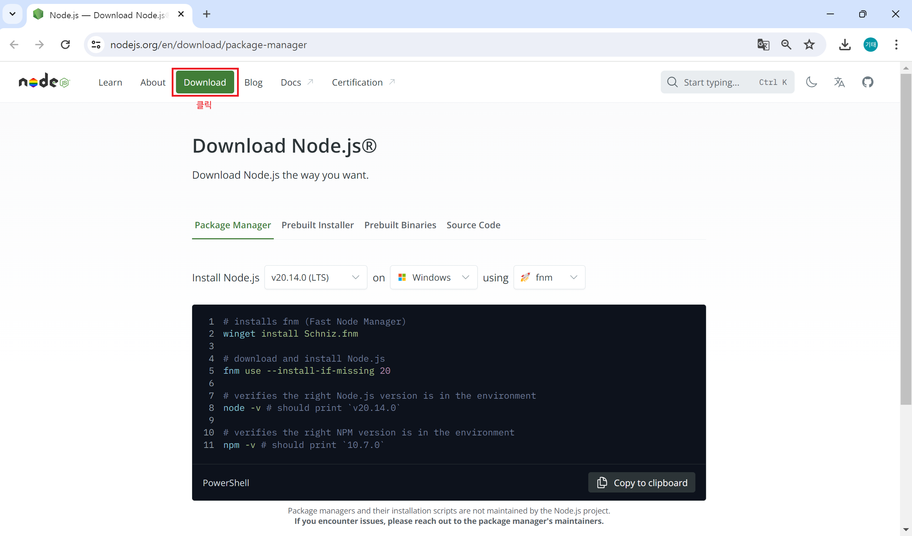

<br>

**V20.11버전 다운로드**

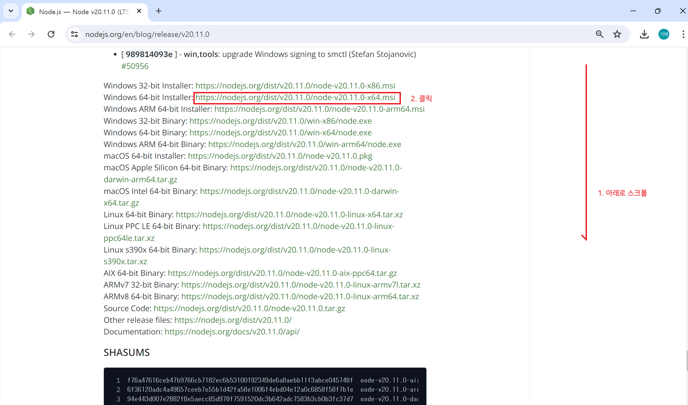

**※ 최신버전 또는 node V20.11 버전 둘 중에서 하나를 선택하여 다운로드 받은 후 다운로드 폴더로 이동하여 설치합니다.**

<br>

### 1-1-2. node 설치

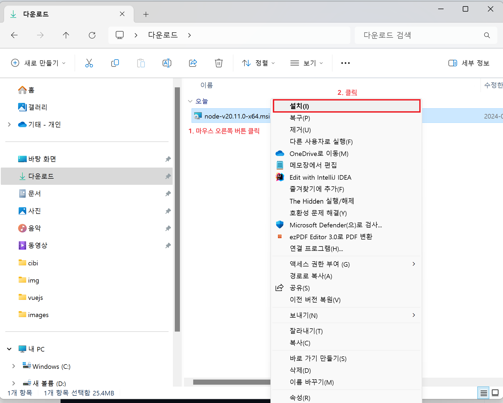

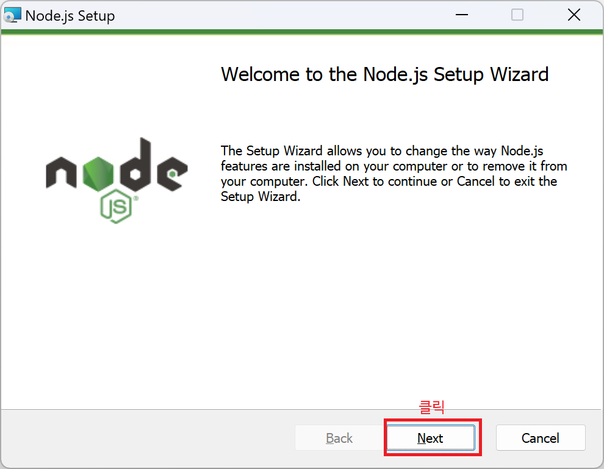

**※ 설치 화면에서 계속 [Next] 버튼을 눌러 설치를 합니다.**

<br>

**node 버전 확인**

```command
D:\gitRepository\kkt09072\vuejs>node -v
v20.11.0
```

<br>

### 1-1-3. node 패키지 관리

- Node.js에서 패키지를 관리하기 위해 주로 사용하는 도구는 npm(Node Package Manager)과 Yarn입니다. 두 가지 모두 패키지 설치, 업데이트, 제거 및 관리에 유용한 기능을 제공합니다.

<br>

#### 1-1-3-1. npm을 사용한 패키지 관리

**1. npm 초기화 및 설정**

- 프로젝트 폴더에서 package.json 파일을 생성합니다.

```bash
npm init
```

- 이 명령어는 프로젝트에 대한 정보를 입력하라는 여러 질문을 합니다. 모든 질문에 답하면 package.json 파일이 생성됩니다.

<br>

**2-1. 패키지 설치 - 로컬 설치**

- 프로젝트 폴더에 패키지를 설치합니다. 이 패키지는 node_modules 폴더에 저장되고 package.json의 dependencies 섹션에 추가됩니다.

```bash
npm install <package-name>
# 예시
npm install express
```

<br>

**2-2. 패키지 설치 - 전역 설치**

- 전역 설치는 패키지를 시스템 전체에서 사용할 수 있도록 설치합니다.

```bash
npm install -g <package-name>
# 예시
npm install -g nodemon
```

<br>

**3-1. 패키지 제거 - 로컬 제거**

- 로컬에 설치된 패키지를 제거합니다.

```bash
npm uninstall <package-name>
# 예시:
npm uninstall express
```

<br>

**3-2. 패키지 제거 - 전역 제거**

- 전역으로 설치된 패키지를 제거합니다.

```bash
npm uninstall -g <package-name>
# 예시:
npm uninstall -g nodemon
```

<br>

**4. 패키지 업데이트**

```bash
npm update <package-name>
# 예시:
npm update express
# 모든 패키지를 업데이트하려면:
npm update
```

<br>

**5. 패키지 확인**

- 설치된 패키지 목록을 확인합니다.

```bash
# 로컬 패키지 확인
코드 복사
npm list
# 전역 패키지 확인
npm list -g --depth=0
```

<br>

**6. 특정 버전 설치**

- 특정 버전의 패키지를 설치합니다.

```bash
npm install <package-name>@<version>
# 예시:
npm install express@4.17.1
```

<br><br>

#### 1-1-3-2. Yarn을 사용한 패키지 관리

**1. Yarn 초기화**

```bash
yarn init
```

- package.json 파일을 생성합니다.

<br>

**2-1. 패키지 설치 - 로컬 설치**

```bash
yarn add <package-name>
# 예시:
yarn add express
```

<br>

**2-2. 패키지 설치 - 전역 설치**

```bash
yarn global add <package-name>
# 예시:
yarn global add nodemon
```

<br>

**3-1. 패키지 제거 - 로컬 제거**

```bash
yarn remove <package-name>
# 예시:
yarn remove express
```

<br>

**3-2. 패키지 제거 - 전역 제거**

```bash
yarn global remove <package-name>
# 예시:
yarn global remove nodemon
```

<br>

**4. 패키지 업데이트**

```bash
yarn upgrade <package-name>
# 예시:
yarn upgrade express
# 모든 패키지를 업데이트하려면:
yarn upgrade
```

<br>

**5. 패키지 확인**

```bash
# 로컬 패키지 확인
yarn list
# 전역 패키지 확인
yarn global list
```

<br>

**6. 특정 버전 설치**

```bash
yarn add <package-name>@<version>
# 예시:
yarn add express@4.17.1
```

<br>

### 1-1-4. Express 웹 애플리케이션 패키지 구성

#### 1-1-4-1. 프로젝트 초기화

```bash
mkdir myapp
cd myapp
npm init -y
```

<br>

#### 1-1-4-2. Express 설치

```bash
npm install express
```

<br>

#### 1-1-4-3. app.js 파일 생성 및 내용 추가

```javascript
// app.js
const express = require('express');
const app = express();
const port = 3000;

app.get('/', (req, res) => {
  res.send('Hello World!');
});

app.listen(port, () => {
  console.log(`Example app listening at http://localhost:${port}`);
});
```

<br>

#### 1-1-4-4. 애플리케이션 실행

```bash
node app.js
```

- 브라우저에서 http://localhost:3000을 열면 "Hello World!" 메시지를 볼 수 있습니다.
- npm과 Yarn을 사용하여 Node.js 프로젝트에서 패키지를 관리할 수 있습니다. 

<br><br>

## 1-2. Visual Studio Code 설치

### 1-2-1. Visual Studio Code 다운로드

https://code.visualstudio.com/download

[Visual Studio Code 다운로드 바로가기](https://code.visualstudio.com/download)

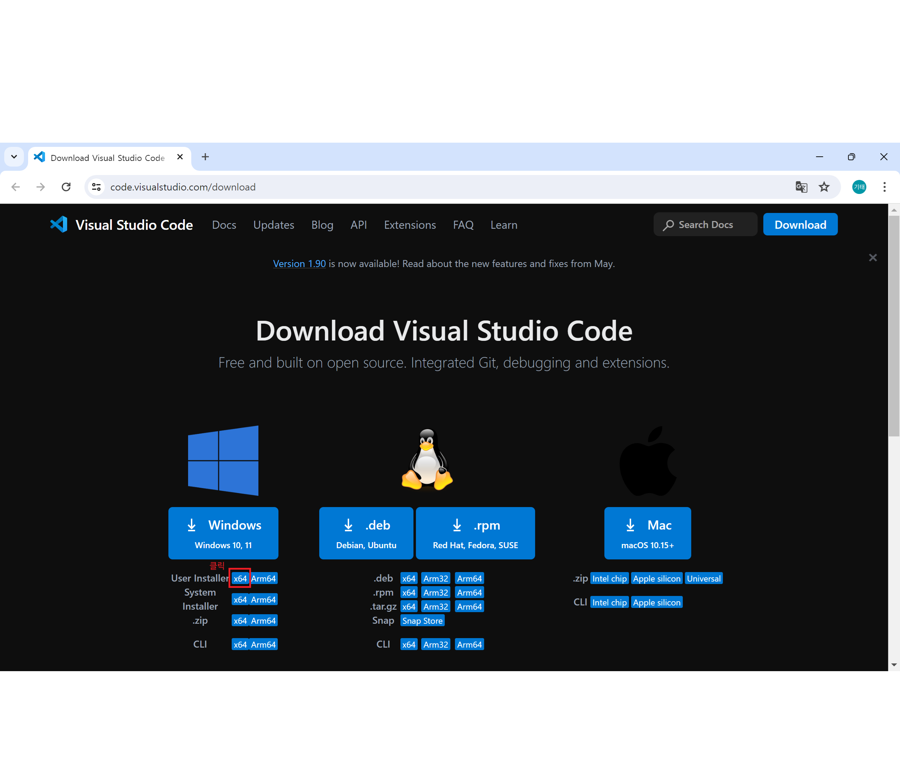

**※ Visual Studio Code 를 다운로드 받은 후 다운로드 폴더로 이동하여 설치합니다.**

<br>

### 1-2-2. Visual Studio Code 설치

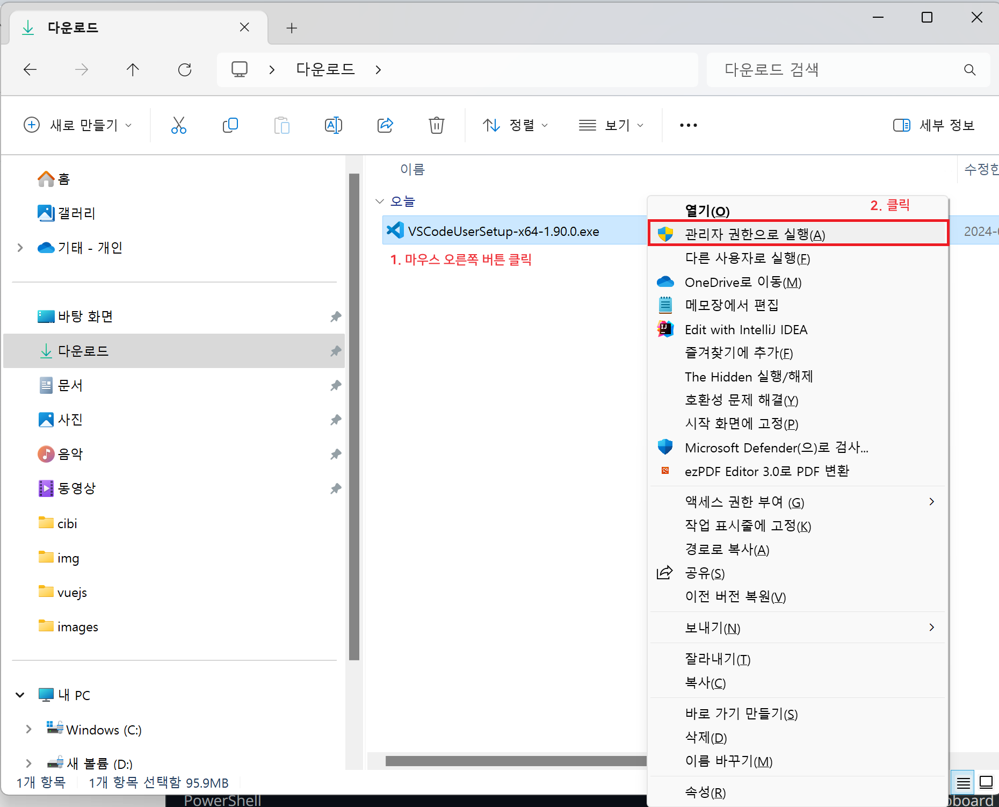

**※ 설치 화면이 나타나면 계속 [Next] 버튼을 눌러 설치를 합니다.**

<br>

### 1-2-2. Visual Studio Code 확장 프로그램 설치

<br><br>

## 1-3. Vuejs 설치

```shell
D:\gitRepository\kkt09072\vuejs> npm install -g @vue/cli
```

<br><br>

### 1-3-1. Vuejs 환경설정

```shell
D:\gitRepository\kkt09072\vuejs>vue --version
@vue/cli 5.0.8
```

<br><br>

### 1-3-2. Vue 프로젝트 생성

**Project setup**
```
npm install
```

<br>

**Compiles and hot-reloads for development**

```
npm run serve
```

<br>

**Compiles and minifies for production**

```
npm run build
```

<br>

**Lints and fixes files**

```
npm run lint
```

<br>

**Customize configuration**

See [Configuration Reference](https://cli.vuejs.org/config/).

<br><br>

**Terminal 에서 study01 Vue 3로 프로젝트를 생성합니다.**

```shell
D:\gitRepository\vuejs>vue create study01

Vue CLI v5.0.8
? Please pick a preset: (Use arrow keys)
> Default ([Vue 3] babel, eslint)   # 기본 Vue 3 를 선택 후 Enter
  Default ([Vue 2] babel, eslint)
  Manually select features

✨  Creating project in D:\gitRepository\vuejs\study01.
🗃  Initializing git repository...
⚙️  Installing CLI plugins. This might take a while...

added 872 packages, and audited 873 packages in 7s

100 packages are looking for funding
  run `npm fund` for details

4 moderate severity vulnerabilities

To address all issues (including breaking changes), run:
  npm audit fix --force

Run `npm audit` for details.
🚀  Invoking generators...
📦  Installing additional dependencies...

added 89 packages, and audited 962 packages in 2s

112 packages are looking for funding
  run `npm fund` for details

4 moderate severity vulnerabilities

To address all issues (including breaking changes), run:
  npm audit fix --force

Run `npm audit` for details.
⚓  Running completion hooks...

📄  Generating README.md...

🎉  Successfully created project study01.
👉  Get started with the following commands:

 $ cd study01
 $ npm run serve
```

<br>

### 1-3-2. Vuejs 명령어 정리

| 명령어              | 설명                                                                                              | 옵션 및 문법                                                                                                                                             | 예시                                                                                           |
|---------------------|--------------------------------------------------------------------------------------------------|----------------------------------------------------------------------------------------------------------------------------------------------------------|-----------------------------------------------------------------------------------------------|
| `vue create`        | 새로운 Vue.js 프로젝트를 생성합니다.                                                             | `vue create <project-name>` <br> - `--preset <preset>`: 미리 설정된 템플릿 사용 <br> - `--default`: 기본 설정 사용 <br> - `--inlinePreset <json>`: 인라인 프리셋 사용 | `vue create my-project` <br> `vue create my-project --preset default`                          |
| `vue add`           | 기존 프로젝트에 플러그인을 추가합니다.                                                           | `vue add <plugin>`                                                                                                                                        | `vue add @vue/cli-plugin-eslint`                                                               |
| `vue invoke`        | 기존 프로젝트에 플러그인을 호출하여 설정을 재구성합니다.                                         | `vue invoke <plugin>`                                                                                                                                     | `vue invoke @vue/cli-plugin-eslint`                                                            |
| `vue inspect`       | 프로젝트의 Webpack 설정을 출력합니다.                                                            | `vue inspect` <br> - `--mode <mode>`: 모드 지정                                                                                                           | `vue inspect` <br> `vue inspect --mode production`                                             |
| `vue serve`         | 프로덕션 빌드 없이 애플리케이션을 개발 서버에서 실행합니다.                                       | `vue serve <entry>` <br> - `--open`: 브라우저 자동 열기 <br> - `--mode <mode>`: 모드 지정 <br> - `--port <port>`: 포트 지정                               | `vue serve` <br> `vue serve src/main.js --open`                                                |
| `vue build`         | 프로덕션용 애플리케이션을 빌드합니다.                                                            | `vue build <entry>` <br> - `--mode <mode>`: 모드 지정                                                                                                     | `vue build` <br> `vue build src/main.js`                                                       |
| `vue ui`            | Vue CLI의 그래픽 사용자 인터페이스를 실행합니다.                                                  | `vue ui`                                                                                                                                                  | `vue ui`                                                                                       |
| `vue config`        | Vue CLI 설정을 관리합니다.                                                                       | `vue config [key] [value]`                                                                                                                                | `vue config --get` <br> `vue config --set useTaobaoRegistry true`                              |
| `vue upgrade`       | Vue CLI 및 관련 패키지를 업그레이드합니다.                                                       | `vue upgrade [plugin-name]`                                                                                                                               | `vue upgrade` <br> `vue upgrade @vue/cli-service`                                              |
| `vue info`          | Vue 프로젝트 및 시스템 환경 정보를 출력합니다.                                                   | `vue info`                                                                                                                                                 | `vue info`                                                                                     |

<br>

#### 1-3-2-1. vue create 명령과 옵션

| 옵션                 | 설명                                                                                              | 예시                                 |
|----------------------|--------------------------------------------------------------------------------------------------|--------------------------------------|
| `--preset <preset>`  | 미리 설정된 프리셋을 사용하여 프로젝트를 생성합니다.                                              | `vue create my-project --preset default` |
| `--default`          | 기본 설정으로 프로젝트를 생성합니다.                                                              | `vue create my-project --default`    |
| `--inlinePreset <json>` | JSON 문자열로 인라인 프리셋을 지정합니다.                                                      | `vue create my-project --inlinePreset '{"useConfigFiles": true, "plugins": {"@vue/cli-plugin-babel": {}, "@vue/cli-plugin-eslint": {}}}' |
| `--packageManager <pm>` | 사용할 패키지 매니저를 지정합니다. npm, yarn, pnpm 등을 지원합니다.                            | `vue create my-project --packageManager yarn` |
| `--registry <url>`   | 패키지 매니저의 레지스트리 URL을 지정합니다.                                                       | `vue create my-project --registry https://registry.npmjs.org/` |
| `--no-git`           | Git 초기화를 하지 않습니다.                                                                       | `vue create my-project --no-git`     |
| `--merge`            | 이미 존재하는 폴더에 설정을 병합합니다.                                                            | `vue create my-project --merge`      |
| `--bare`             | 추가 파일 없이 최소한의 파일로 프로젝트를 생성합니다.                                              | `vue create my-project --bare`       |

<br>

#### 1-3-2-2. vue add 명령과 옵션

| 플러그인                | 설명                                                                                              | 예시                                 |
|-------------------------|--------------------------------------------------------------------------------------------------|--------------------------------------|
| `@vue/cli-plugin-babel` | Babel 설정을 추가합니다.                                                                          | `vue add @vue/cli-plugin-babel`      |
| `@vue/cli-plugin-typescript` | TypeScript 설정을 추가합니다.                                                                  | `vue add @vue/cli-plugin-typescript` |
| `@vue/cli-plugin-eslint` | ESLint 설정을 추가합니다.                                                                        | `vue add @vue/cli-plugin-eslint`     |
| `@vue/cli-plugin-router` | Vue Router 설정을 추가합니다.                                                                     | `vue add @vue/cli-plugin-router`     |
| `@vue/cli-plugin-vuex`   | Vuex 설정을 추가합니다.                                                                         | `vue add @vue/cli-plugin-vuex`       |


<br>

#### 1-3-2-3. vue serve 명령과 옵션

| 옵션                 | 설명                                                                                              | 예시                                 |
|----------------------|--------------------------------------------------------------------------------------------------|--------------------------------------|
| `--open`             | 개발 서버를 시작할 때 브라우저를 자동으로 엽니다.                                                  | `vue serve --open`                   |
| `--mode <mode>`      | 특정 모드로 개발 서버를 시작합니다.                                                                 | `vue serve --mode production`        |
| `--port <port>`      | 개발 서버의 포트를 지정합니다.                                                                     | `vue serve --port 3000`              |

<br>

#### 1-3-2-4. vue build 명령과 옵션

| 옵션                 | 설명                                                                                              | 예시                                 |
|----------------------|--------------------------------------------------------------------------------------------------|--------------------------------------|
| `--mode <mode>`      | 특정 모드로 빌드합니다.                                                                            | `vue build --mode production`        |

<br>

#### 1-3-2-5. vue config 명령과 옵션

| 옵션                 | 설명                                                                                              | 예시                                 |
|----------------------|--------------------------------------------------------------------------------------------------|--------------------------------------|
| `--get [key]`        | 특정 설정 값을 가져옵니다.                                                                         | `vue config --get useTaobaoRegistry` |
| `--set [key] [value]` | 특정 설정 값을 설정합니다.                                                                       | `vue config --set useTaobaoRegistry true` |


<br>

#### 1-3-2-6. vue upgrade 명령과 옵션

| 옵션                 | 설명                                                                                              | 예시                                 |
|----------------------|--------------------------------------------------------------------------------------------------|--------------------------------------|
| `[plugin-name]`      | 특정 플러그인을 업그레이드합니다.                                                                 | `vue upgrade @vue/cli-service`       |


<br>

#### 1-3-2-7. vue invoke 명령과 옵션

| 명령어                | 설명                                                                                              | 예시                                 |
|-----------------------|--------------------------------------------------------------------------------------------------|--------------------------------------|
| `vue invoke <plugin>` | 기존 프로젝트에 플러그인을 호출하여 설정을 재구성합니다.                                           | `vue invoke @vue/cli-plugin-eslint` |

<br>

#### 1-3-2-8. vue inspect 명령과 옵션

| 명령어                | 설명                                                                                              | 예시                                 |
|-----------------------|--------------------------------------------------------------------------------------------------|--------------------------------------|
| `vue inspect`         | 프로젝트의 Webpack 설정을 출력합니다.                                                             | `vue inspect`                       |
| `vue inspect --mode <mode>` | 특정 모드로 Webpack 설정을 출력합니다.                                                      | `vue inspect --mode production`     |


<br>

#### 1-3-2-9. 기타 명령

vue ui : 명령어를 실행하면 브라우저가 열리고 Vue CLI의 그래픽 사용자 인터페이스가 표시됩니다. 여기에서 프로젝트 생성, 플러그인 추가, 설정 변경 등을 쉽게 할 수 있습니다.
vue info : 명령어를 실행하면 프로젝트 및 시스템 환경에 대한 정보가 출력됩니다. 이 정보는 디버깅 및 지원 요청 시 유용합니다.

<br><br>

### 1-3-3. Vuejs의 지원 라이브러리

#### 1-3-3-1. Vue Router

- Vue.js 애플리케이션에서 라우팅을 관리하는 공식 라이브러리입니다.

**설치**

```bash
npm install vue-router
```

<br>

**활용법**

```typescript
import { createRouter, createWebHistory } from 'vue-router';
import Home from './components/Home.vue';
import About from './components/About.vue';

const routes = [
  { path: '/', component: Home },
  { path: '/about', component: About },
];

const router = createRouter({
  history: createWebHistory(),
  routes,
});

export default router;
```

<br>

#### 1-3-3-2. Vuex

- Vue.js 애플리케이션에서 상태 관리를 담당하는 공식 라이브러리입니다.

**설치**

```bash
npm install vuex
```

<br>

**활용법**

```typescript
import { createStore } from 'vuex';

export default createStore({
  state: {
    count: 0
  },
  mutations: {
    increment(state) {
      state.count++;
    }
  },
  actions: {
    incrementAsync({ commit }) {
      setTimeout(() => {
        commit('increment');
      }, 1000);
    }
  },
  getters: {
    doubleCount(state) {
      return state.count * 2;
    }
  }
});
```

<br>

#### 1-3-3-3. Vue Loader

- Webpack을 사용하여 Vue 컴포넌트를 로드하고 처리하는 로더입니다.

**설치**

```bash
npm install vue-loader vue-template-compiler --save-dev
```

<br>

**활용법**

```typescript
// webpack.config.js
const { VueLoaderPlugin } = require('vue-loader');

module.exports = {
  module: {
    rules: [
      {
        test: /\.vue$/,
        loader: 'vue-loader'
      },
    ]
  },
  plugins: [
    new VueLoaderPlugin()
  ]
};
```

<br>

#### 1-3-3-4. Vueify

- Browserify와 함께 Vue 컴포넌트를 처리하는 트랜스포머입니다. 현재는 Vue Loader가 더 널리 사용됩니다.

**설치**

```bash
npm install vueify --save-dev
```

<br>

**활용법**

```javascript
// browserify config
browserify({
  entries: ['src/main.js'],
  transform: [vueify]
});
```

<br>

#### 1-3-3-5. Vue CLI

- Vue.js 프로젝트를 생성하고 관리하는 데 사용되는 CLI 도구입니다.

**설치**

```bash
npm install -g @vue/cli
```

<br>

**활용법**

```bash
vue create my-project
cd my-project
npm run serve
```

<br>

#### 1-3-3-6. Vue JSTree

- Vue.js 애플리케이션에서 트리 구조를 표현하는 라이브러리입니다.

**설치**

```bash
npm install vue-jstree
```

<br>

**활용법**

```typescript
import VueJstree from 'vue-jstree';

export default {
  components: {
    'vue-jstree': VueJstree
  }
};
```

<br>

#### 1-3-3-7. Vue Sys

- 시스템 레벨의 기능을 Vue.js에서 쉽게 사용할 수 있도록 하는 라이브러리입니다. (비교적 적게 사용됨)

**설치**

```bash
npm install vue-sys
```

<br>

**활용법**

```typescript
import VueSys from 'vue-sys';
Vue.use(VueSys);
```

<br>

#### 1-3-3-8. Axios

- HTTP 요청을 처리하는 라이브러리로, Vue.js 애플리케이션에서도 널리 사용됩니다.

**설치**

```bash
npm install axios
```

<br>

**활용법**

```typescript
import axios from 'axios';

axios.get('https://api.example.com')
  .then(response => {
    console.log(response.data);
  });
```

<br>

#### 1-3-3-9. Vuetify

- Vue.js를 위한 인기 있는 Material Design 컴포넌트 프레임워크입니다.

**설치**

```bash
npm install vuetify
```

<br>

**활용법**

```typescript
import { createApp } from 'vue';
import App from './App.vue';
import Vuetify from 'vuetify';

const app = createApp(App);
app.use(Vuetify);
app.mount('#app');
```

<br>

#### 1-3-3-10. Vue Apollo

- Vue.js 애플리케이션에서 GraphQL을 사용하기 위한 라이브러리입니다.

**설치**

```bash
npm install @vue/apollo-composable apollo-client graphql
```

<br>

**활용법**

```typescript
import { createApp } from 'vue';
import { provideApolloClient } from '@vue/apollo-composable';
import ApolloClient from 'apollo-boost';
import App from './App.vue';

const apolloClient = new ApolloClient({
  uri: 'https://api.example.com/graphql'
});

const app = createApp(App);
provideApolloClient(apolloClient);
app.mount('#app');
```

<br>

#### 1-3-3-11. Vuelidate

- Vue.js 애플리케이션에서 폼 유효성 검사를 쉽게 할 수 있도록 돕는 라이브러리입니다.

**설치**

```bash
npm install @vuelidate/core @vuelidate/validators
```

<br>

**활용법**

```typescript
import { createApp } from 'vue';
import { useVuelidate } from '@vuelidate/core';
import { required } from '@vuelidate/validators';

const app = createApp({
  setup() {
    const rules = {
      name: { required }
    };
    const v$ = useVuelidate(rules);
    return { v$ };
  }
});
app.mount('#app');
```

<br>

#### 1-3-3-12. Vuex Persisted State

- Vuex 상태를 로컬 스토리지에 저장하여 페이지 새로고침 시에도 상태가 유지되도록 하는 라이브러리입니다.

**설치**

```bash
npm install vuex-persistedstate
```

<br>

**활용법**

```typescript
import createPersistedState from 'vuex-persistedstate';

const store = createStore({
  plugins: [createPersistedState()],
  state: {
    count: 0
  },
  mutations: {
    increment(state) {
      state.count++;
    }
  }
});
```

<br><br>

## 1-4. MariaDB 설치

### 1-4-1. MariaDB 다운로드

https://mariadb.org/download/?t=mariadb&p=mariadb&r=10.11.8&os=windows&cpu=x86_64&pkg=msi&mirror=blendbyte

[MariaDB 다운로드 바로가기](https://mariadb.org/download/?t=mariadb&p=mariadb&r=10.11.8&os=windows&cpu=x86_64&pkg=msi&mirror=blendbyte)

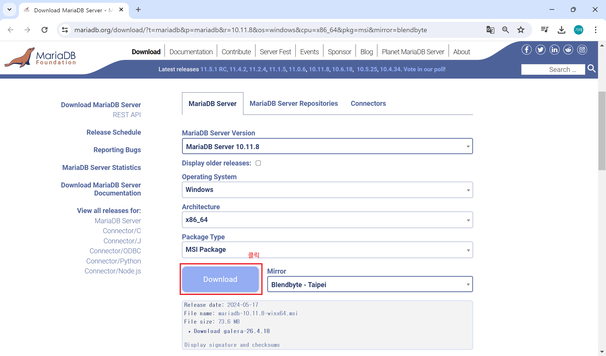

<br>

### 1-4-2. MariaDB 설치

**1. 다운로드 받은 파일에서 오른쪽 버튼을 눌러 설치를 시작합니다.**

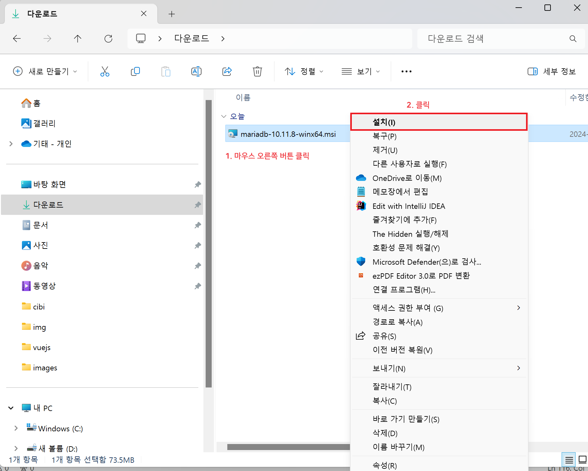

<br>

**2. 설치 화면이 나타나면 [Next] 버튼을 누르고 설치를 계속 진행합니다.**

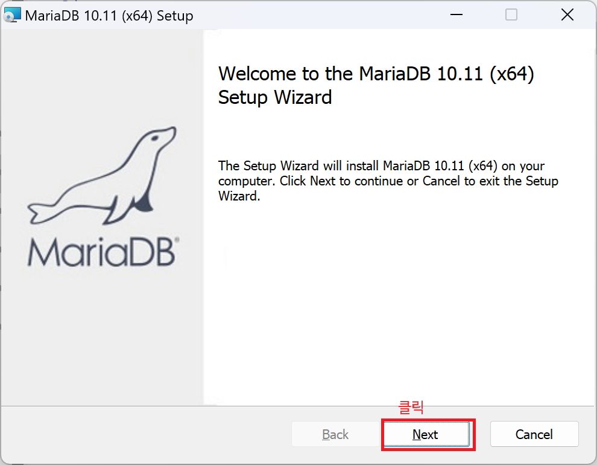

<br>

**3. 약관 동의 화면이 나타나면 약관에 동의(I accept the terms in the License Agreement)를 체크하고, [Next] 버튼을 누르고 설치를 계속 진행합니다.**

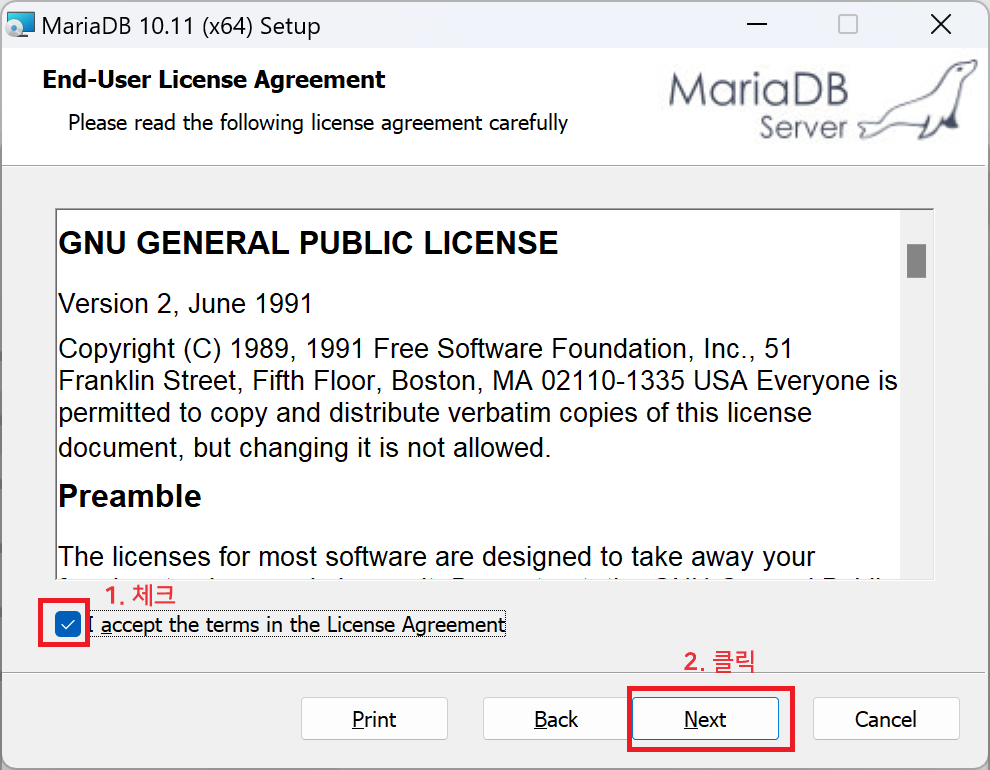

<br>

**4. 인스턴스 생성 선택 화면이 나타나면 새로운 인스턴스 생성(Create new database instance)를 선택하고, [Next] 버튼을 누르고 설치를 계속 진행합니다.**

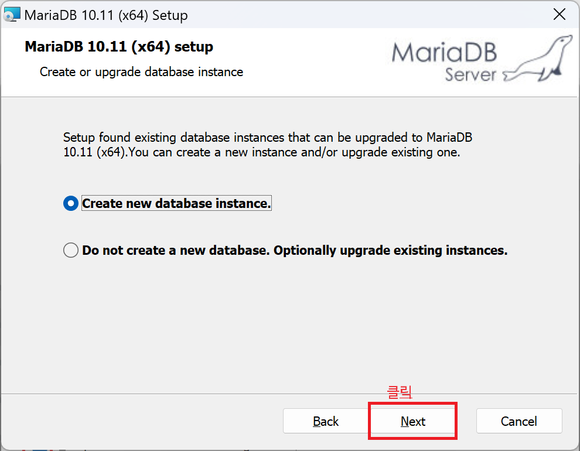

<br>

**5. 사용자 설정(Custom Setup) 화면이 나타나면 설치 옵션 및 설치 디렉토리를 확인하고, [Next] 버튼을 누르고 설치를 계속 진행합니다.**


<br>

**6. 기본 인스턴스 속성(Default instance properties) 화면이 나타나면 비밀번호(New root password), 비밀번호 확인(Confirm)를 입력하고, 루트 사용자 원격 접속 허용(Enable access from remote machines for root user)와 캐릭터셋을 UTF8(Use UTF8 as default server's character set)로 설정을 모두 체크하고, [Next] 버튼을 누르고 설치를 계속 진행합니다.**

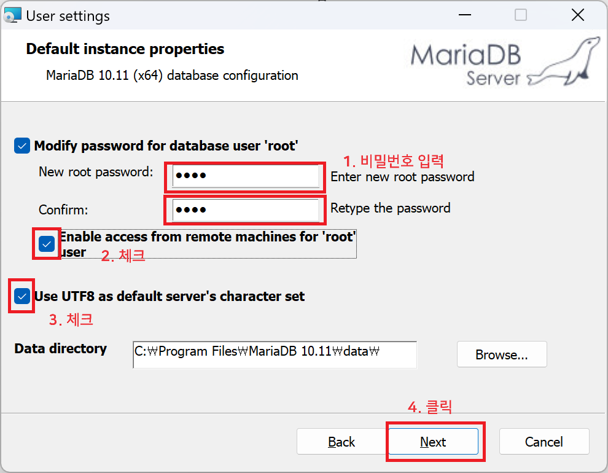

<br>

**7. 기본 인스턴스 속성(Default instance properties)의 두 번째 화면이 나타나면 서비스 이름(Service Name)과 포트 번호(Tcp port)를 각 각 입력하고, [Next] 버튼을 누르고 설치를 계속 진행합니다.**

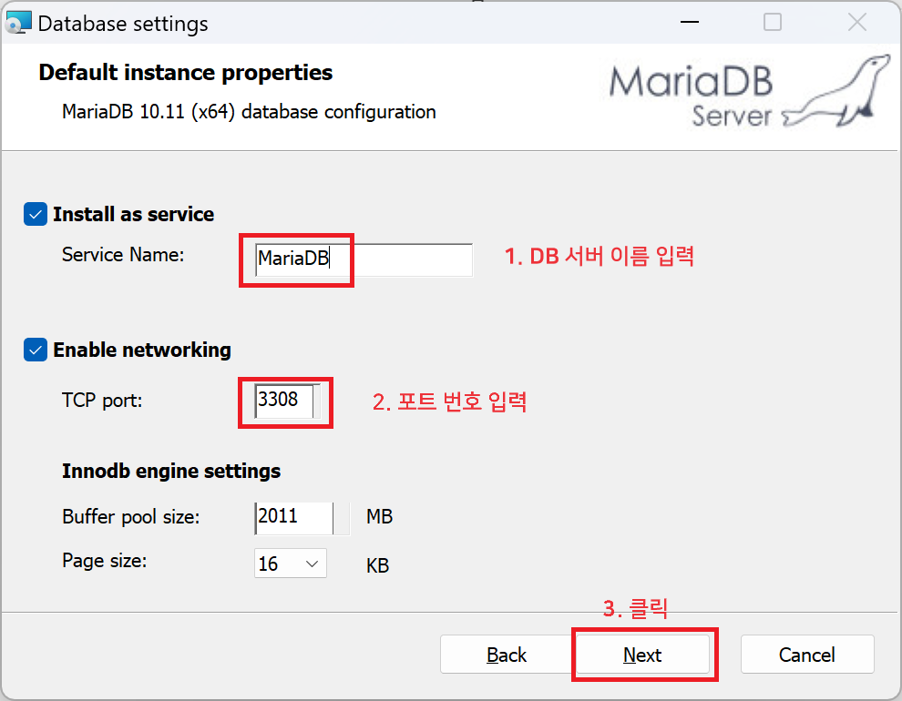

<br>

**7. 설치 준비(Ready to install MariaDB) 화면이 나타나면 [Install] 버튼을 누르고 설치를 계속 진행합니다.**

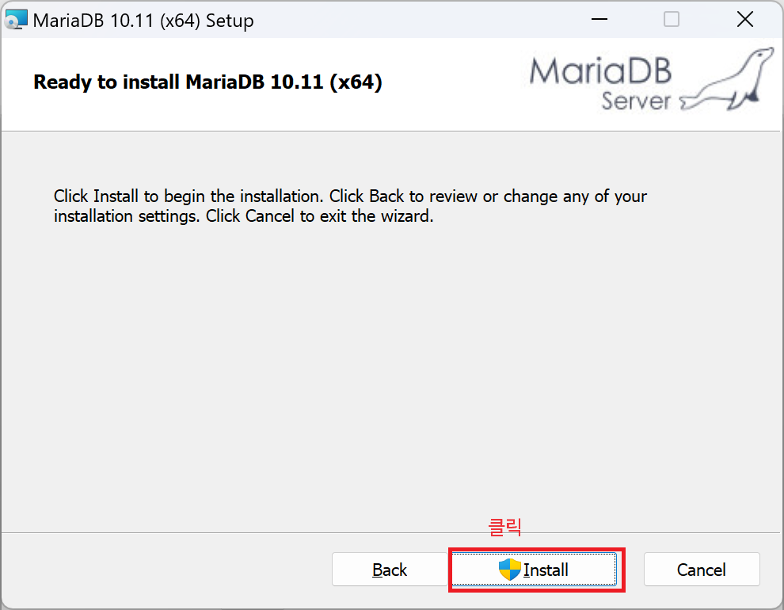

<br><br><br>
