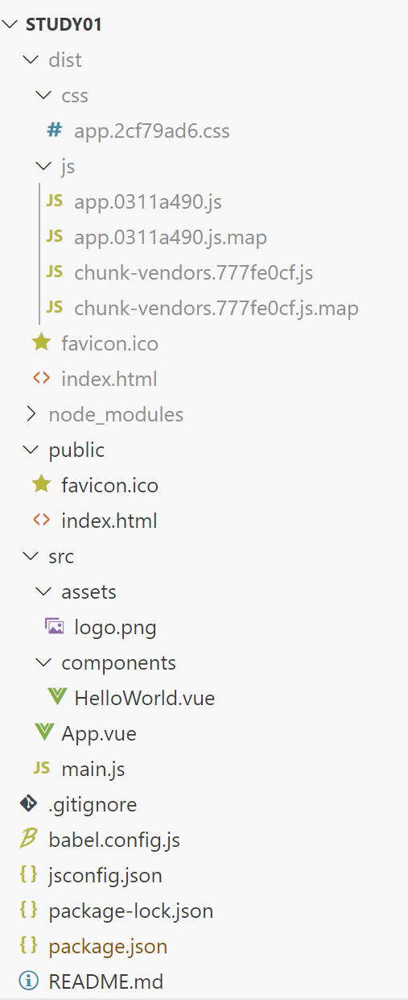

**Project setup**

```
npm install
```

<br>

**Compiles and hot-reloads for development**

```
npm run serve
```

<br>

**Compiles and minifies for production**

```
npm run build
```

<br>

**Run your unit tests**

```
npm run test:unit
```

<br>

**Lints and fixes files**

```
npm run lint
```

<br>

**Customize configuration**

See [Configuration Reference](https://cli.vuejs.org/config/).

<br><br>

# 2. 프로젝트 생성 및 환경 설정

## 2-1. 프로젝트 생성

<br>

**Terminal 에서 study02 세부사항을 개발자가 선택하여 프로젝트를 생성합니다.**

```shell
D:\gitRepository\vuejs>vue create study02

Vue CLI v5.0.8  # 사전 설정을 선택하세요.
? Please pick a preset:
  Default ([Vue 3] babel, eslint)
  Default ([Vue 2] babel, eslint)
> Manually select features          # 수동으로 기능 선택

Vue CLI v5.0.8
? Please pick a preset: Manually select features
? Check the features needed for your project: (Press <space> to select, <a> to toggle all, <i> to invert selection, and
<enter> to proceed)   # 프로젝트에 필요한 기능을 확인하세요. (선택하려면 <space>를 누르고, 모두 전환하려면 <a>를 누르고, 선택을 반전하려면 <i>를 누르고, 계속하려면 <enter>하세요)
 (*) Babel
 (*) TypeScript
>(*) Progressive Web App (PWA) Support
 (*) Router
 (*) Vuex
 (*) CSS Pre-processors
 (*) Linter / Formatter
 (*) Unit Testing
 ( ) E2E Testing

Vue CLI v5.0.8
? Please pick a preset: Manually select features
? Check the features needed for your project: Babel, TS, PWA, Router, Vuex, CSS Pre-processors, Linter, Unit
? Choose a version of Vue.js that you want to start the project with (Use arrow keys)  # 프로젝트를 시작하려는 Vue.js 버전을 선택하세요(화살표 키 사용).
> 3.x
  2.x

Vue CLI v5.0.8
? Please pick a preset: Manually select features
? Check the features needed for your project: Babel, TS, PWA, Router, Vuex, CSS Pre-processors, Linter, Unit
? Choose a version of Vue.js that you want to start the project with 3.x
? Use class-style component syntax? No    # 클래스 스타일 구성 요소 구문을 사용하시겠습니까?
? Use Babel alongside TypeScript (required for modern mode, auto-detected polyfills, transpiling JSX)? Yes   # TypeScript와 함께 Babel 사용하시겠습니까? 
? Use history mode for router? (Requires proper server setup for index fallback in production) Yes    # 라우터에 기록 모드를 사용하시겠습니까?
? Pick a CSS pre-processor (PostCSS, Autoprefixer and CSS Modules are supported by default): (Use arrow keys)   # CSS 전처리기를 선택하세요
> Sass/SCSS (with dart-sass)
  Less
  Stylus

? Pick a linter / formatter config:     # linter / formatter 설정 방법을 선택하세요
  ESLint with error prevention only
  ESLint + Airbnb config
> ESLint + Standard config
  ESLint + Prettier

? Pick additional lint features: (Press <space> to select, <a> to toggle all, <i> to invert selection, and <enter> to
proceed)    # 추가 Lint 기능 선택: (선택하려면 <space>를 누르고, 모두 전환하려면 <a>를 누르고, 선택을 반전하려면 <i>를, <enter>를 눌러
진행하다)
>(*) Lint on save
 ( ) Lint and fix on commit

? Pick a unit testing solution: (Use arrow keys)      # 단위 테스트 솔루션 선택: (화살표 키 사용)
> Jest
  Mocha + Chai

? Where do you prefer placing config for Babel, ESLint, etc.?     # Babel, ESLint 등의 구성을 어디에 배치하는 것을 선호하시나요?
  In dedicated config files
> In package.json  

? Save this as a preset for future projects? (y/N) y      # 향후 프로젝트를 위한 사전 설정으로 저장하시겠습니까?

? Save preset as: project02       # 사전 설정을 위한 파일 이름 입력


# 프로젝트 구성 결과
? Please pick a preset: Manually select features
? Check the features needed for your project: Babel, TS, PWA, Router, Vuex, CSS Pre-processors, Linter, Unit
? Choose a version of Vue.js that you want to start the project with 3.x
? Use class-style component syntax? No
? Use Babel alongside TypeScript (required for modern mode, auto-detected polyfills, transpiling JSX)? Yes
? Use history mode for router? (Requires proper server setup for index fallback in production) Yes
? Pick a CSS pre-processor (PostCSS, Autoprefixer and CSS Modules are supported by default): Sass/SCSS (with dart-sass)
? Pick a linter / formatter config: Standard
? Pick additional lint features: Lint on save
? Pick a unit testing solution: Jest
? Where do you prefer placing config for Babel, ESLint, etc.? In package.json
? Save this as a preset for future projects? Yes
? Save preset as: project02

# 설치된 내용 출력
Vue CLI v5.0.8
✨  Creating project in D:\gitRepository\vuejs\study02.
🗃  Initializing git repository...
⚙️  Installing CLI plugins. This might take a while...

added 1427 packages, and audited 1428 packages in 2m

170 packages are looking for funding
  run `npm fund` for details

4 moderate severity vulnerabilities

To address all issues (including breaking changes), run:
  npm audit fix --force

Run `npm audit` for details.
🚀  Invoking generators...
📦  Installing additional dependencies...

added 156 packages, and audited 1584 packages in 28s

201 packages are looking for funding
  run `npm fund` for details

4 moderate severity vulnerabilities

To address all issues (including breaking changes), run:
  npm audit fix --force

Run `npm audit` for details.
⚓  Running completion hooks...

📄  Generating README.md...

🎉  Successfully created project study02.
👉  Get started with the following commands:

 $ cd study02
 $ npm run serve
```

### 2-1-1. Babel

- 최신 JavaScript 코드를 구형 브라우저나 환경에서도 동작하도록 변환해주는 트랜스파일러입니다.

**설치**

```bash
npm install @babel/core @babel/cli @babel/preset-env
```

<br>

**활용법**

```json
// .babelrc
{
  "presets": ["@babel/preset-env"]
}
```

<br>

**babel의 출력 디렉토리 생성**

```bash
npx babel src --out-dir dist
```

<br>

**종류**

1. @babel/core: Babel의 핵심 패키지.
2. @babel/preset-env: 최신 JavaScript를 특정 환경에 맞게 변환하는 프리셋.
3. @babel/preset-react: React JSX를 변환하는 프리셋.
4. @babel/plugin-transform-runtime: 중복되는 헬퍼 코드를 재사용할 수 있게 하는 플러그인.

<br><br>

### 2-1-2. Webpack

- JavaScript 모듈 번들러로, 여러 파일을 하나의 파일로 묶어줍니다.

**설치**

```bash
npm install webpack webpack-cli --save-dev
```

<br>

**활용법**

```javascript
// webpack.config.js
const path = require('path');

module.exports = {
  entry: './src/index.js',
  output: {
    filename: 'bundle.js',
    path: path.resolve(__dirname, 'dist')
  },
  module: {
    rules: [
      {
        test: /\.js$/,
        exclude: /node_modules/,
        use: {
          loader: 'babel-loader'
        }
      }
    ]
  }
};
```

<br>

**webpack의 환경설정 파일 생성**

```bash
npx webpack --config webpack.config.js
```

<br>

**종류**

1. Loaders: 파일을 모듈로 변환. 예: babel-loader, css-loader, file-loader.
2. Plugins: 번들된 결과물을 처리. 예: HtmlWebpackPlugin, MiniCssExtractPlugin.

<br><br>

### 2-1-3. CSS Pre-processors

- CSS를 더 강력하고 유지보수하기 쉽게 작성할 수 있게 도와주는 도구입니다.

<br>

#### 2-1-3-1. Sass (SCSS):

**설치**

```bash
npm install sass sass-loader --save-dev
```

<br>

**활용법**

```css
// styles.scss
$primary-color: #333;

body {
  color: $primary-color;
}
```

<br>

#### 2-1-3-2. Less

**설치**

```bash
npm install less less-loader --save-dev
```

<br>

**활용법**

```css
// styles.less
@primary-color: #333;

body {
  color: @primary-color;
}
```

<br>

#### 2-1-3-3. Stylus

**설치**

```bash
npm install stylus stylus-loader --save-dev
```

<br>

**활용법**

```css
// styles.styl
primary-color = #333

body
  color: primary-color
```

<br><br>

### 2-1-4. Linter/Formatter

- 코드의 스타일과 품질을 일관되게 유지하고 오류를 사전에 방지합니다.

<br>

#### 2-1-4-1. ESLint

**설치**

```bash
npm install eslint --save-dev
```

<br>

**활용법**

```json
// .eslintrc.json
{
  "env": {
    "browser": true,
    "es2021": true
  },
  "extends": "eslint:recommended",
  "parserOptions": {
    "ecmaVersion": 12,
    "sourceType": "module"
  },
  "rules": {
  }
}
```

<br>

#### 2-1-4-2. Prettier

**설치**

```bash
npm install prettier --save-dev
```

<br>

**활용법**

```json
// .prettierrc
{
  "singleQuote": true,
  "semi": false
}
```

<br>

#### 2-1-4-3. Stylelint:

**설치**

```bash
npm install stylelint stylelint-config-standard --save-dev
```

<br>

**활용법**

```json
// .stylelintrc.json
{
  "extends": "stylelint-config-standard"
}
```

<br><br>

### 2-1-5. Unit Testing

- 개별 모듈이나 컴포넌트가 예상대로 동작하는지 검증합니다.

#### 2-1-5-1. Jest

**설치**

```bash
npm install jest --save-dev
```

<br>

**활용법**

```javascript
// sum.js
function sum(a, b) {
  return a + b;
}
module.exports = sum;

// sum.test.js
const sum = require('./sum');

test('adds 1 + 2 to equal 3', () => {
  expect(sum(1, 2)).toBe(3);
});
```

<br>

#### 2-1-5-2. Mocha

**설치**

```bash
npm install mocha --save-dev
```

**활용법**

```javascript
// test.js
const assert = require('assert');
describe('Array', () => {
  describe('#indexOf()', () => {
    it('should return -1 when the value is not present', () => {
      assert.equal([1, 2, 3].indexOf(4), -1);
    });
  });
});
```

<br><br>

### 2-1-6. E2E Testing

- 애플리케이션의 전체적인 흐름을 테스트하여 사용자의 행동을 시뮬레이션합니다.

#### 2-1-6-1. Cypress

**설치**

```bash
npm install cypress --save-dev
```

**활용법**

```javascript
// cypress/integration/sample_spec.js
describe('My First Test', () => {
  it('Does not do much!', () => {
    expect(true).to.equal(true);
  });
});
```

<br>

#### 2-1-6-2. Selenium

**설치**

```bash
npm install selenium-webdriver --save-dev
```

<br>

**활용법**

```javascript
const { Builder, By, until } = require('selenium-webdriver');

(async function example() {
  let driver = await new Builder().forBrowser('firefox').build();
  try {
    await driver.get('http://www.google.com/ncr');
    await driver.findElement(By.name('q')).sendKeys('webdriver');
    await driver.findElement(By.name('btnK')).click();
    await driver.wait(until.titleIs('webdriver - Google Search'), 1000);
  } finally {
    await driver.quit();
  }
})();
```

<br><br>

## 2-2. 프로젝트의 구성



<br>

### 2-2-1. 프로젝트 구조 및 파일 설명

**루트 디렉토리**

babel.config.js: Babel 설정 파일로, ES6 이상의 최신 JavaScript 문법을 구버전 브라우저에서도 호환되도록 변환하는 설정이 담깁니다.
jsconfig.json: JavaScript 프로젝트 설정 파일로, IDE(통합 개발 환경)에서 더 나은 지원을 제공하기 위한 설정이 포함됩니다. 파일 경로 단축, IntelliSense(코드 자동 완성), 코드 내비게이션 등을 설정할 수 있습니다.
package.json: 프로젝트의 메타데이터를 포함하는 파일로, 프로젝트 이름, 버전, 의존성 패키지 목록, 스크립트, 라이선스 등의 정보를 담고 있습니다.
package-lock.json: npm이 생성하는 파일로, 설치된 각 패키지의 정확한 버전과 종속성을 잠금(lock)으로써, 프로젝트의 동일한 환경을 보장합니다.
node_modules: 프로젝트의 의존성 패키지들이 설치되는 디렉토리입니다. 이 디렉토리는 package.json의 의존성 목록을 바탕으로 npm install 명령어를 실행하면 자동으로 생성됩니다.

<br>

**dist 디렉토리**

/dist/index.html: 빌드 후 생성되는 HTML 파일입니다. Vue CLI를 사용하여 프로젝트를 빌드하면, 소스 코드가 번들링되고 최적화된 파일들이 이 디렉토리에 생성됩니다.
/dist/css: 빌드 후 생성되는 CSS 파일이 저장되는 디렉토리입니다.
/dist/js: 빌드 후 생성되는 JavaScript 파일이 저장되는 디렉토리입니다.

<br>

**public 디렉토리**

/public/index.html: 프로젝트의 기본 HTML 템플릿 파일로, Vue 앱의 루트 HTML 파일입니다. 이 파일에 Vue 앱이 마운트됩니다. 빌드 시 이 파일을 기반으로 최종 HTML 파일이 생성됩니다.

<br>

**src 디렉토리**

/src/assets: 이미지, 폰트, 스타일시트 등 정적 자산을 저장하는 디렉토리입니다.
/src/components: Vue 컴포넌트를 저장하는 디렉토리입니다. Vue 컴포넌트는 UI의 재사용 가능한 부분을 정의합니다.
/src/components/HelloWorld.vue: 기본 생성되는 예제 컴포넌트 파일로, 새로운 컴포넌트를 만들 때 참고할 수 있습니다.
/src/App.vue: 루트 컴포넌트 파일로, 모든 다른 컴포넌트가 포함되는 최상위 컴포넌트입니다.
/src/main.js: Vue 애플리케이션의 진입점 파일로, Vue 인스턴스를 생성하고, App.vue를 마운트합니다.

<br>

**기본 프로젝트 구조**

```lua
study01
├── babel.config.js
├── jsconfig.json
├── package.json
├── package-lock.json
├── node_modules/
├── dist/
│   ├── index.html
│   ├── css/
│   └── js/
├── public/
│   └── index.html
└── src/
    ├── assets/
    ├── components/
    │   └── HelloWorld.vue
    ├── App.vue
    └── main.js
```

<br><br>

#### 2-2-2. 주요 파일의 용도

| 주요 파일 | 용도 |
|----------------------|------------------------------------------------------|
| babel.config.js | Babel 설정 파일. | 
| jsconfig.json | JavaScript 프로젝트 설정 파일. | 
| package.json | 프로젝트 메타데이터 및 의존성 관리 파일. | 
| package-lock.json | 의존성 버전을 고정하여 동일한 환경을 보장하는 파일. | 
| /dist/ | 빌드 결과물이 저장되는 디렉토리. | 
| /dist/index.html | 빌드된 HTML 파일. | 
| /dist/css/ | 빌드된 CSS 파일. | 
| /dist/js/ | 빌드된 JavaScript 파일. | 
| /public/ | 정적 파일을 저장하는 디렉토리. | 
| /public/index.html | 기본 HTML 템플릿 파일. | 
| /src/ | 소스 파일을 저장하는 디렉토리. | 
| /src/assets/ | 정적 자산 디렉토리. | 
| /src/components/ | Vue 컴포넌트 디렉토리. | 
| /src/components/HelloWorld.vue | 예제 컴포넌트 파일. | 
| /src/App.vue | 루트 컴포넌트 파일. | 
| /src/main.js | 애플리케이션 진입점 파일. | 


<br><br>

## 2-3. 프로젝트 환경설정

### 2-3-1. 포트번호 변경

**package.json 에서 포트 번호 변경** 

```javascript
{
  "name": "study01",
  "version": "0.1.0",
  "private": true,
  "scripts": {
    "serve": "vue-cli-service serve --port 8502",
    "build": "vue-cli-service build --port 8501",
    "lint": "vue-cli-service lint"
  },
  "dependencies": {
    "core-js": "^3.8.3",
    "vue": "^3.2.13"
  },
  "devDependencies": {
    "@babel/core": "^7.12.16",
    "@babel/eslint-parser": "^7.12.16",
    "@vue/cli-plugin-babel": "~5.0.0",
    "@vue/cli-plugin-eslint": "~5.0.0",
    "@vue/cli-service": "~5.0.0",
    "eslint": "^7.32.0",
    "eslint-plugin-vue": "^8.0.3"
  },
  //중간 생략
```

<br><br>

## 2-4. 프로젝트 실행


```shell
D:\gitRepository\kkt09072\vuejs>cd study01

D:\gitRepository\kkt09072\vuejs\study01>npm run serve

> study01@0.1.0 serve
> vue-cli-service serve

 INFO  Starting development server...
```

<br><br>

## 2-5. 프로그래밍 디자인 패턴

소프트웨어 디자인 패턴(software design pattern)은 소프트웨어 공학의 소프트웨어 디자인에서 특정 문맥에서 공통적으로 발생하는 문제에 대해 재사용 가능한 해결책입니다. 소스나 기계 코드로 바로 전환될수 있는 완성된 디자인은 아니며, 다른 상황에 맞게 사용될 수 있는 문제들을 해결하는데에 쓰이는 서술이나 템플릿이며, 디자인 패턴은 프로그래머가 어플리케이션이나 시스템을 디자인할 때 공통된 문제들을 해결하는데에 쓰이는 형식화 된 가장 좋은 방법입니다.

### 2-5-1. MVC 패턴

- 가장 기본적인 프로그래밍 디자인 패턴입니다.

<br>

**주요 구성 요소 및 동작원리**

Model : 애플리케이션에서 사용되는 데이터와 그 데이터를 처리하는 부분으로 비즈니스 로직을 관리합니다.
View : 사용자에게 보여지는 UI 부분으로 사용자 인터페이스를 정의합니다.
Controller : 사용자의 입력(Action)을 받고 처리하는 부분으로 사용자 입력을 처리하고 모델과 상호작용합니다.

<br>

[MVC 패턴](../images/pattern01.png)

**MVC 동작 순서**

1. User action : View를 통하여 사용자의 Action들은 Controller에 들어오게 됩니다.
2. Model Update : Controller는 사용자의 Action을 확인하고, Model을 업데이트합니다.
3. Notify : Controller는 Model로 부터 결과를 받아 View를 선택합니다.
4. View Update : View는 Model의 결과를 화면에 나타냅니다.

<br>

**간단한 예시 코드**

```javascript
//src/pattern/mvcpattern.js
// Model (Vuex store)
const store = new Vuex.Store({
  state: { count: 0 },
  mutations: { increment(state) { state.count++; } }
});

// View (Vue Component)
const Counter = {
  template: `<button @click="increment">{{ count }}</button>`,
  computed: { count() { return this.$store.state.count; } },
  methods: { increment() { this.$store.commit('increment'); } }
};

// Controller (Component methods)
const app = new Vue({
  el: '#app',
  store,
  components: { Counter }
});
```

<br><br>

#### 2-5-1-1. MVC 패턴의 프로젝트 구조

```lua
mvcproject/
├── src/
│   ├── assets/
│   ├── components/
│   ├── controllers/
│   ├── models/
│   ├── views/
│   ├── router/
│   ├── store/
│   ├── App.vue
│   └── main.ts
├── public/
├── tests/
├── .eslintrc.js
├── babel.config.js
├── package.json
├── tsconfig.json
├── vue.config.js
└── webpack.config.js
```

<br>

**폴더 및 파일 설명**

src: 소스 코드가 위치한 폴더입니다.
assets: 이미지, 폰트 등 정적 파일을 저장하는 폴더입니다.
components: Vue 컴포넌트를 저장하는 폴더입니다. View에서 사용할 재사용 가능한 컴포넌트를 여기서 정의합니다.
**controllers**: 비즈니스 로직과 사용자 입력을 처리하는 컨트롤러 파일을 저장하는 폴더입니다.
**models**: 애플리케이션의 데이터 구조와 로직을 정의하는 모델 파일을 저장하는 폴더입니다.
**views**: 라우팅된 뷰 컴포넌트를 저장하는 폴더입니다. 일반적으로 페이지 단위의 컴포넌트를 여기서 정의합니다.
router: Vue Router 설정 파일을 저장하는 폴더입니다.
store: Vuex 상태 관리 파일을 저장하는 폴더입니다.
App.vue: 애플리케이션의 최상위 컴포넌트입니다.
main.ts: Vue 인스턴스를 생성하고 애플리케이션을 마운트하는 진입점 파일입니다.
.eslintrc.js : ESLint는 JavaScript와 TypeScript 코드의 문법과 스타일을 검사하고 오류를 식별하는 도구이며, 이 파일에서 ESLint 설정 파일로서 프로젝트의 코드 규칙을 정의하고 ESLint가 사용하는 파서와 플러그인 등을 설정합니다.
babel.config.js : Babel은 최신 JavaScript 문법을 구형 브라우저에서도 호환되도록 변환하는 도구이며, 이 파일은 Babel 설정 파일로서 변환할 규칙과 플러그인을 설정합니다.
package.json : 프로젝트의 메타데이터와 의존성을 관리합니다. scripts 섹션은 프로젝트의 명령을 정의하고, dependencies와 devDependencies 섹션은 프로젝트가 필요한 패키지를 명시합니다.
tsconfig.json : TypeScript 컴파일러의 설정을 정의합니다. 여기에는 타입 검사 옵션, 모듈 해석 옵션 및 파일 경로 매핑 설정이 포함됩니다.
vue.config.js : Vue CLI 프로젝트의 사용자 정의 설정 파일로서 webpack 설정을 확장하거나 덮어쓸 수 있습니다. 또한, 개발 서버 설정이나 빌드 옵션 등을 정의할 수 있습니다.
webpack.config.js : Webpack 설정 파일로, 여기서 프로젝트의 모듈 번들링 옵션을 정의합니다. alias를 사용하여 경로 별칭을 설정할 수 있습니다.

<br>

**라이브러리 설치**

```shell
npm install axios@^1.7.2 core-js@^3.8.3 store@^2.0.12 vue@^3.2.13 vue-router@^4.3.3 vuex@^4.1.0 @babel/core@^7.24.7 @babel/eslint-parser@^7.12.16 @babel/preset-env@^7.24.7 @vue/cli-plugin-babel@~5.0.0 @vue/cli-plugin-eslint@~5.0.0 @vue/cli-plugin-typescript@~5.0.0 @vue/cli-service@~5.0.0 babel-loader@^9.1.3 eslint@^7.32.0 eslint-plugin-vue@^8.0.3 typescript@^5.4.5 webpack@^5.92.0 webpack-cli@^5.1.4 webpack-dev-server@^5.0.4
npm install --save-dev @babel/plugin-proposal-private-methods
```

<br>

**Model 구현**

```javascript
// src/models/User.ts
export default class User {
  constructor(public id: number, public name: string, public email: string) {}
}
```

<br>

**View 구현**

```vue
<!-- src/views/UserView.vue -->
<template>
  <div>
    <h1>User Details</h1>
    <p>Name: {{ user.name }}</p>
    <p>Email: {{ user.email }}</p>
  </div>
</template>

<script lang="ts">
import { defineComponent } from 'vue';
import User from '@/models/User';

export default defineComponent({
  data() {
    return {
      user: new User(1, 'John Doe', 'john@example.com')
    };
  }
});
</script>
```

<br>

**Controller 구현**

```javascript
// src/controllers/UserController.ts
import User from '@/models/User';

export default class UserController {
  getUser(): User {
    return new User(1, 'John Doe', 'john@example.com');
  }
}
```

<br>

**main.ts - 애플리케이션 설정 및 마운트**

```typescript
//src/main.ts
import { createApp } from 'vue';
import App from './App.vue';
import router from './router';
import store from './store';

createApp(App)
  .use(router)
  .use(store)
  .mount('#app');
```

<br>

**router/index.ts - Vue Router 설정 파일**

```typescript
//src/router/index.ts
import { createRouter, createWebHistory } from 'vue-router';
import UserView from '@/views/UserView.vue';

const routes = [
  { path: '/', component: UserView }
];

const router = createRouter({
  history: createWebHistory(),
  routes
});

export default router;
```

<br>

**store/index.ts - Vuex 상태 관리 설정 파일 작성**

```typescript
//src/store/index.ts
import { createStore } from 'vuex';

export default createStore({
  state: {},
  mutations: {},
  actions: {},
  modules: {}
});
```

<br>

**App.vue - 최상위 컴포넌트**

```vue
<template>
  <div id="app">
    <router-view></router-view>
  </div>
</template>

<script lang="ts">
import { defineComponent } from 'vue';

export default defineComponent({
  name: 'App'
});
</script>

<style>
#app {
  font-family: Avenir, Helvetica, Arial, sans-serif;
  -webkit-font-smoothing: antialiased;
  -moz-osx-font-smoothing: grayscale;
  text-align: center;
  color: #2c3e50;
  margin-top: 60px;
}
</style>
```

<br>

**package.json - 프로젝트의 메타데이터와 의존성 관리**

```json
{
  "name": "mvcproject",
  "version": "0.1.0",
  "private": true,
  "scripts": {
    "serve": "vue-cli-service serve",
    "build": "vue-cli-service build",
    "lint": "vue-cli-service lint"
  },
  "dependencies": {
    "axios": "^1.7.2",
    "core-js": "^3.8.3",
    "store": "^2.0.12",
    "vue": "^3.2.13",
    "vue-router": "^4.3.3",
    "vuex": "^4.1.0"
  },
  "devDependencies": {
    "@babel/core": "^7.24.7",
    "@babel/eslint-parser": "^7.12.16",
    "@babel/preset-env": "^7.24.7",
    "@vue/cli-plugin-babel": "~5.0.0",
    "@vue/cli-plugin-eslint": "~5.0.0",
    "@vue/cli-plugin-typescript": "~5.0.0",
    "@vue/cli-service": "~5.0.0",
    "@vue/compiler-sfc": "^3.0.0",
    "babel-loader": "^9.1.3",
    "eslint": "^7.32.0",
    "eslint-plugin-vue": "^8.0.3",
    "typescript": "^5.4.5",
    "webpack": "^5.92.0",
    "webpack-cli": "^5.1.4",
    "webpack-dev-server": "^5.0.4",
    "@babel/plugin-proposal-private-methods": "^7.16.0"
  },
  "eslintConfig": {
    "root": true,
    "env": {
      "node": true
    },
    "extends": [
      "plugin:vue/vue3-essential",
      "eslint:recommended"
    ],
    "parserOptions": {
      "parser": "@babel/eslint-parser"
    },
    "rules": {}
  },
  "browserslist": [
    "> 1%",
    "last 2 versions",
    "not dead",
    "not ie 11"
  ]
}
```

<br>

**tsconfig.json - TypeScript 컴파일러 옵션 설정**

```json
{
  "compilerOptions": {
    "target": "esnext",
    "module": "esnext",
    "strict": true,
    "jsx": "preserve",
    "importHelpers": true,
    "moduleResolution": "node",
    "skipLibCheck": true,
    "esModuleInterop": true,
    "allowSyntheticDefaultImports": true,
    "sourceMap": true,
    "baseUrl": ".",
    "paths": {
      "@/*": ["src/*"]
    },
    "types": ["webpack-env"]
  },
  "include": [
    "src/**/*.ts",
    "src/**/*.d.ts",
    "src/**/*.tsx",
    "tests/**/*.ts",
    "tests/**/*.tsx"
  ],
  "exclude": [
    "node_modules"
  ]
}
```

<br>

**webpack.config.js - Webpack 설정 관리**

```javascript
const { defineConfig } = require('@vue/cli-service');
const path = require('path');

module.exports = defineConfig({
  transpileDependencies: true,
  configureWebpack: {
    resolve: {
      alias: {
        '@': path.resolve(__dirname, 'src')
      }
    }
  }
});
```

<br>

**vue.config.js - vue 프로젝트 설정**

```javascript
module.exports = {
  // Vue CLI 프로젝트 설정 (필요시 추가)
}
```

<br>

**.eslintrc.js - vue3 eslint 설정**

```jsvascript
module.exports = {
  root: true,
  env: {
    node: true
  },
  extends: [
    'plugin:vue/vue3-essential',
    'eslint:recommended',
    '@vue/typescript/recommended'
  ],
  parserOptions: {
    ecmaVersion: 2020
  },
  rules: {
    // 사용자 정의 규칙 추가
  }
}
```

<br>

**babel.config.js - 바벨 환경 설정**

```javascript
module.exports = {
  presets: [
    '@vue/cli-plugin-babel/preset'
  ],
  plugins: [
    '@babel/plugin-proposal-private-methods'
  ]
}
```

<br><br>

### 2-5-2. MVP 패턴

- Model과 View는 MVC 패턴과 동일하지만, Controller 대신 Presenter가 존재합니다.

<br>

**주요 구성 요소 및 동작원리**

Model : 어플리케이션에서 사용되는 데이터와 그 데이터를 처리하는 부분으로 데이터와 비즈니스 로직을 담당합니다.
View : 사용자에서 보여지는 UI 부분으로 사용자 인터페이스를 담당하며, 사용자가 볼 수 있는 화면을 정의합니다.
Presenter : View에서 요청한 정보로 Model을 가공하여 View에 전달해 주는 부분으로 View와 Model을 붙여주는 역할을 하며, Model과 View 사이의 중간 관리자로, 사용자 입력을 처리하고, Model과 View를 업데이트합니다.

<br>

[MVP 패턴](../images/pattern02.png)

**MVP 동작 순서**

1. User actions : 사용자의 Action들은 View를 통해 Presenter에 요청합니다.
2. Update Model : Presenter는 Model에게 데이터를 요청합니다.
3. Model change : Model은 Presenter에서 요청받은 데이터를 응답합니다.
4. Update UI : Presenter는 View에게 데이터를 보내고 화면에 나타나도록 합니다.

<br>

**간단한 예시 코드**

```javascript
//src/pattern/mvppattern.js
// Model (State)
const state = { count: 0 };

// View (Vue Component)
const Counter = {
  template: `<button @click="increment">{{ count }}</button>`,
  computed: { count() { return state.count; } },
  methods: { increment() { presenter.increment(); } }
};

// Presenter (Logic)
const presenter = {
  increment() { state.count++; }
};

new Vue({
  el: '#app',
  components: { Counter }
});
```

<br><br>

#### 2-5-2-1. MVP 프로젝트 구조

```lua
mvpproject/
├── src/
│   ├── assets/
│   ├── components/
│   ├── models/
│   ├── views/
│   ├── presenters/
│   ├── router/
│   ├── store/
│   ├── App.vue
│   └── main.ts
├── public/
├── tests/
├── .eslintrc.js
├── babel.config.js
├── package.json
├── tsconfig.json
├── vue.config.js
└── webpack.config.js
```

<br>

**폴더 및 파일 설명**

src: 소스 코드가 위치한 폴더입니다.
assets: 이미지, 폰트 등 정적 파일을 저장하는 폴더입니다.
components: 재사용 가능한 Vue 컴포넌트를 저장하는 폴더입니다.
**models**: 데이터 구조와 비즈니스 로직을 정의하는 파일을 저장하는 폴더입니다.
**views**: 라우팅된 뷰 컴포넌트를 저장하는 폴더입니다. 일반적으로 페이지 단위의 컴포넌트를 여기서 정의합니다.
**presenters**: Model과 View를 연결하고, 비즈니스 로직을 처리하는 파일을 저장하는 폴더입니다.
router: Vue Router 설정 파일을 저장하는 폴더입니다.
store: Vuex 상태 관리 파일을 저장하는 폴더입니다.
App.vue: 최상위 Vue 컴포넌트입니다.
main.ts: Vue 인스턴스를 생성하고 애플리케이션을 마운트하는 진입점 파일입니다.
.eslintrc.js : ESLint는 JavaScript와 TypeScript 코드의 문법과 스타일을 검사하고 오류를 식별하는 도구이며, 이 파일에서 ESLint 설정 파일로서 프로젝트의 코드 규칙을 정의하고 ESLint가 사용하는 파서와 플러그인 등을 설정합니다.
babel.config.js : Babel은 최신 JavaScript 문법을 구형 브라우저에서도 호환되도록 변환하는 도구이며, 이 파일은 Babel 설정 파일로서 변환할 규칙과 플러그인을 설정합니다.
package.json : 프로젝트의 메타데이터와 의존성을 관리합니다. scripts 섹션은 프로젝트의 명령을 정의하고, dependencies와 devDependencies 섹션은 프로젝트가 필요한 패키지를 명시합니다.
tsconfig.json : TypeScript 컴파일러의 설정을 정의합니다. 여기에는 타입 검사 옵션, 모듈 해석 옵션 및 파일 경로 매핑 설정이 포함됩니다.
vue.config.js : Vue CLI 프로젝트의 사용자 정의 설정 파일로서 webpack 설정을 확장하거나 덮어쓸 수 있습니다. 또한, 개발 서버 설정이나 빌드 옵션 등을 정의할 수 있습니다.
webpack.config.js : Webpack 설정 파일로, 여기서 프로젝트의 모듈 번들링 옵션을 정의합니다. alias를 사용하여 경로 별칭을 설정할 수 있습니다.

<br>

**필요한 라이브러리 및 패키지 설치**

```shell
npm install axios@^1.7.2 core-js@^3.8.3 store@^2.0.12 vue@^3.2.13 vue-router@^4.3.3 vuex@^4.1.0 @babel/core@^7.24.7 @babel/eslint-parser@^7.12.16 @babel/preset-env@^7.24.7 @vue/cli-plugin-babel@~5.0.0 @vue/cli-plugin-eslint@~5.0.0 @vue/cli-plugin-typescript@~5.0.0 @vue/cli-service@~5.0.0 babel-loader@^9.1.3 eslint@^7.32.0 eslint-plugin-vue@^8.0.3 typescript@^5.4.5 webpack@^5.92.0 webpack-cli@^5.1.4 webpack-dev-server@^5.0.4
npm install babel-loader --save-dev
npm install --save-dev @babel/plugin-proposal-private-methods
```

<br>


**Model 구현**

```typescript
// src/models/User.ts
export default class User {
  constructor(public id: number, public name: string, public email: string) {}
}
```

<br>

**View 구현**

```vue
<!-- src/views/UserView.vue -->
<template>
    <div>
      <h1>User Details</h1>
      <p>Name: {{ user.name }}</p>
      <p>Email: {{ user.email }}</p>
      <button @click="fetchUser">Fetch User</button>
    </div>
  </template>
  
  <script lang="ts">
  import { defineComponent } from 'vue';
  import User from '@/models/User';
  import UserPresenter from '@/presenters/UserPresenter';
  
  export default defineComponent({
    data() {
      return {
        user: new User(1, 'Gitae Kim', 'kim@example.com')
      };
    },
    methods: {
      async fetchUser() {
        const presenter = new UserPresenter();
        this.user = await presenter.getUser();
      }
    }
  });
  </script>
```

<br>

**Presenter 구현**

```typescript
// src/presenters/UserPresenter.ts
import User from '@/models/User';

export default class UserPresenter {
  async getUser(): Promise<User> {
    // API 호출을 통해 사용자 데이터를 가져오는 예시
    const response = await fetch('https://api.example.com/user/1');
    const data = await response.json();
    return new User(data.id, data.name, data.email);
  }
}
```

<br>

**main.ts - Vue 인스턴스 생성 및 마운트**

```typescript
//src/main.ts
import { createApp } from 'vue';
import App from './App.vue';
import router from './router';
import store from './store';

createApp(App)
  .use(router)
  .use(store)
  .mount('#app');
```

<br>

**router/index.ts - Vue Router 설정**

```typescript
//src/router/index.ts
import { createRouter, createWebHistory } from 'vue-router';
import UserView from '@/views/UserView.vue';

const routes = [
  { path: '/', component: UserView }
];

const router = createRouter({
  history: createWebHistory(),
  routes
});

export default router;
```

<br>

**store/index.ts - Vuex 상태 관리**

```typescript
//src/store/index.ts
import { createStore } from 'vuex';

export default createStore({
  state: {},
  mutations: {},
  actions: {},
  modules: {}
});
```

<br>

**App.vue - 최상위 컴포넌트**

```vue
<template>
  <div id="app">
    <router-view></router-view>
  </div>
</template>

<script lang="ts">
import { defineComponent } from 'vue';

export default defineComponent({
  name: 'App'
});
</script>

<style>
#app {
  font-family: Avenir, Helvetica, Arial, sans-serif;
  -webkit-font-smoothing: antialiased;
  -moz-osx-font-smoothing: grayscale;
  text-align: center;
  color: #2c3e50;
  margin-top: 60px;
}
</style>
```

<br>

**package.json - 프로젝트의 메타데이터와 의존성 관리**

```json
{
  "name": "mvcproject",
  "version": "0.1.0",
  "private": true,
  "scripts": {
    "serve": "vue-cli-service serve",
    "build": "vue-cli-service build",
    "lint": "vue-cli-service lint"
  },
  "dependencies": {
    "axios": "^1.7.2",
    "core-js": "^3.8.3",
    "store": "^2.0.12",
    "vue": "^3.2.13",
    "vue-router": "^4.3.3",
    "vuex": "^4.1.0"
  },
  "devDependencies": {
    "@babel/core": "^7.24.7",
    "@babel/eslint-parser": "^7.12.16",
    "@babel/preset-env": "^7.24.7",
    "@vue/cli-plugin-babel": "~5.0.0",
    "@vue/cli-plugin-eslint": "~5.0.0",
    "@vue/cli-plugin-typescript": "~5.0.0",
    "@vue/cli-service": "~5.0.0",
    "@vue/compiler-sfc": "^3.0.0",
    "babel-loader": "^9.1.3",
    "eslint": "^7.32.0",
    "eslint-plugin-vue": "^8.0.3",
    "typescript": "^5.4.5",
    "webpack": "^5.92.0",
    "webpack-cli": "^5.1.4",
    "webpack-dev-server": "^5.0.4",
    "@babel/plugin-proposal-private-methods": "^7.16.0"
  },
  "eslintConfig": {
    "root": true,
    "env": {
      "node": true
    },
    "extends": [
      "plugin:vue/vue3-essential",
      "eslint:recommended"
    ],
    "parserOptions": {
      "parser": "@babel/eslint-parser"
    },
    "rules": {}
  },
  "browserslist": [
    "> 1%",
    "last 2 versions",
    "not dead",
    "not ie 11"
  ]
}
```

<br>

**tsconfig.json - TypeScript 컴파일러 옵션 설정**

```json
{
  "compilerOptions": {
    "target": "esnext",
    "module": "esnext",
    "strict": true,
    "jsx": "preserve",
    "importHelpers": true,
    "moduleResolution": "node",
    "skipLibCheck": true,
    "esModuleInterop": true,
    "allowSyntheticDefaultImports": true,
    "sourceMap": true,
    "baseUrl": ".",
    "paths": {
      "@/*": ["src/*"]
    },
    "types": ["webpack-env"]
  },
  "include": [
    "src/**/*.ts",
    "src/**/*.d.ts",
    "src/**/*.tsx",
    "tests/**/*.ts",
    "tests/**/*.tsx"
  ],
  "exclude": [
    "node_modules"
  ]
}
```

<br>

**webpack.config.js - Webpack 설정 관리**

```javascript
const { defineConfig } = require('@vue/cli-service');
const path = require('path');

module.exports = defineConfig({
  transpileDependencies: true,
  configureWebpack: {
    resolve: {
      alias: {
        '@': path.resolve(__dirname, 'src')
      }
    }
  }
});
```

<br>

**vue.config.js - vue 프로젝트 설정**

```javascript
module.exports = {
  // Vue CLI 프로젝트 설정 (필요시 추가)
}
```

<br>

**.eslintrc.js - vue3 eslint 설정**

```jsvascript
module.exports = {
  root: true,
  env: {
    node: true
  },
  extends: [
    'plugin:vue/vue3-essential',
    'eslint:recommended',
    '@vue/typescript/recommended'
  ],
  parserOptions: {
    ecmaVersion: 2020
  },
  rules: {
    // 사용자 정의 규칙 추가
  }
}
```

<br>

**babel.config.js - 바벨 환경 설정**

```javascript
module.exports = {
  presets: [
    '@vue/cli-plugin-babel/preset'
  ],
  plugins: [
    '@babel/plugin-proposal-private-methods'
  ]
}
```

<br><br>

### 2-5-3. MVVM 패턴

- Model과 View는 다른 패턴과 동일하지만, 중계 역할을 하는 ViewModel이 존재합니다.

<br>

**주요 구성 요소 및 동작원리**

Model : 어플리케이션에서 사용되는 데이터와 그 데이터를 처리하는 부분으로 데이터와 비즈니스 로직을 담당합니다.
View : 사용자에서 보여지는 UI 부분으로 사용자 인터페이스를 담당하며, 사용자가 볼 수 있는 화면을 정의합니다.
View Model : View를 표현하기 위해 만든 View를 위한 Model입니다. View를 나타내 주기 위한 Model이자 View를 나타내기 위한 데이터 처리를 하는 부분으로 Model과 View 사이의 중간 관리자로, 데이터를 바인딩하고, View의 상태를 관리합니다.

[MVVM 패턴](../images/pattern03.png)

1. Event : 사용자의 Action들은 View를 통해 들어오게 되면, Command 패턴으로 View Model에 Action을 전달합니다.
2. Update : View Model은 Model에게 데이터를 요청합니다.
3. Notify : Model은 View Model에게 요청받은 데이터를 응답합니다.
4. Binding : View Model은 응답 받은 데이터를 가공하여 View 전달하고, 화면에 나타나도록 합니다.

<br>

**간단한 예시 코드**

```javascript
//src/pattern/mvvmpattern.js
// Model (Vuex store)
const store = new Vuex.Store({
  state: { count: 0 },
  mutations: { increment(state) { state.count++; } }
});

// View & ViewModel (Vue Component)
const Counter = {
  template: `<button @click="increment">{{ count }}</button>`,
  computed: { count() { return this.$store.state.count; } },
  methods: { increment() { this.$store.commit('increment'); } }
};

new Vue({
  el: '#app',
  store,
  components: { Counter }
});
```

<br><br>

#### 2-5-3-1. MVVM 프로젝트 구조

```lua
mvvmproject/
├── src/
│   ├── assets/
│   ├── components/
│   ├── models/
│   ├── views/
│   ├── viewmodels/
│   ├── router/
│   ├── store/
│   ├── App.vue
│   └── main.ts
├── public/
├── tests/
├── .eslintrc.js
├── babel.config.js
├── package.json
├── tsconfig.json
├── vue.config.js
└── webpack.config.js
```

<br>

**폴더 및 파일 설명**

src: 소스 코드가 위치한 폴더입니다.
assets: 이미지, 폰트 등 정적 파일을 저장하는 폴더입니다.
components: 재사용 가능한 Vue 컴포넌트를 저장하는 폴더입니다.
**models**: 데이터 구조와 비즈니스 로직을 정의하는 파일을 저장하는 폴더입니다.
**views**: 라우팅된 뷰 컴포넌트를 저장하는 폴더입니다. 일반적으로 페이지 단위의 컴포넌트를 여기서 정의합니다.
**viewmodels**: Model과 View를 연결하고, 데이터 바인딩 및 상태 관리를 담당하는 파일을 저장하는 폴더입니다.
router: Vue Router 설정 파일을 저장하는 폴더입니다.
store: Vuex 상태 관리 파일을 저장하는 폴더입니다.
App.vue: 최상위 Vue 컴포넌트입니다.
main.ts: Vue 인스턴스를 생성하고 애플리케이션을 마운트하는 진입점 파일입니다.
.eslintrc.js : ESLint는 JavaScript와 TypeScript 코드의 문법과 스타일을 검사하고 오류를 식별하는 도구이며, 이 파일에서 ESLint 설정 파일로서 프로젝트의 코드 규칙을 정의하고 ESLint가 사용하는 파서와 플러그인 등을 설정합니다.
babel.config.js : Babel은 최신 JavaScript 문법을 구형 브라우저에서도 호환되도록 변환하는 도구이며, 이 파일은 Babel 설정 파일로서 변환할 규칙과 플러그인을 설정합니다.
package.json : 프로젝트의 메타데이터와 의존성을 관리합니다. scripts 섹션은 프로젝트의 명령을 정의하고, dependencies와 devDependencies 섹션은 프로젝트가 필요한 패키지를 명시합니다.
tsconfig.json : TypeScript 컴파일러의 설정을 정의합니다. 여기에는 타입 검사 옵션, 모듈 해석 옵션 및 파일 경로 매핑 설정이 포함됩니다.
vue.config.js : Vue CLI 프로젝트의 사용자 정의 설정 파일로서 webpack 설정을 확장하거나 덮어쓸 수 있습니다. 또한, 개발 서버 설정이나 빌드 옵션 등을 정의할 수 있습니다.
webpack.config.js : Webpack 설정 파일로, 여기서 프로젝트의 모듈 번들링 옵션을 정의합니다. alias를 사용하여 경로 별칭을 설정할 수 있습니다.

<br>

**필요한 라이브러리 및 패키지 설치**

```shell
npm install axios@^1.7.2 core-js@^3.8.3 store@^2.0.12 vue@^3.2.13 vue-router@^4.3.3 vuex@^4.1.0 @babel/core@^7.24.7 @babel/eslint-parser@^7.12.16 @babel/preset-env@^7.24.7 @vue/cli-plugin-babel@~5.0.0 @vue/cli-plugin-eslint@~5.0.0 @vue/cli-plugin-typescript@~5.0.0 @vue/cli-service@~5.0.0 babel-loader@^9.1.3 eslint@^7.32.0 eslint-plugin-vue@^8.0.3 typescript@^5.4.5 webpack@^5.92.0 webpack-cli@^5.1.4 webpack-dev-server@^5.0.4
npm install babel-loader --save-dev
npm install --save-dev @babel/plugin-proposal-private-methods
```

<br>

**Model 구현**

```typescript
// src/models/User.ts
export default class User {
  constructor(public id: number, public name: string, public email: string) {}
}
```

<br>

**View 구현**

```vue
<!-- src/views/UserView.vue -->
<template>
  <div>
    <h1>User Details</h1>
    <p>Name: {{ user.name }}</p>
    <p>Email: {{ user.email }}</p>
    <button @click="fetchUser">Fetch User</button>
  </div>
</template>

<script lang="ts">
import { defineComponent } from 'vue';
import { useUserViewModel } from '@/viewmodels/UserViewModel';

export default defineComponent({
  setup() {
    const { user, fetchUser } = useUserViewModel();

    return {
      user,
      fetchUser
    };
  }
});
</script>
```

<br>

**ViewModel 구현**

```typescript
// src/viewmodels/UserViewModel.ts
import { ref } from 'vue';
import User from '@/models/User';

export function useUserViewModel() {
  const user = ref<User | null>(null);

  async function fetchUser() {
    const response = await fetch('https://api.example.com/user/1');
    const data = await response.json();
    user.value = new User(data.id, data.name, data.email);
  }

  return {
    user,
    fetchUser
  };
}
```

<br>

**main.ts**

```typescript
import { createApp } from 'vue';
import App from './App.vue';
import router from './router';
import store from './store';

createApp(App)
  .use(router)
  .use(store)
  .mount('#app');
```

<br>

**router/index.ts**

```typescript
import { createRouter, createWebHistory } from 'vue-router';
import UserView from '@/views/UserView.vue';

const routes = [
  { path: '/', component: UserView }
];

const router = createRouter({
  history: createWebHistory(),
  routes
});

export default router;
```

<br>

**store/index.ts**

```typescript
import { createStore } from 'vuex';

export default createStore({
  state: {},
  mutations: {},
  actions: {},
  modules: {}
});
```

<br>

**App.vue - 최상위 컴포넌트**

```vue
<template>
  <div id="app">
    <router-view></router-view>
  </div>
</template>

<script lang="ts">
import { defineComponent } from 'vue';

export default defineComponent({
  name: 'App'
});
</script>

<style>
#app {
  font-family: Avenir, Helvetica, Arial, sans-serif;
  -webkit-font-smoothing: antialiased;
  -moz-osx-font-smoothing: grayscale;
  text-align: center;
  color: #2c3e50;
  margin-top: 60px;
}
</style>
```

<br>

**package.json - 프로젝트의 메타데이터와 의존성 관리**

```json
{
  "name": "mvvmproject",
  "version": "0.1.0",
  "private": true,
  "scripts": {
    "serve": "vue-cli-service serve",
    "build": "vue-cli-service build",
    "lint": "vue-cli-service lint"
  },
  "dependencies": {
    "axios": "^1.7.2",
    "core-js": "^3.8.3",
    "store": "^2.0.12",
    "vue": "^3.2.13",
    "vue-router": "^4.3.3",
    "vuex": "^4.1.0"
  },
  "devDependencies": {
    "@babel/core": "^7.24.7",
    "@babel/eslint-parser": "^7.12.16",
    "@babel/preset-env": "^7.24.7",
    "@vue/cli-plugin-babel": "~5.0.0",
    "@vue/cli-plugin-eslint": "~5.0.0",
    "@vue/cli-plugin-typescript": "~5.0.0",
    "@vue/cli-service": "~5.0.0",
    "@vue/compiler-sfc": "^3.0.0",
    "babel-loader": "^9.1.3",
    "eslint": "^7.32.0",
    "eslint-plugin-vue": "^8.0.3",
    "typescript": "^5.4.5",
    "webpack": "^5.92.0",
    "webpack-cli": "^5.1.4",
    "webpack-dev-server": "^5.0.4",
    "@babel/plugin-proposal-private-methods": "^7.16.0"
  },
  "eslintConfig": {
    "root": true,
    "env": {
      "node": true
    },
    "extends": [
      "plugin:vue/vue3-essential",
      "eslint:recommended"
    ],
    "parserOptions": {
      "parser": "@babel/eslint-parser"
    },
    "rules": {}
  },
  "browserslist": [
    "> 1%",
    "last 2 versions",
    "not dead",
    "not ie 11"
  ]
}
```

<br>

**tsconfig.json - TypeScript 컴파일러 옵션 설정**

```json
{
  "compilerOptions": {
    "target": "esnext",
    "module": "esnext",
    "strict": true,
    "jsx": "preserve",
    "importHelpers": true,
    "moduleResolution": "node",
    "skipLibCheck": true,
    "esModuleInterop": true,
    "allowSyntheticDefaultImports": true,
    "sourceMap": true,
    "baseUrl": ".",
    "paths": {
      "@/*": ["src/*"]
    },
    "types": ["webpack-env"]
  },
  "include": [
    "src/**/*.ts",
    "src/**/*.d.ts",
    "src/**/*.tsx",
    "tests/**/*.ts",
    "tests/**/*.tsx"
  ],
  "exclude": [
    "node_modules"
  ]
}
```

<br>

**webpack.config.js - Webpack 설정 관리**

```javascript
const { defineConfig } = require('@vue/cli-service');
const path = require('path');

module.exports = defineConfig({
  transpileDependencies: true,
  configureWebpack: {
    resolve: {
      alias: {
        '@': path.resolve(__dirname, 'src')
      }
    }
  }
});
```

<br>

**vue.config.js - vue 프로젝트 설정**

```javascript
module.exports = {
  // Vue CLI 프로젝트 설정 (필요시 추가)
}
```

<br>

**.eslintrc.js - vue3 eslint 설정**

```jsvascript
module.exports = {
  root: true,
  env: {
    node: true
  },
  extends: [
    'plugin:vue/vue3-essential',
    'eslint:recommended',
    '@vue/typescript/recommended'
  ],
  parserOptions: {
    ecmaVersion: 2020
  },
  rules: {
    // 사용자 정의 규칙 추가
  }
}
```

<br>

**babel.config.js - 바벨 환경 설정**

```javascript
module.exports = {
  presets: [
    '@vue/cli-plugin-babel/preset'
  ],
  plugins: [
    '@babel/plugin-proposal-private-methods'
  ]
}
```

<br><br>

### 2-5-4. Flux 패턴

- Flux는 단방향 데이터 흐름을 통해 애플리케이션 상태 관리를 체계화하는 패턴입니다. Vue.js에서 Flux 패턴을 구현할 때는 Vuex를 주로 사용합니다.

<br>

**주요 구성 요소와 동작원리**

Actions: 상태 변화를 트리거하는 함수들입니다.
Dispatcher: 모든 액션을 관리하는 중앙 허브입니다.
Stores: Vuex 스토어를 사용하여 상태를 관리합니다.
Views: Vue 컴포넌트를 사용합니다.

[Flux 패턴](../images/pattern04.png)

```
1. Action : 사용자가 View(Vue Component)를 통하여 Dispacher에 요청합니다.
2. Dispatch : Dispatcher가 Vuex의 Actions를 통하여 Backend에 처리를 요청합니다.
3. Commit : Backend에서 응답된 데이터는 Vuex Actions 에서 Vuex Mutations 으로 전달됩니다.
4. Mutate : Vuex Mutations에서 Vuex State로 저장합니다.
   Render : Vuex State에 저장된 데이터는 View(Vue Component)에 표시됩니다.
```

<br>

**간단한 예시 코드**

```javascript
//src/pattern/fluxpattern.js
// Action
const actions = {
  increment(context) { context.commit('increment'); }
};

// Store (Vuex)
const store = new Vuex.Store({
  state: { count: 0 },
  mutations: { increment(state) { state.count++; } },
  actions
});

// View (Vue Component)
const Counter = {
  template: `<button @click="increment">{{ count }}</button>`,
  computed: { count() { return this.$store.state.count; } },
  methods: { increment() { this.$store.dispatch('increment'); } }
};

new Vue({
  el: '#app',
  store,
  components: { Counter }
});
```

<br><br>

#### 2-5-4-1. Flux 프로젝트 구조

```lua
fluxproject/
├── src/
│   ├── assets/
│   ├── components/
│   ├── actions/
│   ├── mutations/
│   ├── state/
│   ├── getters/
│   ├── store/
│   ├── views/
│   ├── router/
│   ├── App.vue
│   └── main.ts
├── public/
├── tests/
├── .eslintrc.js
├── babel.config.js
├── package.json
├── tsconfig.json
├── vue.config.js
└── webpack.config.js
```

**각 폴더 및 파일 설명**

src: 소스 코드가 위치한 폴더입니다.
assets: 정적 파일 (이미지, 폰트 등)을 이곳에 추가합니다.
components: 재사용 가능한 Vue 컴포넌트입니다.
**actions**: Vuex 액션 정의 파일입니다.
**mutations**: Vuex 뮤테이션 정의 파일입니다.
**state**: Vuex 상태 정의 파일입니다.
**getters**: Vuex 게터 정의 파일입니다.
store: Vuex 스토어 설정 파일입니다.
views: 라우팅된 뷰 컴포넌트입니다.
router: Vue Router 설정 파일입니다.
App.vue: 최상위 Vue 컴포넌트입니다.
main.ts: 애플리케이션의 진입점 파일
.eslintrc.js : ESLint는 JavaScript와 TypeScript 코드의 문법과 스타일을 검사하고 오류를 식별하는 도구이며, 이 파일에서 ESLint 설정 파일로서 프로젝트의 코드 규칙을 정의하고 ESLint가 사용하는 파서와 플러그인 등을 설정합니다.
babel.config.js : Babel은 최신 JavaScript 문법을 구형 브라우저에서도 호환되도록 변환하는 도구이며, 이 파일은 Babel 설정 파일로서 변환할 규칙과 플러그인을 설정합니다.
package.json : 프로젝트의 메타데이터와 의존성을 관리합니다. scripts 섹션은 프로젝트의 명령을 정의하고, dependencies와 devDependencies 섹션은 프로젝트가 필요한 패키지를 명시합니다.
tsconfig.json : TypeScript 컴파일러의 설정을 정의합니다. 여기에는 타입 검사 옵션, 모듈 해석 옵션 및 파일 경로 매핑 설정이 포함됩니다.
vue.config.js : Vue CLI 프로젝트의 사용자 정의 설정 파일로서 webpack 설정을 확장하거나 덮어쓸 수 있습니다. 또한, 개발 서버 설정이나 빌드 옵션 등을 정의할 수 있습니다.
webpack.config.js : Webpack 설정 파일로, 여기서 프로젝트의 모듈 번들링 옵션을 정의합니다. alias를 사용하여 경로 별칭을 설정할 수 있습니다.

<br>

**필요한 라이브러리 및 패키지 설치**

```shell
npm install axios@^1.7.2 core-js@^3.8.3 store@^2.0.12 vue@^3.2.13 vue-router@^4.3.3 vuex@^4.1.0 @babel/core@^7.24.7 @babel/eslint-parser@^7.12.16 @babel/preset-env@^7.24.7 @vue/cli-plugin-babel@~5.0.0 @vue/cli-plugin-eslint@~5.0.0 @vue/cli-plugin-typescript@~5.0.0 @vue/cli-service@~5.0.0 babel-loader@^9.1.3 eslint@^7.32.0 eslint-plugin-vue@^8.0.3 typescript@^5.4.5 webpack@^5.92.0 webpack-cli@^5.1.4 webpack-dev-server@^5.0.4
npm install babel-loader --save-dev
npm install --save-dev @babel/plugin-proposal-private-methods
```

<br>

**Model 구현**

```javascript
// src/models/User.ts
export default class User {
  constructor(public id: number, public name: string, public email: string) {}
}
```

<br>

**View 구현**

```vue
<!-- src/views/UserView.vue -->
<template>
  <div>
    <h1>User Details</h1>
    <p>Name: {{ user.name }}</p>
    <p>Email: {{ user.email }}</p>
  </div>
</template>

<script lang="ts">
import { defineComponent } from 'vue';
import User from '@/models/User';

export default defineComponent({
  data() {
    return {
      user: new User(1, 'John Doe', 'john@example.com')
    };
  }
});
</script>
```

<br>

**Actions 구현**

```typescript
// src/actions/userActions.ts
import { ActionContext } from 'vuex';
import { State } from '@/state';
import { User } from '@/models/User';

export const actions = {
  async fetchUser(context: ActionContext<State, State>, userId: number) {
    const response = await fetch(`https://api.example.com/users/${userId}`);
    const user = await response.json();
    context.commit('setUser', user);
  }
};
```

<br>

**Mutations 구현**


```typescript
// src/mutations/userMutations.ts
import { State } from '@/state';
import { User } from '@/models/User';

export const mutations = {
  setUser(state: State, user: User) {
    state.user = user;
  }
};
```

<br>

**State 구현**

```typescript
// src/state/index.ts
import { User } from '@/models/User';

export interface State {
  user: User | null;
}

export const state: State = {
  user: null
};
```

<br>

**Getters 구현**

```typescript
// src/getters/userGetters.ts
import { State } from '@/state';

export const getters = {
  getUser: (state: State) => state.user
};
```

<br>

**Store 작성**

```typescript
// src/store/index.ts
import { createStore } from 'vuex';
import { state } from '@/state';
import { mutations } from '@/mutations/userMutations';
import { actions } from '@/actions/userActions';
import { getters } from '@/getters/userGetters';

export default createStore({
  state,
  mutations,
  actions,
  getters
});
```

<br>

**main.ts**

```typescript
import { createApp } from 'vue';
import App from './App.vue';
import router from './router';
import store from './store';

createApp(App)
  .use(router)
  .use(store)
  .mount('#app');
```

<br>

**router/index.ts**

```typescript
import { createRouter, createWebHistory } from 'vue-router';
import UserView from '@/views/UserView.vue';

const routes = [
  { path: '/', component: UserView }
];

const router = createRouter({
  history: createWebHistory(),
  routes
});

export default router;
```

<br>

**App.vue**

```vue
<template>
  <div id="app">
    <router-view></router-view>
  </div>
</template>

<script lang="ts">
import { defineComponent } from 'vue';

export default defineComponent({
  name: 'App'
});
</script>

<style>
#app {
  font-family: Avenir, Helvetica, Arial, sans-serif;
  -webkit-font-smoothing: antialiased;
  -moz-osx-font-smoothing: grayscale;
  text-align: center;
  color: #2c3e50;
  margin-top: 60px;
}
</style>
```

<br>

**package.json - 프로젝트의 메타데이터와 의존성 관리**

```json
{
  "name": "mvvmproject",
  "version": "0.1.0",
  "private": true,
  "scripts": {
    "serve": "vue-cli-service serve",
    "build": "vue-cli-service build",
    "lint": "vue-cli-service lint"
  },
  "dependencies": {
    "axios": "^1.7.2",
    "core-js": "^3.8.3",
    "store": "^2.0.12",
    "vue": "^3.2.13",
    "vue-router": "^4.3.3",
    "vuex": "^4.1.0"
  },
  "devDependencies": {
    "@babel/core": "^7.24.7",
    "@babel/eslint-parser": "^7.12.16",
    "@babel/preset-env": "^7.24.7",
    "@vue/cli-plugin-babel": "~5.0.0",
    "@vue/cli-plugin-eslint": "~5.0.0",
    "@vue/cli-plugin-typescript": "~5.0.0",
    "@vue/cli-service": "~5.0.0",
    "@vue/compiler-sfc": "^3.0.0",
    "babel-loader": "^9.1.3",
    "eslint": "^7.32.0",
    "eslint-plugin-vue": "^8.0.3",
    "typescript": "^5.4.5",
    "webpack": "^5.92.0",
    "webpack-cli": "^5.1.4",
    "webpack-dev-server": "^5.0.4",
    "@babel/plugin-proposal-private-methods": "^7.16.0"
  },
  "eslintConfig": {
    "root": true,
    "env": {
      "node": true
    },
    "extends": [
      "plugin:vue/vue3-essential",
      "eslint:recommended"
    ],
    "parserOptions": {
      "parser": "@babel/eslint-parser"
    },
    "rules": {}
  },
  "browserslist": [
    "> 1%",
    "last 2 versions",
    "not dead",
    "not ie 11"
  ]
}
```

<br>

**tsconfig.json - TypeScript 컴파일러 옵션 설정**

```json
{
  "compilerOptions": {
    "target": "esnext",
    "module": "esnext",
    "strict": true,
    "jsx": "preserve",
    "importHelpers": true,
    "moduleResolution": "node",
    "skipLibCheck": true,
    "esModuleInterop": true,
    "allowSyntheticDefaultImports": true,
    "sourceMap": true,
    "baseUrl": ".",
    "paths": {
      "@/*": ["src/*"]
    },
    "types": ["webpack-env"]
  },
  "include": [
    "src/**/*.ts",
    "src/**/*.d.ts",
    "src/**/*.tsx",
    "tests/**/*.ts",
    "tests/**/*.tsx"
  ],
  "exclude": [
    "node_modules"
  ]
}
```

<br>

**webpack.config.js - Webpack 설정 관리**

```javascript
const { defineConfig } = require('@vue/cli-service');
const path = require('path');

module.exports = defineConfig({
  transpileDependencies: true,
  configureWebpack: {
    resolve: {
      alias: {
        '@': path.resolve(__dirname, 'src')
      }
    }
  }
});
```

<br>

**vue.config.js - vue 프로젝트 설정**

```javascript
module.exports = {
  // Vue CLI 프로젝트 설정 (필요시 추가)
}
```

<br>

**.eslintrc.js - vue3 eslint 설정**

```jsvascript
module.exports = {
  root: true,
  env: {
    node: true
  },
  extends: [
    'plugin:vue/vue3-essential',
    'eslint:recommended',
    '@vue/typescript/recommended'
  ],
  parserOptions: {
    ecmaVersion: 2020
  },
  rules: {
    // 사용자 정의 규칙 추가
  }
}
```

<br>

**babel.config.js - 바벨 환경 설정**

```javascript
module.exports = {
  presets: [
    '@vue/cli-plugin-babel/preset'
  ],
  plugins: [
    '@babel/plugin-proposal-private-methods'
  ]
}
```

<br><br>

### 2-5-5. 여러 가지 프로그래밍 디자인 패턴

#### 2-5-5-1. Observer 패턴

- 이 패턴은 객체의 상태 변화를 감지하고 자동으로 관련 객체에 알리는 메커니즘입니다. Vue.js의 반응형 시스템은 이 패턴을 기반으로 작동합니다.
- Vue.js에서는 Vue의 반응형 객체와 watch 함수를 사용하여 구현합니다.

**예시 코드**

```javascript
//src/other_pattern/Observer.js
import { ref, watch } from 'vue';

const count = ref(0);

watch(count, (newVal, oldVal) => {
  console.log(`Count changed from ${oldVal} to ${newVal}`);
});

count.value++;
```

<br>

#### 2-5-5-2. Singleton 패턴

- 싱글톤 패턴은 클래스의 인스턴스가 하나만 존재하도록 보장하는 패턴입니다.
- Vue.js에서는 싱글톤 패턴 방식이 Vuex 스토어에서 활용되며, 애플리케이션 전역에서 하나의 인스턴스를 공유하도록 설계되어 있습니다. 

**예시 코드**

```javascript
//src/other_pattern/Singleton.js
import { createStore } from 'vuex';

const store = createStore({
  state: {
    count: 0
  },
  mutations: {
    increment(state) {
      state.count++;
    }
  }
});

export default store;
```

<br>

#### 2-5-5-3. Factory 패턴

- 객체 생성을 위한 인터페이스를 정의하고, 서브클래스가 어떤 클래스의 인스턴스를 생성할지를 결정하도록 하는 패턴입니다.
- Vue.js에서는 Vue 컴포넌트를 동적으로 생성할 때 팩토리 패턴을 사용할 수 있습니다.

**예시 코드**

```javascript
//src/other_pattern/Factory.js
import { defineComponent, h } from 'vue';

const ButtonFactory = (type) => {
  return defineComponent({
    render() {
      return h('button', { class: type }, this.$slots.default());
    }
  });
};

const PrimaryButton = ButtonFactory('primary');
const SecondaryButton = ButtonFactory('secondary');
```

<br>

#### 2-5-5-4. Proxy 패턴

- 다른 객체에 대한 접근을 제어하는 대리 객체를 제공하는 패턴입니다. Vue 3에서 Proxy 객체를 사용하여 반응형 시스템을 구현합니다.
- Vue.js에서의 반응형 API (reactive, ref 등)는 Proxy 객체를 사용하여 상태 변화를 감지하고 반응형으로 동작합니다.

**예시 코드**

```javascript
//src/other_pattern/Proxy.js
import { reactive } from 'vue';

const state = reactive({
  count: 0
});

const increment = () => {
  state.count++;
};
```

<br>

#### 2-5-5-5. Decorator 패턴

- 객체에 새로운 기능을 동적으로 추가할 수 있게 하는 패턴입니다.
- Vue.js에서는 장식자 패턴을 활용해 HTML 요소에 동적으로 기능을 추가할 수 있습니다.

**예시 코드**

```javascript
//src/other_pattern/Decorator.js
// 사용자 정의 디렉티브
const vFocus = {
  mounted(el) {
    el.focus();
  }
};

const app = createApp({
  template: `<input v-focus />`
});

app.directive('focus', vFocus);
app.mount('#app');
```

<br>

#### 2-5-5-6. Strategy 패턴

- 전략 패턴은 알고리즘을 개별 클래스들로 캡슐화하여 교체할 수 있도록 하는 패턴입니다.
- Vue.js에서의 사용는 컴포넌트 내부에서 다양한 전략을 구현하여 필요한 전략을 선택적으로 사용할 수 있습니다.

**예시 코드**

```javascript
//src/other_pattern/Strategy.js
const strategies = {
  strategyA() {
    console.log('Executing Strategy A');
  },
  strategyB() {
    console.log('Executing Strategy B');
  }
};

const app = createApp({
  data() {
    return {
      currentStrategy: 'strategyA'
    };
  },
  methods: {
    executeStrategy() {
      strategies[this.currentStrategy]();
    }
  },
  template: `<button @click="executeStrategy">Execute Strategy</button>`
});

app.mount('#app');
```

<br><br><br>

