# 5. Vue Router와 Axois

- Vue.js 애플리케이션에서 페이지 네비게이션을 관리하기 위한 공식 라우팅 라이브러리입니다.
- Vue Router는 Vue.js 애플리케이션에 라우팅 기능을 추가하며, 이를 통해 페이지 간 네비게이션을 관리할 수 있습니다.
- Vue Router를 사용하면 단일 페이지 애플리케이션(SPA)에서 여러 페이지로 이동하고, URL을 기반으로 다른 뷰 및 컴포넌트를 렌더링할 수 있습니다.

<br>

## 5-1. Vue Router의 필요성과 라우팅 종류

### 5-1-1. Vue Router의 필요성

1. 페이지 네비게이션 관리 : Vue Router를 사용하면 브라우저의 주소 표시줄의 URL을 변경하여 페이지 간의 네비게이션을 관리할 수 있습니다. 이를 통해 사용자가 다른 페이지로 이동할 때 페이지를 새로 고치지 않고도 애플리케이션을 빠르게 로드할 수 있습니다.
2. 중첩된 라우트 및 뷰 : Vue Router를 사용하면 중첩된 라우트와 중첩된 뷰를 쉽게 정의할 수 있습니다. 이를 통해 애플리케이션의 복잡한 레이아웃을 만들고 여러 라우트에서 동일한 컴포넌트를 재사용할 수 있습니다.
3. 동적 라우트 및 매칭 : Vue Router를 사용하면 동적으로 생성되는 라우트를 정의하고 동적 매개변수를 사용하여 URL을 매핑할 수 있습니다. 이를 통해 동적 콘텐츠를 렌더링하고 사용자에게 맞춤형 콘텐츠를 제공할 수 있습니다.
4. 네비게이션 가드 : Vue Router는 네비게이션 가드를 제공하여 라우트 전환 전에 사용자가 인증되었는지 확인하거나 특정 조건을 충족하는지 확인할 수 있습니다. 이를 통해 사용자 인증, 권한 관리, 라우트 전환 전의 데이터 검증 등을 수행할 수 있습니다.
5. 히스토리 모드 및 해시 모드 : Vue Router는 HTML5 히스토리 API를 사용하여 브라우저 히스토리를 조작할 수 있는 히스토리 모드와 URL 해시를 사용하여 라우팅을 관리하는 해시 모드를 지원합니다. 이를 통해 애플리케이션의 URL을 사용자 친화적으로 만들고 검색 엔진 최적화(SEO)를 개선할 수 있습니다.

<br><br>

### 5-1-2. 전통적인 방법의 라우팅

#### 5-1-2-1. 흐름과 개념

1. 클라이언트가 서버에 페이지를 요청합니다.
2. 서버는 요청받은 URL에 해당하는 HTML 파일을 찾습니다.
3. 서버는 찾아온 HTML에 필요한 내용을 응답할 데이터에 포함시킵니다. 
4. 서버는 해당 페이지에 대한 HTML을 반환합니다. 
5. 브라우저에서 새로운 페이지를 로드할 때마다 전체 페이지를 새로고침합니다.

<br>

#### 5-1-2-2. 장/단점

**장점** 

- 검색 엔진 최적화(SEO)가 용이합니다. 
- 각 페이지의 URL에 대한 별도의 메타데이터가 있으므로 검색 엔진이 내용을 쉽게 색인화할 수 있습니다.

<br>

**단점** 

- 페이지 간의 전환이 느립니다. 
- 새로고침이 발생하면서 사용자가 페이지 간의 전환이 느리며, 서버 요청이 발생하므로 서버 부하가 발생할 수 있습니다.

<br><br>

### 5-1-3. 단일 페이지 애플리케이션(SPA)의 라우팅

#### 5-1-3-1. 흐름과 개념:

1. SPA에서는 초기에 애플리케이션을 로드한 후에는 페이지 간의 전환에 서버에 요청을 보내지 않습니다. 
2. 자바스크립트 프레임워크나 라이브러리(Vue Router 등)를 사용하여 클라이언트 측에서 라우팅을 처리합니다. 
3. 페이지 간의 전환은 클라이언트 측에서 동적으로 처리되므로 사용자 경험이 향상됩니다.

<br>

#### 5-1-3-2. 장/단점

**장점** 

- 빠른 페이지 로드 및 전환 속도를 제공합니다. 
- 초기 로딩 후에는 페이지 간의 전환에 새로 고침이 발생하지 않으므로 빠른 사용자 경험을 제공합니다.

<br>

**단점**

- 초기 로딩 시간이 길어질 수 있습니다. 모든 자원이 한 번에 로드되므로 초기 로딩 시간이 오래 걸릴 수 있습니다. 또한, 검색 엔진 최적화가 어려울 수 있습니다.

<br><br>

#### 5-1-4-3. 애플리케이션 작성 실습

**SPA 프로젝트 생성**

```bash
D:\gitRepository\vuejs>md study05
D:\gitRepository\vuejs>cd study05
D:\gitRepository\vuejs\study05>vue create spaproject

Vue CLI v5.0.8
? Please pick a preset: Manually select features
? Check the features needed for your project: (Press <space> to select, <a> to toggle all, <i> to invert selection, and
<enter> to proceed)
 (*) Babel
 (*) TypeScript
 ( ) Progressive Web App (PWA) Support
 (*) Router
>(*) Vuex
 ( ) CSS Pre-processors
 ( ) Linter / Formatter
 ( ) Unit Testing
 ( ) E2E Testing
```

<br>

**프로젝트 구조도**

```lua
spaproject/
├── node_modules/
├── public/
│   ├── index.html
│   └── favicon.ico
├── src/
│   ├── assets/
│   ├── components/
│   │   ├── Footer.vue
│   │   └── Header.vue
│   ├── model/
│   │   └── index.ts
│   ├── router/
│   │   └── index.ts
│   ├── store/
│   │   ├── actions.ts
│   │   ├── index.ts
│   │   ├── mutations.ts
│   │   └── state.ts
│   ├── views/
│   │   ├── AboutView.vue
│   │   ├── CommunityView.vue
│   │   ├── HomeView.vue
│   │   └── ProductView.vue
│   ├── App.vue
│   ├── main.ts
│   └── shims-vue.d.ts
├── babel.config.js
├── package-lock.json
├── package.json
├── tsconfig.json
└── vue.config.js
```

<br>

**01. package.json**

```json
{
  "name": "spaproject",
  "version": "0.1.0",
  "private": true,
  "scripts": {
    "serve": "vue-cli-service serve",
    "build": "vue-cli-service build"
  },
  "dependencies": {
    "core-js": "^3.8.3",
    "vue": "^3.2.13",
    "vue-router": "^4.0.3",
    "vuex": "^4.0.0"
  },
  "devDependencies": {
    "@vue/cli-plugin-babel": "~5.0.0",
    "@vue/cli-plugin-router": "~5.0.0",
    "@vue/cli-plugin-typescript": "~5.0.0",
    "@vue/cli-plugin-vuex": "~5.0.0",
    "@vue/cli-service": "~5.0.0",
    "typescript": "~4.5.5"
  },
  "browserslist": [
    "> 1%",
    "last 2 versions",
    "not dead",
    "not ie 11"
  ]
}
```

<br>

**02. babel.config.js**

```javascript
module.exports = {
  presets: [
    '@vue/cli-plugin-babel/preset'
  ]
}
```

<br>

**03. tsconfig.json**

```json
{
  "compilerOptions": {
    "target": "esnext",
    "module": "esnext",
    "strict": true,
    "jsx": "preserve",
    "importHelpers": true,
    "moduleResolution": "node",
    "skipLibCheck": true,
    "esModuleInterop": true,
    "allowSyntheticDefaultImports": true,
    "sourceMap": true,
    "baseUrl": ".",
    "types": [
      "webpack-env"
    ],
    "paths": {
      "@/*": [
        "src/*"
      ]
    },
    "lib": [
      "esnext",
      "dom",
      "dom.iterable",
      "scripthost"
    ]
  },
  "include": [
    "src/**/*.ts",
    "src/**/*.tsx",
    "src/**/*.vue",
    "tests/**/*.ts",
    "tests/**/*.tsx"
  ],
  "exclude": [
    "node_modules"
  ]
}
```

<br>

**04. vue.config.js**

```javascript
module.exports = {
  lintOnSave: false,
  devServer: {
    port: 8080
  },
  configureWebpack: {
    resolve: {
      alias: {
        '@': require('path').resolve(__dirname, 'src')
      }
    }
  }
}
```

<br>

**05. src/main.ts**

```typescript
import { createApp } from 'vue'
import App from './App.vue'
import router from './router'
import store from './store'

createApp(App)
  .use(router)
  .use(store)
  .mount('#app')
```

<br>

**06. src/App.vue**

```vue
<template>
  <div id="app">
    <Header />
    <router-view/>
    <Footer />
  </div>
</template>

<script lang="ts">
import { defineComponent } from 'vue'
import Header from './components/Header.vue'
import Footer from './components/Footer.vue'

export default defineComponent({
  name: 'App',
  components: {
    Header,
    Footer
  }
})
</script>

<style>
/* 글로벌 스타일 설정 */
#app {
  font-family: Avenir, Helvetica, Arial, sans-serif;
  -webkit-font-smoothing: antialiased;
  -moz-osx-font-smoothing: grayscale;
  text-align: center;
  color: #2c3e50;
  margin-top: 60px;
}
</style>
```

<br>

**07. src/views/HomeView.vue**

```vue
<template>
  <div class="home">
    <h1>Home Page</h1>
  </div>
</template>

<script lang="ts">
import { defineComponent } from 'vue'

export default defineComponent({
  name: 'HomeView'
})
</script>

<style scoped>
/* 홈 뷰 스타일 */
</style>
```

<br>

**08. src/views/AboutView.vue**

```vue
<template>
  <div class="about">
    <h1>About Page</h1>
  </div>
</template>

<script lang="ts">
import { defineComponent } from 'vue'

export default defineComponent({
  name: 'AboutView'
})
</script>

<style scoped>
/* 어바웃 뷰 스타일 */
</style>
```

<br>

**09. src/views/ProductView.vue**

```vue
<template>
  <div class="product">
    <h1>Product Page</h1>
  </div>
</template>

<script lang="ts">
import { defineComponent } from 'vue'

export default defineComponent({
  name: 'ProductView'
})
</script>

<style scoped>
/* 제품 뷰 스타일 */
</style>
```

<br>

**10. src/views/CommunityView.vue**

```vue
<template>
  <div class="community">
    <h1>Community Page</h1>
  </div>
</template>

<script lang="ts">
import { defineComponent } from 'vue'

export default defineComponent({
  name: 'CommunityView'
})
</script>

<style scoped>
/* 커뮤니티 뷰 스타일 */
</style>
```

<br>

**11. src/components/Header.vue**

```vue
<template>
  <header>
    <nav>
      <router-link to="/">Home</router-link>
      <router-link to="/about">About</router-link>
      <router-link to="/product">Product</router-link>
      <router-link to="/community">Community</router-link>
    </nav>
  </header>
</template>

<script lang="ts">
import { defineComponent } from 'vue'

export default defineComponent({
  name: 'Header'
})
</script>

<style scoped>
/* 헤더 스타일 */
nav {
  display: flex;
  gap: 1rem;
}
</style>
```

<br>

**12. src/components/Footer.vue**

```vue
<template>
  <footer>
    <p>&copy; 2024 Your Company</p>
  </footer>
</template>

<script lang="ts">
import { defineComponent } from 'vue'

export default defineComponent({
  name: 'Footer'
})
</script>

<style scoped>
/* 푸터 스타일 */
footer {
  text-align: center;
  padding: 1rem;
  background-color: #f1f1f1;
}
</style>
```

<br>

**13. src/router/index.ts**

```typescript
import { createRouter, createWebHistory, RouteRecordRaw } from 'vue-router'
import HomeView from '../views/HomeView.vue'
import AboutView from '../views/AboutView.vue'
import ProductView from '../views/ProductView.vue'
import CommunityView from '../views/CommunityView.vue'

const routes: Array<RouteRecordRaw> = [
  { path: '/', name: 'Home', component: HomeView },
  { path: '/about', name: 'About', component: AboutView },
  { path: '/product', name: 'Product', component: ProductView },
  { path: '/community', name: 'Community', component: CommunityView }
]

const router = createRouter({
  history: createWebHistory(process.env.BASE_URL),
  routes
})

export default router
```

<br>

**14. src/store/index.ts**

```typescript
import { createStore } from 'vuex'
import state from './state'
import mutations from './mutations'
import actions from './actions'

export default createStore({
  state,
  mutations,
  actions
})
```

<br>

**15. src/store/state.ts**

```typescript
import { Product } from '@/model'

export interface State {
  products: Product[]
}

export default {
  products: []
} as State
```

<br>

**16. src/store/mutations.ts**

```typescript
import { State } from './state'
import { Product } from '@/model'

export default {
  setProducts(state: State, products: Product[]) {
    state.products = products
  }
}
```

<br>

**17. src/store/actions.ts**

```typescript
import { ActionContext } from 'vuex'
import { State } from './state'
import { Product } from '@/model'

export default {
  fetchProducts({ commit }: ActionContext<State, State>) {
    // 여기에 API 호출 또는 비동기 작업을 추가하여 제품 데이터를 가져옵니다.
    const products: Product[] = [
      { id: 1, name: 'Product A', price: 100 },
      { id: 2, name: 'Product B', price: 200 }
    ]
    commit('setProducts', products)
  }
}
```

<br>

**18. src/model/index.ts**

```typescript
export interface Product {
  id: number;
  name: string;
  price: number;
}
```

<br>

**19. src/shims-vue.d.ts**

```typescript
declare module '*.vue' {
  import { DefineComponent } from 'vue'
  const component: DefineComponent<{}, {}, any>
  export default component
}
```

<br>

**프로젝트 실행**

```bash
D:\gitRepository\vuejs\study05>cd spaproject

D:\gitRepository\vuejs\study05\spaproject>npm run serve

> spaproject@0.1.0 serve
> vue-cli-service serve

 INFO  Starting development server...


 DONE  Compiled successfully in 2448ms                                                                      오후 2:36:02

  App running at:
  - Local:   http://localhost:8080/
  - Network: http://192.168.0.9:8080/

  Note that the development build is not optimized.
  To create a production build, run npm run build.
```

<br>

**프로젝트 브라우저에서 열기**

1. 브라우저의 주소 입력줄에 `http://localhost:8080/` 을 입력한다.
2. 나타난 화면에서 Home / About / Product / Community 를 각 각 클릭해본다.

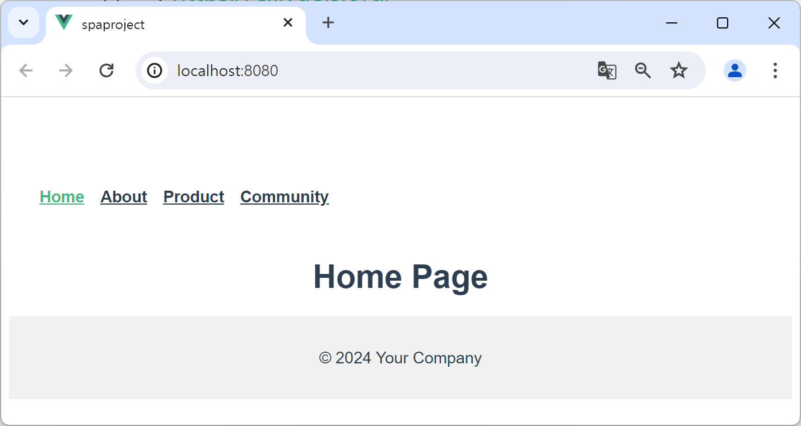

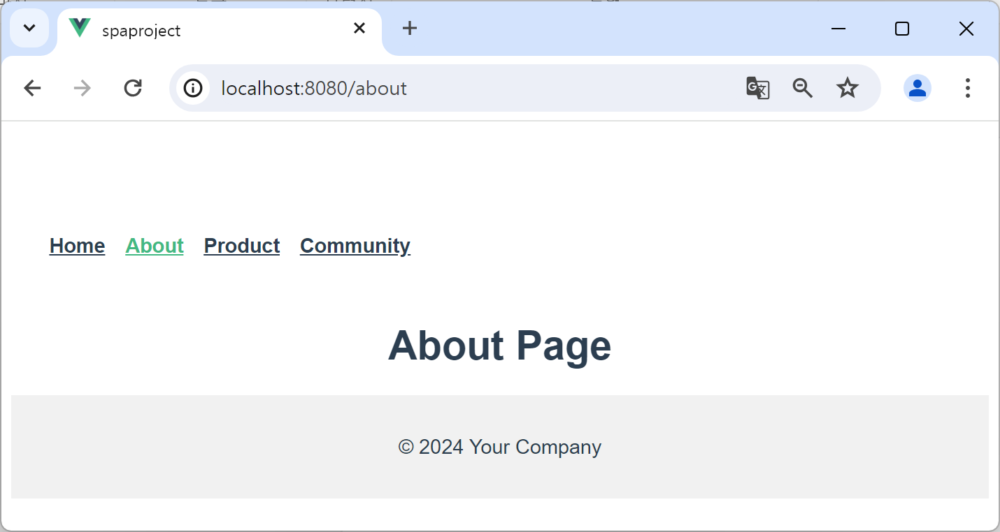

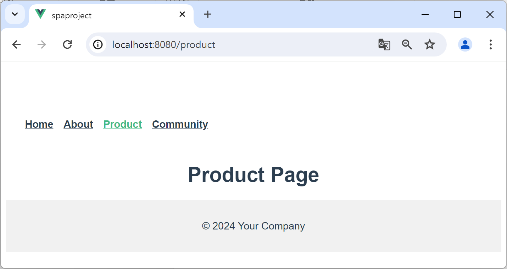

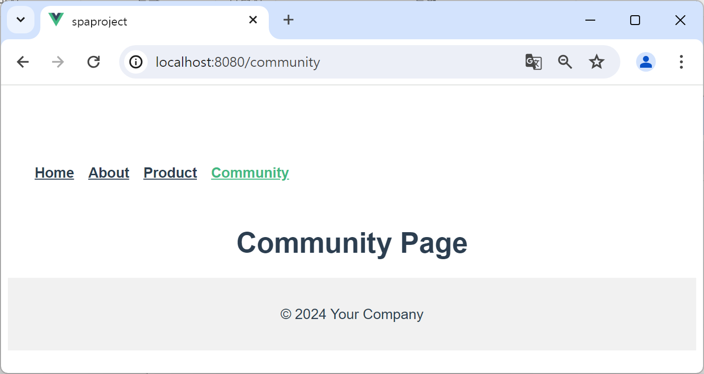

<br><br>

### 5-1-4. 여러 페이지 애플리케이션의 라우팅

#### 5-1-4-1. 흐름과 개념:

1. 여러 페이지 애플리케이션은 SPA와 비슷하지만, 애플리케이션의 각 페이지에 대해 별도의 HTML 파일이 있습니다. 
2. 각 페이지는 SPA처럼 동작하지만, 서버에서 각 페이지에 대한 HTML을 반환합니다.

<br>

#### 5-1-4-2. 장/단점

**장점** 

검색 엔진 최적화가 가능합니다. 각 페이지의 URL에 대한 별도의 메타데이터가 있으므로 검색 엔진이 내용을 쉽게 색인화할 수 있습니다. 또한, 초기 로딩 시간이 단일 페이지 애플리케이션에 비해 빠를 수 있습니다.

<br>

**단점** 

페이지 간의 전환 시 새로 고침이 발생하므로 사용자 경험이 덜 부드러울 수 있습니다.

<br><br>

#### 5-1-4-3. 애플리케이션 작성 실습

**MPA 프로젝트 생성**

```shell
D:\gitRepository\vuejs\study05>vue create mpaproject

Vue CLI v5.0.8
? Please pick a preset: Manually select features
? Check the features needed for your project: (Press <space> to select, <a> to toggle all, <i> to invert selection, and
<enter> to proceed)
 (*) Babel
 (*) TypeScript
 ( ) Progressive Web App (PWA) Support
 (*) Router
>(*) Vuex
 ( ) CSS Pre-processors
 ( ) Linter / Formatter
 ( ) Unit Testing
 ( ) E2E Testing
```

<br>

**프로젝트 구조도**

```lua
mpaproject/
├── node_modules/
├── public/
│   ├── index.html
│   ├── about.html
│   ├── community.html
│   ├── product.html
│   └── favicon.ico
├── src/
│   ├── assets/
│   ├── components/
│   │   ├── Footer.vue
│   │   └── Header.vue
│   ├── model/
│   │   └── index.ts
│   ├── store/
│   │   ├── actions.ts
│   │   ├── index.ts
│   │   ├── mutations.ts
│   │   └── state.ts
│   ├── pages/
│   │   ├── about.ts
│   │   ├── community.ts
│   │   ├── home.ts
│   │   └── product.ts
│   ├── views/
│   │   ├── AboutView.vue
│   │   ├── CommunityView.vue
│   │   ├── HomeView.vue
│   │   └── ProductView.vue
│   ├── main.ts
│   └── shims-vue.d.ts
├── babel.config.js
├── package-lock.json
├── package.json
├── tsconfig.json
└── vue.config.js
```

<br>

**각 파일 및 폴더의 설명**

public/: 각 페이지의 HTML 파일을 포함.
  index.html: 홈 페이지 HTML 파일.
  about.html: 어바웃 페이지 HTML 파일.
  community.html: 커뮤니티 페이지 HTML 파일.
  product.html: 제품 페이지 HTML 파일.
  favicon.ico: 웹사이트의 파비콘.
src/: 소스 코드가 위치하는 디렉토리.
assets/: 이미지, 폰트, 스타일 등 정적 자산.
components/: 재사용 가능한 Vue 컴포넌트.
model/: TypeScript 인터페이스 및 모델 정의.
store/: Vuex 상태 관리 파일.
pages/: 각 페이지의 진입점 파일.
  about.ts: 어바웃 페이지 진입점.
  community.ts: 커뮤니티 페이지 진입점.
  home.ts: 홈 페이지 진입점.
  product.ts: 제품 페이지 진입점.
views/: 페이지 컴포넌트.
main.ts: 공통 로직이 있는 메인 파일.
shims-vue.d.ts: TypeScript가 .vue 파일을 인식할 수 있도록 도와주는 파일.
babel.config.js: Babel 설정 파일.
package-lock.json: 설치된 정확한 의존성 트리를 보장하는 파일.
package.json: 프로젝트 메타데이터 및 의존성 관리 파일.
tsconfig.json: TypeScript 설정 파일.
vue.config.js: Vue CLI 프로젝트 설정 파일.

<br>

**01. package.json**

```json
{
  "name": "mpaproject",
  "version": "0.1.0",
  "private": true,
  "scripts": {
    "serve": "vue-cli-service serve",
    "build": "vue-cli-service build"
  },
  "dependencies": {
    "core-js": "^3.8.3",
    "vue": "^3.2.13",
    "vue-router": "^4.0.3",
    "vuex": "^4.0.0"
  },
  "devDependencies": {
    "@vue/cli-plugin-babel": "~5.0.0",
    "@vue/cli-plugin-router": "~5.0.0",
    "@vue/cli-plugin-typescript": "~5.0.0",
    "@vue/cli-plugin-vuex": "~5.0.0",
    "@vue/cli-service": "~5.0.0",
    "typescript": "~4.5.5"
  },
  "browserslist": [
    "> 1%",
    "last 2 versions",
    "not dead",
    "not ie 11"
  ]
}
```

<br>

**02. babel.config.js**

```javascript
module.exports = {
  presets: [
    '@vue/cli-plugin-babel/preset'
  ]
}
```

<br>

**03. tsconfig.json**

```json
{
  "compilerOptions": {
    "target": "esnext",
    "module": "esnext",
    "strict": true,
    "jsx": "preserve",
    "importHelpers": true,
    "moduleResolution": "node",
    "skipLibCheck": true,
    "esModuleInterop": true,
    "allowSyntheticDefaultImports": true,
    "experimentalDecorators": true,
    "sourceMap": true,
    "baseUrl": ".",
    "paths": {
      "@/*": [
        "src/*"
      ]
    },
    "lib": [
      "esnext",
      "dom"
    ]
  },
  "include": [
    "src/**/*.ts",
    "src/**/*.d.ts",
    "src/**/*.tsx",
    "src/**/*.vue"
  ],
  "exclude": [
    "node_modules"
  ]
}
```

<br>

**04. vue.config.js**

```javascript
module.exports = {
  pages: {
    index: {
      entry: 'src/pages/home.ts',
      template: 'public/index.html',
      filename: 'index.html',
      title: 'Home'
    },
    about: {
      entry: 'src/pages/about.ts',
      template: 'public/about.html',
      filename: 'about.html',
      title: 'About'
    },
    community: {
      entry: 'src/pages/community.ts',
      template: 'public/community.html',
      filename: 'community.html',
      title: 'Community'
    },
    product: {
      entry: 'src/pages/product.ts',
      template: 'public/product.html',
      filename: 'product.html',
      title: 'Product'
    }
  },
  configureWebpack: {
    devtool: 'source-map'
  }
}
```

<br>

**05. public/index.html**

```html
<!DOCTYPE html>
<html lang="en">
<head>
  <meta charset="UTF-8">
  <meta name="viewport" content="width=device-width, initial-scale=1.0">
  <title>Home</title>
</head>
<body>
  <div id="app"></div>
  <script src="/js/home.js"></script>
</body>
</html>
```

<br>

**06. public/about.html**

```html
<!DOCTYPE html>
<html lang="en">
<head>
  <meta charset="UTF-8">
  <meta name="viewport" content="width=device-width, initial-scale=1.0">
  <title>About</title>
</head>
<body>
  <div id="app"></div>
  <script src="/js/about.js"></script>
</body>
</html>
```

<br>

**07. public/community.html**

```html
<!DOCTYPE html>
<html lang="en">
<head>
  <meta charset="UTF-8">
  <meta name="viewport" content="width=device-width, initial-scale=1.0">
  <title>Community</title>
</head>
<body>
  <div id="app"></div>
  <script src="/js/community.js"></script>
</body>
</html>
```

<br>

**08. public/product.html**

```html
<!DOCTYPE html>
<html lang="en">
<head>
  <meta charset="UTF-8">
  <meta name="viewport" content="width=device-width, initial-scale=1.0">
  <title>Product</title>
</head>
<body>
  <div id="app"></div>
  <script src="/js/product.js"></script>
</body>
</html>
```

<br>

**09. src/main.ts**

```typescript
import { createApp } from 'vue'
import store from './store'
import Header from './components/Header.vue'
import Footer from './components/Footer.vue'

export function initApp(component: any) {
  const app = createApp(component)
  app.component('Header', Header)
  app.component('Footer', Footer)
  app.use(store)
  app.mount('#app')
}
```

<br>

**10. src/pages/home.ts**

```typescript
import { initApp } from '../main'
import HomeView from '../views/HomeView.vue'

initApp(HomeView)
```

<br>

**11. src/pages/about.ts**

```typescript
import { initApp } from '../main'
import AboutView from '../views/AboutView.vue'

initApp(AboutView)
```

<br>

**12. src/pages/community.ts**

```typescript
import { initApp } from '../main'
import CommunityView from '../views/CommunityView.vue'

initApp(CommunityView)
```

<br>

**13. src/pages/product.ts**

```typescript
import { initApp } from '../main'
import ProductView from '../views/ProductView.vue'

initApp(ProductView)
```

<br>

**14. src/views/HomeView.vue**

```vue
<template>
  <div>
    <Header />
    <h1>Home</h1>
    <Footer />
  </div>
</template>

<script lang="ts">
import { defineComponent } from 'vue'

export default defineComponent({
  name: 'HomeView'
})
</script>

<style scoped>
/* Add your styles here */
</style>
```

<br>

**15. src/views/AboutView.vue**

```vue
<template>
  <div>
    <Header />
    <h1>About</h1>
    <Footer />
  </div>
</template>

<script lang="ts">
import { defineComponent } from 'vue'

export default defineComponent({
  name: 'AboutView'
})
</script>

<style scoped>
/* Add your styles here */
</style>
```

<br>

**16. src/views/CommunityView.vue**

```vue
<template>
  <div>
    <Header />
    <h1>Community</h1>
    <Footer />
  </div>
</template>

<script lang="ts">
import { defineComponent } from 'vue'

export default defineComponent({
  name: 'CommunityView'
})
</script>

<style scoped>
/* Add your styles here */
</style>
```

<br>

**17. src/views/ProductView.vue**

```vue
<template>
  <div>
    <Header />
    <h1>Product</h1>
    <Footer />
  </div>
</template>

<script lang="ts">
import { defineComponent } from 'vue'

export default defineComponent({
  name: 'ProductView'
})
</script>

<style scoped>
/* Add your styles here */
</style>
```

<br>

**18. src/store/state.ts**

```typescript
import { Product } from '@/model'

export interface State {
  products: Product[]
}

export default {
  products: []
} as State
```

<br>

**19. src/store/mutations.ts**

```typescript
import { State } from './state'
import { Product } from '@/model'

export default {
  setProducts(state: State, products: Product[]) {
    state.products = products
  }
}
```

<br>

**20. src/store/actions.ts**

```typescript
import { ActionContext } from 'vuex'
import { State } from './state'
import { Product } from '@/model'

export default {
  fetchProducts({ commit }: ActionContext<State, State>) {
    const products: Product[] = [
      { id: 1, name: 'Product A', price: 100 },
      { id: 2, name: 'Product B', price: 200 }
    ]
    commit('setProducts', products)
  }
}
```

<br>

**21. src/store/index.ts**

```typescript
import { createStore } from 'vuex'
import state from './state'
import mutations from './mutations'
import actions from './actions'

export default createStore({
  state,
  mutations,
  actions
})
```

<br>

**22. src/model/index.ts**

```typescript
export interface Product {
  id: number;
  name: string;
  price: number;
}
```

<br>

**23. src/components/Header.vue**

```vue
<template>
  <header>
    <nav>
      <ul>
        <li><a href="/">Home</a></li>
        <li><a href="/about.html">About</a></li>
        <li><a href="/community.html">Community</a></li>
        <li><a href="/product.html">Product</a></li>
      </ul>
    </nav>
  </header>
</template>

<script lang="ts">
import { defineComponent } from 'vue'

export default defineComponent({
  name: 'Header'
})
</script>

<style scoped>
nav ul {
  list-style: none;
  display: flex;
}
nav ul li {
  margin-right: 1rem;
}
</style>
```

<br>

**24. src/components/Footer.vue**

```vue
<template>
  <footer>
    <p>&copy; 2024 My Company</p>
  </footer>
</template>

<script lang="ts">
import { defineComponent } from 'vue'

export default defineComponent({
  name: 'Footer'
})
</script>

<style scoped>
footer {
  text-align: center;
  margin-top: 2rem;
}
</style>
```

<br>

**25. src/shims-vue.d.ts**

```typescript
declare module '*.vue' {
  import { DefineComponent } from 'vue'
  const component: DefineComponent<{}, {}, any>
  export default component
}
```

- 각 페이지별로 별도의 HTML 파일을 가지고 있으며, 서버 측에서 라우팅을 처리할 수 있습니다.

<br>

**애플리케이션 실행**

```shell
D:\gitRepository\vuejs\study05\mpaproject>npm run serve

> mpaproject@0.1.0 serve
> vue-cli-service serve

 INFO  Starting development server...

 DONE  Compiled successfully in 1884ms                                                                      오후 4:46:49

  App running at:
  - Local:   http://localhost:8080/
  - Network: http://192.168.0.9:8080/

  Note that the development build is not optimized.
  To create a production build, run npm run build.

Issues checking in progress...
No issues found.
```

<br>


**프로젝트 브라우저에서 열기**

1. 브라우저의 주소 입력줄에 `http://localhost:8080/` 을 입력한다.
2. 나타난 화면에서 Home / About / Product / Community 를 각 각 클릭해본다.

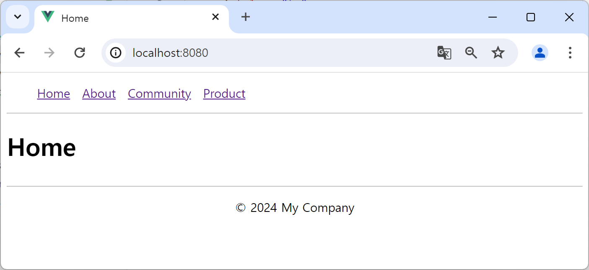

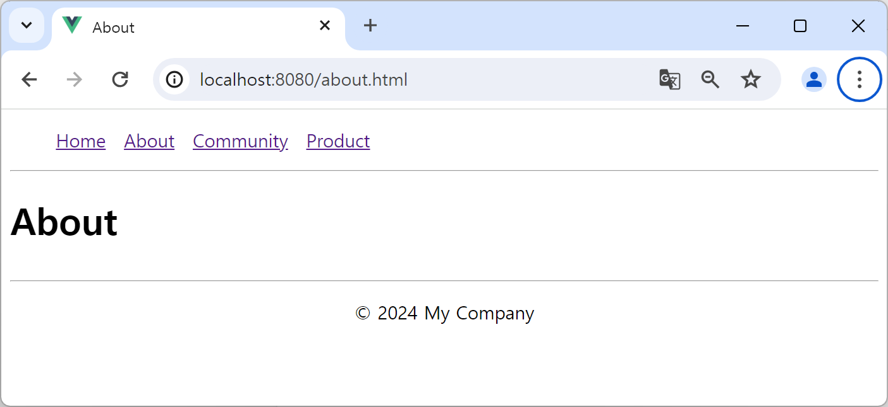

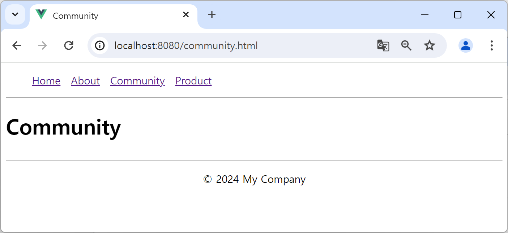

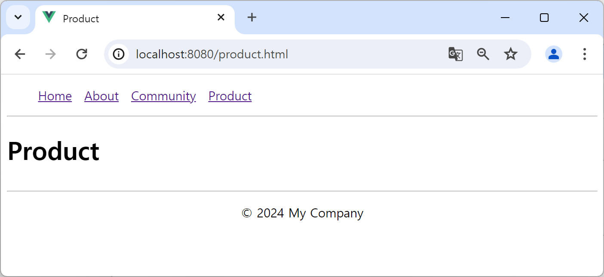

<br><br>

## 5-2. Vue Router의 기본 사용

### 5-2-1. Router의 사용 프로세스

1. 라우터 생성: Vue Router를 사용하기 위해 먼저 라우터를 생성해야 합니다. createRouter 함수를 사용하여 라우터를 생성합니다.
2. 라우트 정의: 라우트는 경로와 해당 경로에 대한 컴포넌트를 매핑합니다. 라우트는 routes 배열에 정의되며, 각 라우트는 path와 component 속성을 포함합니다.
3. 라우터 사용: 라우터를 애플리케이션에 적용하여 현재 경로에 대한 컴포넌트를 렌더링하고, 경로 간에 이동할 수 있습니다.

- Vue Router를 사용하면 Vue.js 애플리케이션에서 페이지 네비게이션을 관리할 수 있습니다. 라우터를 생성하고 라우트를 정의하여 각 경로에 해당하는 컴포넌트를 매핑합니다. 그런 다음 라우터를 애플리케이션에 적용하여 현재 경로에 대한 컴포넌트를 동적으로 렌더링하고, 사용자가 경로 간에 이동할 수 있습니다.

<br>

**예시 코드**

```typescript
// main.ts
import { createApp } from 'vue';
import { createRouter, createWebHistory } from 'vue-router';
import App from './App.vue';
import Home from './views/Home.vue';
import About from './views/About.vue';
import Product from './views/Product.vue';
import Community from './views/Community.vue';

const routes = [
  { path: '/', component: Home },
  { path: '/about', component: About },
  { path: '/product', component: Product },
  { path: '/community', component: Community }
];

const router = createRouter({
  history: createWebHistory(),
  routes
});

const app = createApp(App);
app.use(router);
app.mount('#app');
```

```html
<!-- App.vue -->
<template>
  <div id="app">
    <router-link to="/">Home</router-link>
    <router-link to="/about">About</router-link>
    <router-link to="/product">Product</router-link>
    <router-link to="/community">Community</router-link>
    <router-view></router-view>
  </div>
</template>

<script>
export default {
  name: 'App'
};
</script>
```

- Vue Router를 사용하여 간단한 라우팅을 구현한 예시이며, createRouter 함수를 사용하여 라우터를 생성하고, createWebHistory 함수를 사용하여 HTML5 히스토리 모드를 설정합니다. 
- 다음은 라우트를 정의하고 라우터를 애플리케이션에 적용합니다. 컴포넌트 내에서 `<router-link>` 컴포넌트를 사용하여 다른 경로로 이동하고, `<router-view>` 컴포넌트를 사용하여 현재 경로에 해당하는 컴포넌트를 동적으로 렌더링합니다.

<br><br>

## 5-3. Vue Router의 속성과 메소드

**라우터 속성**

| 이름            | 기본 문법                                | 설명                                           | 예시 코드                                                     |
|----------------|-----------------------------------------|------------------------------------------------|---------------------------------------------------------------|
| history        | `createWebHistory()` 또는 `createWebHashHistory()` | HTML5 히스토리 API 또는 해시 모드를 사용하여 라우터 히스토리를 관리합니다. | ```typescript createRouter({ history: createWebHistory(), routes })``` |
| currentRoute   | `$route`                                | 현재 활성화된 라우트에 대한 정보를 제공합니다.        | ```typescript const currentRoute = useRoute()```              |

<br>

**라우터 메소드**

코드 복사
| 이름            | 기본 문법                                | 설명                                           | 예시 코드                                                     |
|----------------|-----------------------------------------|------------------------------------------------|---------------------------------------------------------------|
| push           | `$router.push(location: RawLocation)`   | 주어진 경로로 이동하고 히스토리 스택에 새 항목을 추가합니다. | ```typescript router.push('/about')```                         |
| replace        | `$router.replace(location: RawLocation)`| 현재 경로를 주어진 경로로 교체하고 히스토리 스택을 수정하지 않습니다. | ```typescript router.replace('/about')```                      |
| go             | `$router.go(n: number)`                  | 히스토리 스택에서 n번째 이동합니다.               | ```typescript router.go(-1)```                                |
| back           | `$router.back()`                        | 뒤로 이동합니다.                               | ```typescript router.back()```                                |
| forward        | `$router.forward()`                     | 앞으로 이동합니다.                              | ```typescript router.forward()```                             |
| beforeEach     | `router.beforeEach(guard: NavigationGuard)` | 라우트 이동 전에 실행할 전역 가드를 등록합니다.         | ```typescript router.beforeEach((to, from) => { /* logic */ })``` |
| afterEach      | `router.afterEach(hook: (to: Route, from: Route) => void)` | 라우트 이동 후에 실행할 후킹 함수를 등록합니다.        | ```typescript router.afterEach((to, from) => { /* logic */ })``` |

<br>

### 5-3-1. Vue Router 를 활용한 애플리케이션 제작 실습

**프로젝트 생성**

```shell
D:\gitRepository\vuejs\study05>vue create vuerouterproject

Vue CLI v5.0.8
? Please pick a preset: Manually select features
? Check the features needed for your project: Babel, TS, Router, Vuex
? Choose a version of Vue.js that you want to start the project with 3.x
? Use class-style component syntax? No
? Use Babel alongside TypeScript (required for modern mode, auto-detected polyfills, transpiling JSX)? Yes
? Use history mode for router? (Requires proper server setup for index fallback in production) Yes
? Where do you prefer placing config for Babel, ESLint, etc.? In package.json
? Save this as a preset for future projects? No
```

<br>

**프로젝트 구조**

```lua
vuerouterproject/
├── node_modules/
├── public/
│   ├── index.html
│   └── favicon.ico
├── src/
│   ├── assets/
│   ├── components/
│   │   ├── Footer.vue
│   │   └── Header.vue
│   ├── model/
│   │   └── index.ts
│   ├── store/
│   │   ├── actions.ts
│   │   ├── index.ts
│   │   ├── mutations.ts
│   │   └── state.ts
│   ├── views/
│   │   ├── About.vue
│   │   ├── Community.vue
│   │   ├── Home.vue
│   │   └── Product.vue
│   ├── App.vue
│   ├── main.ts
│   └── shims-vue.d.ts
├── babel.config.js
├── package-lock.json
├── package.json
├── tsconfig.json
└── vue.config.js
```

<br>

**01. package.json**

```json
{
  "name": "vuerouterproject",
  "version": "0.1.0",
  "private": true,
  "scripts": {
    "serve": "vue-cli-service serve",
    "build": "vue-cli-service build"
  },
  "dependencies": {
    "core-js": "^3.8.3",
    "vue": "^3.2.13",
    "vue-router": "^4.0.3",
    "vuex": "^4.0.0"
  },
  "devDependencies": {
    "@vue/cli-plugin-babel": "~5.0.0",
    "@vue/cli-plugin-router": "~5.0.0",
    "@vue/cli-plugin-typescript": "~5.0.0",
    "@vue/cli-plugin-vuex": "~5.0.0",
    "@vue/cli-service": "~5.0.0",
    "typescript": "~4.5.5"
  },
  "browserslist": [
    "> 1%",
    "last 2 versions",
    "not dead",
    "not ie 11"
  ]
}
```

<br>

**02. babel.config.js**

```javascript
module.exports = {
  presets: [
    '@vue/cli-plugin-babel/preset'
  ]
};
```

<br>

**03. tsconfig.json**

```json
{
  "compilerOptions": {
    "target": "esnext",
    "module": "esnext",
    "strict": true,
    "jsx": "preserve",
    "importHelpers": true,
    "moduleResolution": "node",
    "skipLibCheck": true,
    "esModuleInterop": true,
    "allowSyntheticDefaultImports": true,
    "experimentalDecorators": true,
    "sourceMap": true,
    "baseUrl": ".",
    "paths": {
      "@/*": [
        "src/*"
      ]
    },
    "lib": [
      "esnext",
      "dom"
    ]
  },
  "include": [
    "src/**/*.ts",
    "src/**/*.d.ts",
    "src/**/*.tsx",
    "src/**/*.vue"
  ],
  "exclude": [
    "node_modules"
  ]
}
```

<br>

**04. vue.config.js**

```javascript
module.exports = {
  configureWebpack: {
    devtool: 'source-map'
  }
};
```

<br>

**05. public/index.html**

```html
<!DOCTYPE html>
<html lang="en">
<head>
  <meta charset="UTF-8">
  <meta name="viewport" content="width=device-width, initial-scale=1.0">
  <title>Vue Router Project</title>
</head>
<body>
  <div id="app"></div>
</body>
</html>
```

<br>

**06. src/main.ts**

```typescript
import { createApp } from 'vue';
import { createRouter, createWebHistory } from 'vue-router';
import App from './App.vue';
import Home from './views/Home.vue';
import About from './views/About.vue';
import Product from './views/Product.vue';
import Community from './views/Community.vue';

const routes = [
  { path: '/', component: Home },
  { path: '/about', component: About },
  { path: '/product', component: Product },
  { path: '/community', component: Community }
];

const router = createRouter({
  history: createWebHistory(),
  routes
});

const app = createApp(App);
app.use(router);
app.mount('#app');
```

<br>

**07. src/App.vue**

```vue
<template>
  <div id="app">
    <header>
      <router-link to="/">Home</router-link>
      <router-link to="/about">About</router-link>
      <router-link to="/product">Product</router-link>
      <router-link to="/community">Community</router-link>
    </header>
    <router-view></router-view>
  </div>
</template>

<script lang="ts">
import { defineComponent } from 'vue';

export default defineComponent({
  name: 'App'
});
</script>

<style scoped>
header {
  display: flex;
  justify-content: space-around;
  background-color: #f8f9fa;
  padding: 1rem;
}
header a {
  text-decoration: none;
  color: #42b983;
}
</style>
```

<br>

**08. src/views/Home.vue**

```vue
<template>
  <div>
    <h1>Home</h1>
    <Footer />
  </div>
</template>

<script lang="ts">
import { defineComponent } from 'vue';
import Header from '../components/Header.vue';
import Footer from '../components/Footer.vue';

export default defineComponent({
  name: 'Home',
  components: {
    Header,
    Footer
  }
});
</script>

<style scoped>
/* Add your styles here */
</style>
```

<br>

**09. src/views/About.vue**

```vue
<template>
  <div>
    <h1>About</h1>
    <Footer />
  </div>
</template>

<script lang="ts">
import { defineComponent } from 'vue';
import Header from '../components/Header.vue';
import Footer from '../components/Footer.vue';

export default defineComponent({
  name: 'About',
  components: {
    Header,
    Footer
  }
});
</script>

<style scoped>
/* Add your styles here */
</style>
```

<br>

**10. src/views/Product.vue**

```vue
<template>
  <div>
    <h1>Product</h1>
    <Footer />
  </div>
</template>

<script lang="ts">
import { defineComponent } from 'vue';
import Header from '../components/Header.vue';
import Footer from '../components/Footer.vue';

export default defineComponent({
  name: 'Product',
  components: {
    Header,
    Footer
  }
});
</script>

<style scoped>
/* Add your styles here */
</style>
```

<br>

**11. src/views/Community.vue**

```vue
<template>
  <div>
    <h1>Community</h1>
    <Footer />
  </div>
</template>

<script lang="ts">
import { defineComponent } from 'vue';
import Header from '../components/Header.vue';
import Footer from '../components/Footer.vue';

export default defineComponent({
  name: 'Community',
  components: {
    Header,
    Footer
  }
});
</script>

<style scoped>
/* Add your styles here */
</style>
```

<br>

**12. src/components/Header.vue**

```vue
<template>
  <header>
    <nav>
      <ul>
        <li><router-link to="/">Home</router-link></li>
        <li><router-link to="/about">About</router-link></li>
        <li><router-link to="/product">Product</router-link></li>
        <li><router-link to="/community">Community</router-link></li>
      </ul>
    </nav>
  </header>
</template>

<script lang="ts">
import { defineComponent } from 'vue';

export default defineComponent({
  name: 'Header'
});
</script>

<style scoped>
nav ul {
  list-style: none;
  display: flex;
  justify-content: space-around;
  padding: 0;
}
nav ul li {
  margin-right: 1rem;
}
nav ul li a {
  text-decoration: none;
  color: #42b983;
}
</style>
```

<br>

**13. src/components/Footer.vue**

```vue
<template>
  <footer>
    <p>&copy; 2024 My Company</p>
  </footer>
</template>

<script lang="ts">
import { defineComponent } from 'vue';

export default defineComponent({
  name: 'Footer'
});
</script>

<style scoped>
footer {
  text-align: center;
  margin-top: 2rem;
}
</style>
```

<br>

**14. src/store/state.ts**

```typescript
import { Product } from '@/model';

export interface State {
  products: Product[];
}

export default {
  products: []
} as State;
```

<br>

**15. src/store/mutations.ts**

```typescript
import { State } from './state';
import { Product } from '@/model';

export default {
  setProducts(state: State, products: Product[]) {
    state.products = products;
  }
};
```

<br>

**16. src/store/actions.ts**

```typescript
import { ActionContext } from 'vuex';
import { State } from './state';
import { Product } from '@/model';

export default {
  fetchProducts({ commit }: ActionContext<State, State>) {
    const products: Product[] = [
      { id: 1, name: 'Product A', price: 100 },
      { id: 2, name: 'Product B', price: 200 }
    ];
    commit('setProducts', products);
  }
};
```

<br>

**17. src/store/index.ts**

```typescript
import { createStore } from 'vuex';
import state from './state';
import mutations from './mutations';
import actions from './actions';

export default createStore({
  state,
  mutations,
  actions
});
```

<br>

**18. src/model/index.ts**

```typescript
export interface Product {
  id: number;
  name: string;
  price: number;
}
```

<br>

**19. src/shims-vue.d.ts**

```typescript
declare module '*.vue' {
  import { DefineComponent } from 'vue';
  const component: DefineComponent<{}, {}, any>;
  export default component;
}
```

<br>

**애플리케이션 실행**

```shell
D:\gitRepository\vuejs\study05\vuerouterproject>npm run serve

> mpaproject@0.1.0 serve
> vue-cli-service serve

 INFO  Starting development server...

 DONE  Compiled successfully in 1884ms                                                                      오후 4:46:49

  App running at:
  - Local:   http://localhost:8080/
  - Network: http://192.168.0.9:8080/

  Note that the development build is not optimized.
  To create a production build, run npm run build.

Issues checking in progress...
No issues found.
```

<br>


**프로젝트 브라우저에서 열기**

1. 브라우저의 주소 입력줄에 `http://localhost:8080/` 을 입력한다.
2. 나타난 화면에서 Home / About / Product / Community 를 각 각 클릭해본다.

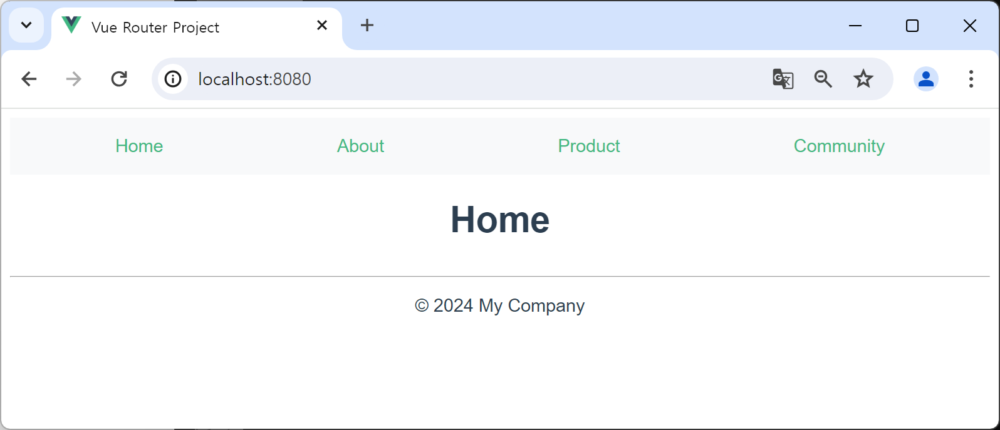

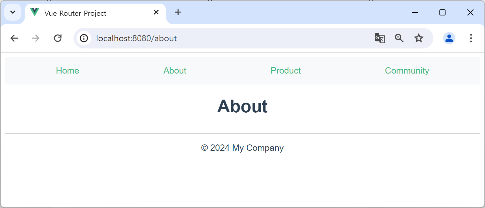

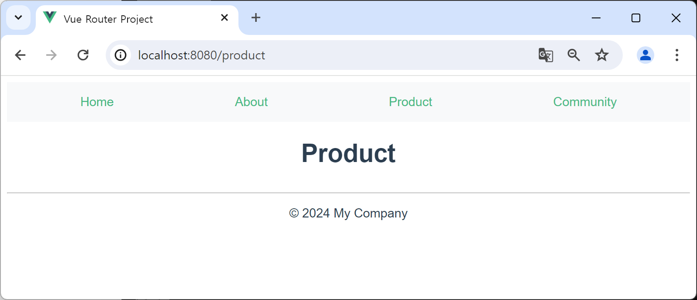

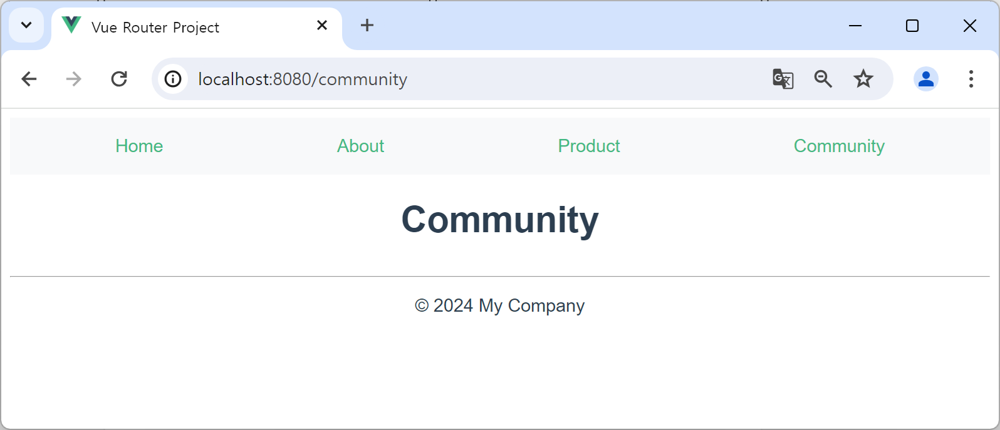

<br><br>

## 5-4. Dynamic Route Matching(동적 라우트 매칭)

- 동적 라우트 매칭은 라우터의 경로에 있는 특정 부분을 매개변수로 취급하여 URL을 동적으로 처리합니다. 예를 들어, 사용자의 ID에 따라 사용자 프로필 페이지를 동적으로 렌더링하는 경우가 있습니다. 이렇게 동적으로 변하는 매개변수를 효과적으로 처리하고 렌더링하기 위해 Vue Router에서는 동적 라우트 매칭을 지원합니다.

<br>

### 5-4-1. 동적 라우트 매칭 관련 메소드:

- Vue Router에서는 동적 라우트 매칭을 위해 $route 객체의 params 속성을 사용합니다. 이 속성은 현재 라우트에 매칭된 동적 세그먼트의 매개변수를 포함합니다.

**$route.params**	

현재 라우트에 매칭된 동적 세그먼트의 매개변수를 포함합니다.	

```typescript 
const userId = $route.params.userId
```

<br>

### 5-4-2. 동적 라우트 매칭 예시 코드

```javascript
// Vue Router 설정
import { createRouter, createWebHistory } from 'vue-router';
import UserProfile from './views/UserProfile.vue';

const routes = [
  { path: '/user/:userId', component: UserProfile }
];

const router = createRouter({
  history: createWebHistory(),
  routes
});

export default router;
```

```html
<!-- UserProfile.vue -->
<template>
  <div>
    <h2>User Profile</h2>
    <p>User ID: {{ $route.params.userId }}</p>
  </div>
</template>

<script>
export default {
  name: 'UserProfile'
};
</script>
```

위의 예시 코드에서는 `/user/:userId`와 같은 형태의 동적 경로를 정의하여 사용자 프로필 페이지를 렌더링합니다. 해당 경로에서 userId는 동적으로 변하는 매개변수를 나타냅니다. 이를 `$route.params.userId`를 통해 접근하여 현재 사용자의 ID를 가져올 수 있습니다.

<br><br>

### 5-4-3. 동작 라우트 매칭의 애플리케이션 제작 실습

**프로젝트 생성**

```shell
D:\gitRepository\vuejs\study05>vue create dynamicproject

Vue CLI v5.0.8
? Please pick a preset: Manually select features
? Check the features needed for your project: Babel, TS, Router, Vuex
? Choose a version of Vue.js that you want to start the project with 3.x
? Use class-style component syntax? No
? Use Babel alongside TypeScript (required for modern mode, auto-detected polyfills, transpiling JSX)? Yes
? Use history mode for router? (Requires proper server setup for index fallback in production) Yes
? Where do you prefer placing config for Babel, ESLint, etc.? In package.json
? Save this as a preset for future projects? No
```

<br>

**프로젝트 구조**

```lua
dynamicproject/
├── node_modules/
├── public/
│   └── index.html
├── src/
│   ├── assets/
│   ├── components/
│   │   ├── Header.vue
│   │   └── Footer.vue
│   ├── model/
│   │   └── index.ts
│   ├── router/
│   │   └── index.ts
│   ├── store/
│   │   ├── actions.ts
│   │   ├── mutations.ts
│   │   └── index.ts
│   ├── views/
│   │   ├── AboutView.vue
│   │   ├── CommunityView.vue
│   │   ├── HomeView.vue
│   │   ├── ProductView.vue
│   │   └── NotFound.vue
│   ├── App.vue
│   ├── main.ts
│   ├── shims-vue.d.ts
│   ├── types/
│   │   └── index.d.ts
├── babel.config.js
├── package.json
├── tsconfig.json
└── vue.config.js
```

<br>

**01. package.json**

```json
{
  "name": "dynamicproject",
  "version": "0.1.0",
  "private": true,
  "scripts": {
    "serve": "vue-cli-service serve",
    "build": "vue-cli-service build"
  },
  "dependencies": {
    "core-js": "^3.8.3",
    "vue": "^3.2.13",
    "vue-router": "^4.0.3",
    "vuex": "^4.0.0"
  },
  "devDependencies": {
    "@vue/cli-plugin-babel": "~5.0.0",
    "@vue/cli-plugin-router": "~5.0.0",
    "@vue/cli-plugin-typescript": "~5.0.0",
    "@vue/cli-plugin-vuex": "~5.0.0",
    "@vue/cli-service": "~5.0.0",
    "typescript": "~4.5.5"
  },
  "browserslist": [
    "> 1%",
    "last 2 versions",
    "not dead",
    "not ie 11"
  ]
}
```

<br>

**02. babel.config.js**

```javascript
// babel.config.js
module.exports = {
  presets: [
    '@vue/cli-plugin-babel/preset'
  ]
};
```

<br>

**03. tsconfig.json**

```json
// tsconfig.json
{
  "compilerOptions": {
    "target": "esnext",
    "module": "esnext",
    "strict": true,
    "jsx": "preserve",
    "moduleResolution": "node",
    "resolveJsonModule": true,
    "esModuleInterop": true,
    "skipLibCheck": true,
    "forceConsistentCasingInFileNames": true,
    "noEmit": true,
    "baseUrl": ".",
    "paths": {
      "@/*": ["src/*"]
    }
  },
  "include": ["src/**/*.ts", "src/**/*.d.ts", "src/**/*.tsx", "src/**/*.vue"],
  "exclude": ["node_modules"]
}
```

<br>

**04. vue.config.js**

```javascript
module.exports = {
  configureWebpack: {
    devtool: 'source-map'
  }
};
```

<br>

**05. public/index.html**

```html
<!-- public/index.html -->
<!DOCTYPE html>
<html lang="en">
<head>
  <meta charset="utf-8">
  <meta name="viewport" content="width=device-width, initial-scale=1.0">
  <title>Dynamic Project</title>
</head>
<body>
  <div id="app"></div>
  <!-- built files will be auto injected -->
</body>
</html>
```

<br>

**06. src/App.vue**

```vue
<!-- src/App.vue -->
<template>
  <div id="app">
    <Header />
    <nav>
      <router-link to="/">Home</router-link>
      <router-link to="/about">About</router-link>
      <router-link to="/product/123">Product</router-link>
      <router-link to="/community/some-slug">Community</router-link>
    </nav>
    <router-view></router-view>
    <Footer />
  </div>
</template>

<script setup>
import Header from '@/components/Header.vue';
import Footer from '@/components/Footer.vue';
</script>

<style>
nav {
  display: flex;
  gap: 10px;
  margin-bottom: 20px;
}
</style>
```

<br>

**07. src/components/Header.vue**

```vue
<!-- src/components/Header.vue -->
<template>
  <header>
    <h1>Dynamic Project</h1>
  </header>
</template>

<script setup>
</script>

<style scoped>
header {
  background-color: #333;
  color: #fff;
  padding: 10px;
  text-align: center;
}
</style>
```

<br>

**08. src/components/Footer.vue**

```vue
<!-- src/components/Footer.vue -->
<template>
  <footer>
    <p>© 2024 My Company</p>
  </footer>
</template>

<script setup>
</script>

<style scoped>
footer {
  background-color: #333;
  color: #fff;
  padding: 10px;
  text-align: center;
}
</style>
```

<br>

**09. src/router/index.ts**

```typescript
// src/router/index.ts
import { createRouter, createWebHistory, RouteRecordRaw } from 'vue-router';
import HomeView from '@/views/HomeView.vue';
import AboutView from '@/views/AboutView.vue';
import ProductView from '@/views/ProductView.vue';
import CommunityView from '@/views/CommunityView.vue';
import NotFound from '@/views/NotFound.vue';

const routes: Array<RouteRecordRaw> = [
  { path: '/', name: 'Home', component: HomeView },
  { path: '/about', name: 'About', component: AboutView },
  { path: '/product/:id', name: 'Product', component: ProductView },
  { path: '/community/:slug', name: 'Community', component: CommunityView },
  { path: '/:catchAll(.*)', name: 'NotFound', component: NotFound }
];

const router = createRouter({
  history: createWebHistory(),
  routes
});

export default router;
```

<br>

**10. src/views/HomeView.vue**

```vue
<!-- src/views/HomeView.vue -->
<template>
  <div>
    <h1>Home</h1>
    <p>Welcome to the home page.</p>
  </div>
</template>

<script setup>
</script>

<style scoped>
h1 {
  color: #42b983;
}
</style>
```

<br>

**11. src/views/AboutView.vue**

```vue
<!-- src/views/AboutView.vue -->
<template>
  <div>
    <h1>About</h1>
    <p>This is the about page.</p>
  </div>
</template>

<script setup>
</script>

<style scoped>
h1 {
  color: #42b983;
}
</style>
```

<br>

**12. src/views/ProductView.vue**

```vue
<!-- src/views/ProductView.vue -->
<template>
  <div>
    <h1>Product</h1>
    <p>Product details for ID: {{ $route.params.id }}</p>
  </div>
</template>

<script setup>
</script>

<style scoped>
h1 {
  color: #42b983;
}
</style>
```

<br>

**13. src/views/CommunityView.vue**

```vue
<!-- src/views/CommunityView.vue -->
<template>
  <div>
    <h1>Community</h1>
    <p>Community details for slug: {{ $route.params.slug }}</p>
  </div>
</template>

<script setup>
</script>

<style scoped>
h1 {
  color: #42b983;
}
</style>
```

<br>

**14. src/views/NotFound.vue**

```vue
<!-- src/views/NotFound.vue -->
<template>
  <div>
    <h1>404 Not Found</h1>
    <p>Sorry, the page you are looking for does not exist.</p>
  </div>
</template>

<script setup>
</script>

<style scoped>
h1 {
  color: red;
}
</style>
```

<br>

**15. src/store/state.ts**

```typescript
import { Product } from '@/model';

export interface State {
  products: Product[];
}

export default {
  products: []
} as State;
```

<br>

**16. src/store/mutations.ts**

```typescript
import { State } from './state';
import { Product } from '@/model';

export default {
  setProducts(state: State, products: Product[]) {
    state.products = products;
  }
};
```

<br>

**17. src/store/actions.ts**

```typescript
import { ActionContext } from 'vuex';
import { State } from './state';
import { Product } from '@/model';

export default {
  fetchProducts({ commit }: ActionContext<State, State>) {
    const products: Product[] = [
      { id: 1, name: 'Product A', price: 100 },
      { id: 2, name: 'Product B', price: 200 }
    ];
    commit('setProducts', products);
  }
};
```

<br>

**18. src/store/index.ts**

```typescript
import { createStore } from 'vuex';
import state from './state';
import mutations from './mutations';
import actions from './actions';

export default createStore({
  state,
  mutations,
  actions
});
```

<br>

**19. src/model/index.ts**

```typescript
export interface Product {
  id: number;
  name: string;
  price: number;
}
```

<br>


**20. src/shims-vue.d.ts**

```typescript
declare module '*.vue' {
  import { DefineComponent } from 'vue';
  const component: DefineComponent<{}, {}, any>;
  export default component;
}
```

<br>

**애플리케이션 실행**

```shell
D:\gitRepository\vuejs\study05>cd dynamicproject

D:\gitRepository\vuejs\study05\dynamicproject>npm run serve

> dynamicproject@0.1.0 serve
> vue-cli-service serve

 INFO  Starting development server...

 DONE  Compiled successfully in 1838ms                                                                      오후 7:04:28

  App running at:
  - Local:   http://localhost:8080/
  - Network: http://192.168.0.9:8080/

  Note that the development build is not optimized.
  To create a production build, run npm run build.

Issues checking in progress...
No issues found.
```

<br>


**프로젝트 브라우저에서 열기**

1. 브라우저의 주소 입력줄에 `http://localhost:8080/` 을 입력한다.
2. 나타난 화면에서 Home / About / Product / Community 를 각 각 클릭해본다.


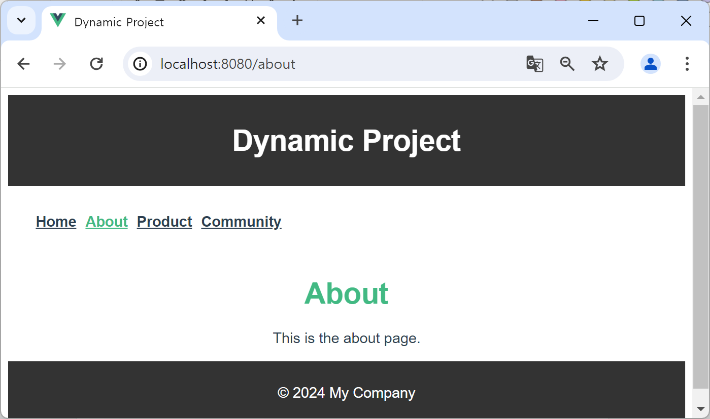

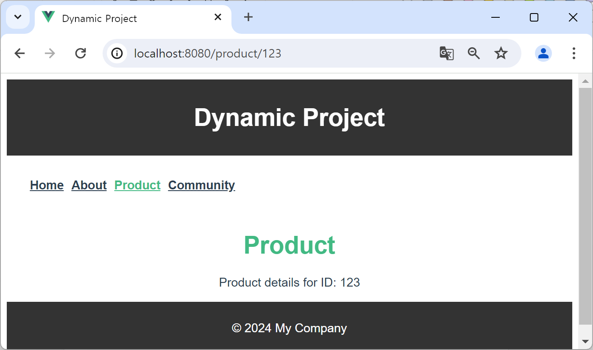

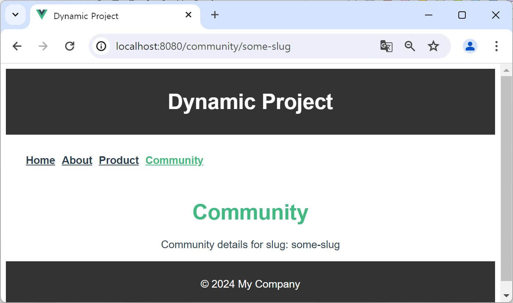

<br><br>


## 5-5. Nested Route(중첩 라우트)

- Nested Route(중첩 라우트)는 라우트가 중첩 구조를 가질 수 있도록 해줍니다. 
- Nested Route(중첩 라우트)를 통해 복잡한 애플리케이션에서 라우트 구성 요소를 계층 구조로 구성할 수 있으며, 부모-자식 관계의 라우트를 쉽게 정의할 수 있습니다.

<br>

### 5-5-1. 중첩 라우트의 개념

중첩 라우트는 URL 경로를 계층 구조로 정의하여 특정 URL 하위에 또 다른 URL을 정의하는 방식입니다. 이를 통해 부모 경로와 자식 경로가 명확하게 구분되며, 애플리케이션의 라우트 구조가 더 체계적으로 관리될 수 있습니다. 중첩 라우트를 사용하면 부모 컴포넌트 안에 자식 컴포넌트를 렌더링할 수 있습니다.

<br><br>

### 5-5-2. 중첩 라우트 매칭 관련 메소드

Vue Router에서는 중첩 라우트를 정의하기 위해 children 속성을 사용합니다. 이 속성은 자식 라우트를 정의하는 배열을 포함합니다. 자식 라우트는 부모 라우트의 경로를 기준으로 상대적으로 정의됩니다.

| 메소드 | 설명 | 예시 코드 |
|------------|----------------------------------------------------------|-------------------------------------------------------|
| children | 부모 라우트에 대한 자식 라우트를 정의하는 배열입니다. | ```javascript { path: '/parent', children: [{ path: 'child', component: ChildComponent }]``` } |
| router-view | 부모 컴포넌트에서 자식 컴포넌트를 렌더링하기 위해 사용됩니다. | ```html <router-view></router-view>``` |

<br><br>

### 5-5-3. 중첩 라우트 매칭 예시 코드

```javascript
// router/index.js
import { createRouter, createWebHistory } from 'vue-router';
import Home from '../views/Home.vue';
import Parent from '../views/Parent.vue';
import Child from '../views/Child.vue';

const routes = [
  { path: '/', component: Home },
  {
    path: '/parent',
    component: Parent,
    children: [
      {
        path: 'child',
        component: Child
      }
    ]
  }
];

const router = createRouter({
  history: createWebHistory(),
  routes
});

export default router;
```

1. path: '/parent' 경로를 정의하고 Parent 컴포넌트를 설정합니다.
2. children 속성을 사용하여 /parent/child 경로를 정의하고 Child 컴포넌트를 설정합니다.

<br>

```html
<!-- App.vue -->
<template>
  <div id="app">
    <router-link to="/">Home</router-link>
    <router-link to="/parent">Parent</router-link>
    <router-view></router-view>
  </div>
</template>

<script>
export default {
  name: 'App'
};
</script>
```

1. router-link를 사용하여 기본 홈 경로와 부모 경로로의 링크를 제공합니다.
2. router-view를 사용하여 현재 경로에 해당하는 컴포넌트를 렌더링합니다.

<br>

```html
<!-- Parent.vue -->
<template>
  <div>
    <h2>Parent Component</h2>
    <router-link to="child">Go to Child</router-link>
    <router-view></router-view>
  </div>
</template>

<script>
export default {
  name: 'Parent'
};
</script>
```

- 부모 컴포넌트로서, 자식 컴포넌트로의 링크를 제공하고 router-view를 사용하여 자식 컴포넌트를 렌더링합니다.

<br>

```html
<!-- Child.vue -->
<template>
  <div>
    <h3>Child Component</h3>
  </div>
</template>

<script>
export default {
  name: 'Child'
};
</script>
```

- 자식 컴포넌트로서, 부모 컴포넌트 내에서 렌더링됩니다.

<br>

- 중첩 라우트 매칭 방식으로 중첩 라우트를 정의하여 계층적인 라우팅 구조를 만들 수 있습니다. 
- router-view를 사용하여 부모 컴포넌트 내에서 자식 컴포넌트를 렌더링하며, 자식 라우트는 부모 라우트의 경로를 기준으로 상대적으로 정의됩니다.

<br><br>

### 5-5-4. 중첩 라우트 매칭 애플리케이션 제작

**프로젝트 생성**

```shell
D:\gitRepository\vuejs\study05>vue create nestedproject

Vue CLI v5.0.8
? Please pick a preset: Manually select features
? Check the features needed for your project: Babel, TS, Router, Vuex
? Choose a version of Vue.js that you want to start the project with 3.x
? Use class-style component syntax? No
? Use Babel alongside TypeScript (required for modern mode, auto-detected polyfills, transpiling JSX)? Yes
? Use history mode for router? (Requires proper server setup for index fallback in production) Yes
? Where do you prefer placing config for Babel, ESLint, etc.? In package.json
? Save this as a preset for future projects? No
```

<br>

**프로젝트 구조**

```lua
nestedproject/
├── node_modules/
├── public/
│   └── index.html
├── src/
│   ├── assets/
│   ├── components/
│   │   ├── Header.vue
│   │   └── Footer.vue
│   ├── model/
│   │   └── index.ts
│   ├── router/
│   │   └── index.ts
│   ├── store/
│   │   ├── actions.ts
│   │   ├── mutations.ts
│   │   ├── state.ts
│   │   └── index.ts
│   ├── views/
│   │   ├── About.vue
│   │   ├── Community.vue
│   │   ├── Home.vue
│   │   ├── Product.vue
│   │   └── ProductDetail.vue
│   ├── App.vue
│   ├── main.ts
│   ├── shims-vue.d.ts
│   └── types/
│       └── index.d.ts
├── babel.config.js
├── package.json
├── tsconfig.json
└── vue.config.js
```

<br>

**01. babel.config.js**

```javascript
// babel.config.js
module.exports = {
  presets: [
    '@vue/cli-plugin-babel/preset'
  ]
};
```

<br>

**02. tsconfig.json**

```json
// tsconfig.json
{
  "compilerOptions": {
    "target": "esnext",
    "module": "esnext",
    "strict": true,
    "jsx": "preserve",
    "moduleResolution": "node",
    "resolveJsonModule": true,
    "esModuleInterop": true,
    "skipLibCheck": true,
    "forceConsistentCasingInFileNames": true,
    "noEmit": true,
    "baseUrl": ".",
    "paths": {
      "@/*": ["src/*"]
    }
  },
  "include": ["src/**/*.ts", "src/**/*.d.ts", "src/**/*.tsx", "src/**/*.vue"],
  "exclude": ["node_modules"]
}
```

<br>

**03. vue.config.js**

```javascript
// vue.config.js
const { defineConfig } = require('@vue/cli-service')
module.exports = defineConfig({
  transpileDependencies: true
})
```

<br>

**04. public/index.html**

```html
<!DOCTYPE html>
<html lang="en">
<head>
  <meta charset="utf-8">
  <meta name="viewport" content="width=device-width, initial-scale=1.0">
  <title>Nested Project</title>
</head>
<body>
  <div id="app"></div>
  <!-- built files will be auto injected -->
</body>
</html>
```

<br>

**05. src/App.vue**

```vue
<template>
  <div id="app">
    <Header />
    <nav>
      <router-link to="/">Home</router-link>
      <router-link to="/about">About</router-link>
      <router-link to="/product">Product</router-link>
      <router-link to="/community">Community</router-link>
    </nav>
    <router-view></router-view>
    <Footer />
  </div>
</template>

<script setup>
import Header from '@/components/Header.vue';
import Footer from '@/components/Footer.vue';
</script>

<style>
nav {
  display: flex;
  gap: 10px;
  margin-bottom: 20px;
}
</style>
```

<br>

**06. src/main.ts**

```typescript
import { createApp } from 'vue';
import App from './App.vue';
import router from './router';
import store from './store';

const app = createApp(App);
app.use(router);
app.use(store);
app.mount('#app');
```

<br>

**07. src/router/index.ts**

```typescript
import { createRouter, createWebHistory, RouteRecordRaw } from 'vue-router';
import Home from '@/views/Home.vue';
import About from '@/views/About.vue';
import Product from '@/views/Product.vue';
import ProductDetail from '@/views/ProductDetail.vue';
import Community from '@/views/Community.vue';

const routes: Array<RouteRecordRaw> = [
  { path: '/', name: 'Home', component: Home },
  { path: '/about', name: 'About', component: About },
  {
    path: '/product',
    name: 'Product',
    component: Product,
    children: [
      { path: ':id', name: 'ProductDetail', component: ProductDetail }
    ]
  },
  { path: '/community', name: 'Community', component: Community }
];

const router = createRouter({
  history: createWebHistory(),
  routes
});

export default router;
```

<br>

**08. src/components/Header.vue**

```vue
<template>
  <header>
    <h1>Nested Project</h1>
  </header>
</template>

<script setup>
</script>

<style scoped>
header {
  background-color: #333;
  color: #fff;
  padding: 10px;
  text-align: center;
}
</style>
```

<br>

**09. src/components/Footer.vue**

```vue
<template>
  <footer>
    <p>© 2024 My Company</p>
  </footer>
</template>

<script setup>
</script>

<style scoped>
footer {
  background-color: #333;
  color: #fff;
  padding: 10px;
  text-align: center;
}
</style>
```

<br>

**10. src/views/Home.vue**

```vue
<template>
  <div>
    <h1>Home</h1>
    <p>Welcome to the home page.</p>
  </div>
</template>

<script setup>
</script>

<style scoped>
h1 {
  color: #42b983;
}
</style>
```

<br>

**11. src/views/About.vue**

```vue
<template>
  <div>
    <h1>About</h1>
    <p>This is the about page.</p>
  </div>
</template>

<script setup>
</script>

<style scoped>
h1 {
  color: #42b983;
}
</style>
```

<br>

**12. src/views/Product.vue**

```vue
<template>
  <div>
    <h1>Product</h1>
    <p>Select a product to view details:</p>
    <ul>
      <li><router-link :to="{ name: 'ProductDetail', params: { id: 1 } }">Product 1</router-link></li>
      <li><router-link :to="{ name: 'ProductDetail', params: { id: 2 } }">Product 2</router-link></li>
      <li><router-link :to="{ name: 'ProductDetail', params: { id: 3 } }">Product 3</router-link></li>
    </ul>
    <router-view></router-view>
  </div>
</template>

<script setup>
</script>

<style scoped>
h1 {
  color: #42b983;
}
</style>
```

<br>

**13. src/views/ProductDetail.vue**

```vue
<template>
  <div>
    <h2>Product Detail</h2>
    <p>Details for product with ID: {{ $route.params.id }}</p>
  </div>
</template>

<script setup>
</script>

<style scoped>
h2 {
  color: #42b983;
}
</style>
```

<br>

**14. src/views/Community.vue**

```vue
<template>
  <div>
    <h1>Community</h1>
    <p>Welcome to the community page.</p>
  </div>
</template>

<script setup>
</script>

<style scoped>
h1 {
  color: #42b983;
}
</style>
```

<br>

**15. src/store/index.ts**

```typescript
import { createStore } from 'vuex';
import state from './state';
import actions from './actions';
import mutations from './mutations';

export default createStore({
  state,
  actions,
  mutations
});
```

<br>

**16. src/store/state.ts**

```typescript
import { Product } from '@/model';

export interface State {
  products: Product[];
}

export default {
  products: []
} as State;
```

<br>

**17. src/store/mutations.ts**

```typescript
import { State } from './state';
import { Product } from '@/model';

export default {
  setProducts(state: State, products: Product[]) {
    state.products = products;
  }
};
```

<br>

**18. src/store/actions.ts**

```typescript
import { ActionContext } from 'vuex';
import { State } from './state';
import { Product } from '@/model';

export default {
  fetchProducts({ commit }: ActionContext<State, State>) {
    const products: Product[] = [
      { id: 1, name: 'Product A', price: 100 },
      { id: 2, name: 'Product B', price: 200 }
    ];
    commit('setProducts', products);
  }
};
```

<br>

**19. src/model/index.ts**

```typescript
export interface Product {
  id: number;
  name: string;
  price: number;
}
```

<br>


**20. src/shims-vue.d.ts**

```typescript
declare module '*.vue' {
  import type { DefineComponent } from 'vue';
  const component: DefineComponent<{}, {}, any>;
  export default component;
}
```

<br>

**애플리케이션 실행**

```shell
D:\gitRepository\vuejs\study05>cd nestedproject

D:\gitRepository\vuejs\study05\nestedproject>npm run serve

> dynamicproject@0.1.0 serve
> vue-cli-service serve

 INFO  Starting development server...

 DONE  Compiled successfully in 1838ms                                                                      오후 7:04:28

  App running at:
  - Local:   http://localhost:8080/
  - Network: http://192.168.0.9:8080/

  Note that the development build is not optimized.
  To create a production build, run npm run build.

Issues checking in progress...
No issues found.
```

<br>


**프로젝트 브라우저에서 열기**

1. 브라우저의 주소 입력줄에 `http://localhost:8080/` 을 입력한다.
2. 나타난 화면에서 Home / About / Product / Community 를 각 각 클릭해본다.
3. Product 페이지에서는 목록으로 나타난 제품목록에서 `Product 1` 을 클릭한다. 

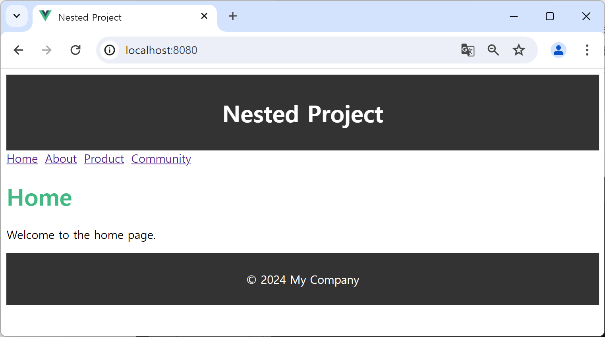

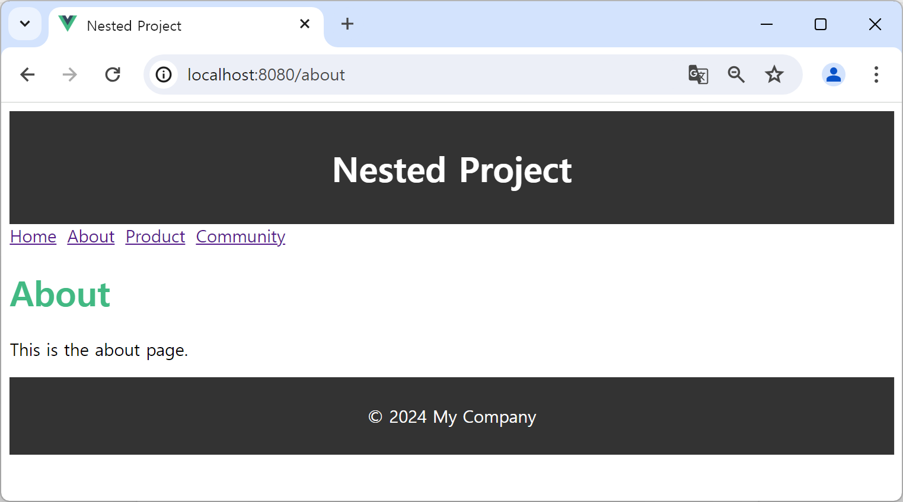

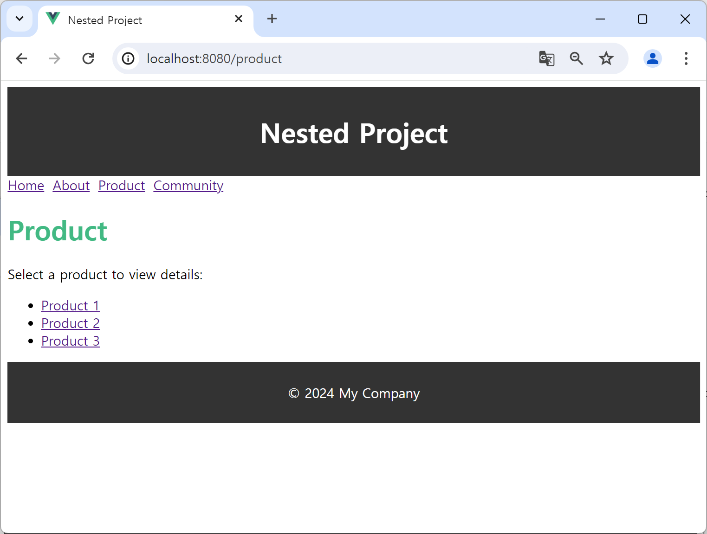

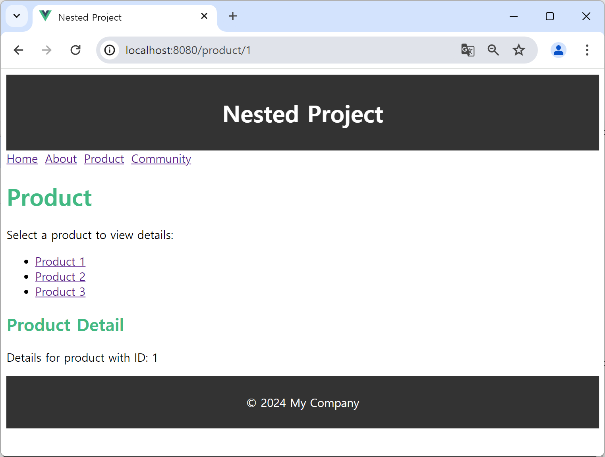

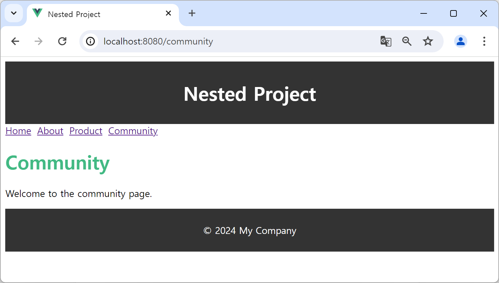

<br><br><br>

## 5-6. Navigation of Programming Method(프로그래밍 방식의 메뉴 구성)

- 프로그래밍 방식으로 라우터를 사용하여 애플리케이션 내의 메뉴를 구성할 수 있습니다. 이를 통해 사용자 인터페이스의 이벤트나 조건에 따라 라우팅을 동적으로 제어할 수 있습니다. Vue Router의 프로그래밍 방식 라우팅은 router.push와 router.replace와 같은 메소드를 사용하여 프로그래밍적으로 라우팅을 처리합니다.

<br>

### 5-6-1. 프로그래밍 방식의 메뉴 구성

프로그래밍 방식의 메뉴 구성은 사용자가 메뉴 항목을 클릭할 때, 조건이 변경될 때, 또는 특정 이벤트가 발생할 때 라우트를 변경하는 것을 의미합니다. 이를 통해 사용자 경험을 향상시키고, 사용자 인터페이스의 유연성을 높일 수 있습니다.

| 관련 메소드 | 설명 |
|---------------------------------------|--------------------------------------------------------------------------------|
| router.push(location: RawLocation) | 주어진 경로로 이동하고 히스토리 스택에 새 항목을 추가합니다. <br> 새로 추가된 경로로 브라우저를 이동시킵니다. |
| router.replace(location: RawLocation) | 현재 경로를 주어진 경로로 교체하고 히스토리 스택을 수정하지 않습니다. <br> 현재 페이지를 교체하는 방식으로 이동합니다. |
| router.go(n: number) | 히스토리 스택에서 n번째 위치로 이동합니다. <br> 양수일 경우 앞으로, 음수일 경우 뒤로 이동합니다. |
| router.back() | 히스토리 스택에서 한 단계 뒤로 이동합니다. |
| router.forward() | 히스토리 스택에서 한 단계 앞으로 이동합니다. |

<br>

### 5-6-2. router.push 사용 예시

```html
<template>
  <div>
    <button @click="goToHome">Go to Home</button>
    <button @click="goToAbout">Go to About</button>
  </div>
</template>

<script>
export default {
  methods: {
    goToHome() {
      this.$router.push('/');
    },
    goToAbout() {
      this.$router.push('/about');
    }
  }
};
</script>
```

<br>

### 5-6-3. router.replace 사용 예시

```html
<template>
  <div>
    <button @click="replaceToHome">Replace to Home</button>
  </div>
</template>

<script>
export default {
  methods: {
    replaceToHome() {
      this.$router.replace('/');
    }
  }
};
</script>
```

<br>

### 5-6-4. router.go 사용 예시

```html
<template>
  <div>
    <button @click="goBack">Go Back</button>
    <button @click="goForward">Go Forward</button>
  </div>
</template>

<script>
export default {
  methods: {
    goBack() {
      this.$router.go(-1);
    },
    goForward() {
      this.$router.go(1);
    }
  }
};
</script>
```

<br>

### 5-6-5. router.back 및 router.forward 사용 예시

```html
<template>
  <div>
    <button @click="navigateBack">Back</button>
    <button @click="navigateForward">Forward</button>
  </div>
</template>

<script>
export default {
  methods: {
    navigateBack() {
      this.$router.back();
    },
    navigateForward() {
      this.$router.forward();
    }
  }
};
</script>
```

<br>

### 5-6-6. 프로그래밍 방식의 메뉴 구성 종합 예시

```html
<template>
  <div>
    <button @click="goToPage('home')">Home</button>
    <button @click="goToPage('about')">About</button>
    <button @click="goToPage('contact')">Contact</button>
    <button @click="replaceToPage('home')">Replace to Home</button>
    <button @click="goBack">Back</button>
    <button @click="goForward">Forward</button>
  </div>
</template>

<script>
export default {
  methods: {
    goToPage(page) {
      this.$router.push({ name: page });
    },
    replaceToPage(page) {
      this.$router.replace({ name: page });
    },
    goBack() {
      this.$router.go(-1);
      //this.$router.back();
    },
    goForward() {
      this.$router.go(1);
      //this.$router.forward();
    }
  }
};
</script>
```

- Vue.js 애플리케이션에서 프로그래밍 방식으로 라우팅을 처리하는 다양한 방법을 보여줍니다. 
- 프로그래밍 방식의 메뉴 구성 방식으로 사용자가 특정 조건이나 이벤트에 따라 동적으로 경로를 변경할 수 있도록 라우팅을 구성할 수 있습니다.

<br><br>

### 5-6-7. 프로그래밍 방식의 메뉴 구성의 애플리케이션 제작 실습

**프로젝트 생성**

```shell
D:\gitRepository\vuejs\study05>vue create pgmenuproject

Vue CLI v5.0.8
? Please pick a preset: Manually select features
? Check the features needed for your project: Babel, TS, Router, Vuex
? Choose a version of Vue.js that you want to start the project with 3.x
? Use class-style component syntax? No
? Use Babel alongside TypeScript (required for modern mode, auto-detected polyfills, transpiling JSX)? Yes
? Use history mode for router? (Requires proper server setup for index fallback in production) Yes
? Where do you prefer placing config for Babel, ESLint, etc.? In package.json
? Save this as a preset for future projects? No
```

<br>

**프로젝트 구조**

```lua
pgmenuproject/
├── node_modules/
├── public/
│   └── index.html
├── src/
│   ├── assets/
│   ├── components/
│   │   ├── Header.vue
│   │   └── Footer.vue
│   ├── model/
│   │   └── index.ts
│   ├── router/
│   │   └── index.ts
│   ├── store/
│   │   ├── actions.ts
│   │   ├── mutations.ts
│   │   ├── state.ts
│   │   └── index.ts
│   ├── views/
│   │   ├── About.vue
│   │   ├── Community.vue
│   │   ├── Home.vue
│   │   └── Product.vue
│   ├── App.vue
│   ├── main.ts
│   ├── shims-vue.d.ts
│   └── types/
│       └── index.d.ts
├── babel.config.js
├── package.json
├── tsconfig.json
└── vue.config.js
```

<br>

**01. babel.config.js**

```javascript
// babel.config.js
module.exports = {
  presets: [
    '@vue/cli-plugin-babel/preset'
  ]
};
```

<br>

**02. tsconfig.json**

```json
// tsconfig.json
{
  "compilerOptions": {
    "target": "esnext",
    "module": "esnext",
    "strict": true,
    "jsx": "preserve",
    "moduleResolution": "node",
    "resolveJsonModule": true,
    "esModuleInterop": true,
    "skipLibCheck": true,
    "forceConsistentCasingInFileNames": true,
    "noEmit": true,
    "baseUrl": ".",
    "paths": {
      "@/*": ["src/*"]
    }
  },
  "include": ["src/**/*.ts", "src/**/*.d.ts", "src/**/*.tsx", "src/**/*.vue"],
  "exclude": ["node_modules"]
}
```

<br>

**03. vue.config.js**

```javascript
// vue.config.js
const { defineConfig } = require('@vue/cli-service')
module.exports = defineConfig({
  transpileDependencies: true
});
```

<br>

**04. public/index.html**

```html
<!DOCTYPE html>
<html lang="en">
<head>
  <meta charset="utf-8">
  <meta name="viewport" content="width=device-width, initial-scale=1.0">
  <title>PG Menu Project</title>
  <style>
  button { background-color:transparent; outline:0; border:0; color:#333; 
    font-weight:bold; padding:1.2em; cursor:pointer; }
  button:hover { color:deepskyblue; }  
  </style>
</head>
<body>
  <div id="app"></div>
  <!-- built files will be auto injected -->
</body>
</html>
```

<br>

**05. src/App.vue**

```vue
<template>
  <div id="app">
    <Header />
    <router-view></router-view>
    <Footer />
  </div>
</template>

<script setup>
import Header from '@/components/Header.vue';
import Footer from '@/components/Footer.vue';
</script>

<style>
nav {
  display: flex;
  gap: 10px;
  margin-bottom: 20px;
}
</style>
```

<br>

**06. src/main.ts**

```typescript
import { createApp } from 'vue';
import App from './App.vue';
import router from './router';
import store from './store';

const app = createApp(App);
app.use(router);
app.use(store);
app.mount('#app');
```

<br>

**07. src/shims-vue.d.ts**

```typescript
declare module '*.vue' {
  import type { DefineComponent } from 'vue';
  const component: DefineComponent<{}, {}, any>;
  export default component;
}
```

<br>

**08. src/router/index.ts**

```typescript
import { createRouter, createWebHistory, RouteRecordRaw } from 'vue-router';
import Home from '@/views/Home.vue';
import About from '@/views/About.vue';
import Product from '@/views/Product.vue';
import Community from '@/views/Community.vue';

const routes: Array<RouteRecordRaw> = [
  { path: '/', name: 'home', component: Home },
  { path: '/about', name: 'about', component: About },
  { path: '/product', name: 'product', component: Product },
  { path: '/community', name: 'community', component: Community }
];

const router = createRouter({
  history: createWebHistory(),
  routes
});

export default router;
```

<br>

**09. src/components/Header.vue**

```vue
<template>
  <div>
    <button @click="goToPage('home')">Home</button>
    <button @click="goToPage('about')">About</button>
    <button @click="goToPage('product')">Product</button>
    <button @click="goToPage('community')">Community</button>
  </div>
</template>

<script>
export default {
  methods: {
    goToPage(page) {
      this.$router.push({ name: page });
    }
  }
};
</script>
```

<br>

**10. src/components/Footer.vue**

```vue
<template>
  <footer>
    <p>© 2024 My Company</p>
  </footer>
</template>

<script setup>
</script>

<style scoped>
footer {
  background-color: #333;
  color: #fff;
  padding: 10px;
  text-align: center;
}
</style>
```

<br>

**11. src/views/Home.vue**

```vue
<template>
  <div>
    <h1>Home</h1>
    <p>Welcome to the home page.</p>
    <button @click="replaceToPage('home')">Replace to Home</button>
    <button @click="goBack">Back</button>
    <button @click="goForward">Forward</button>
  </div>
</template>

<script>
export default {
  methods: {
    replaceToPage(page) {
      this.$router.replace({ name: page });
    },
    goBack() {
      this.$router.go(-1);
    },
    goForward() {
      this.$router.go(1);
    }
  }
};
</script>

<style scoped>
h1 {
  color: #42b983;
}
</style>
```

<br>

**12. src/views/About.vue**

```vue
<template>
  <div>
    <h1>About</h1>
    <p>This is the about page.</p>
    <button @click="replaceToPage('home')">Replace to Home</button>
    <button @click="goBack">Back</button>
    <button @click="goForward">Forward</button>
  </div>
</template>

<script>
export default {
  methods: {
    replaceToPage(page) {
      this.$router.replace({ name: page });
    },
    goBack() {
      this.$router.go(-1);
    },
    goForward() {
      this.$router.go(1);
    }
  }
};
</script>

<style scoped>
h1 {
  color: #42b983;
}
</style>
```

<br>

**13. src/views/Product.vue**

```vue
<template>
  <div>
    <h1>Product</h1>
    <p>Here are our products.</p>
    <button @click="replaceToPage('home')">Replace to Home</button>
    <button @click="goBack">Back</button>
    <button @click="goForward">Forward</button>
  </div>
</template>

<script>
export default {
  methods: {
    replaceToPage(page) {
      this.$router.replace({ name: page });
    },
    goBack() {
      this.$router.go(-1);
    },
    goForward() {
      this.$router.go(1);
    }
  }
};
</script>

<style scoped>
h1 {
  color: #42b983;
}
</style>
```

<br>

**14. src/views/Community.vue**

```vue
<template>
  <div>
    <h1>Community</h1>
    <p>Welcome to the community page.</p>
    <button @click="replaceToPage('home')">Replace to Home</button>
    <button @click="goBack">Back</button>
    <button @click="goForward">Forward</button>
  </div>
</template>

<script>
export default {
  methods: {
    replaceToPage(page) {
      this.$router.replace({ name: page });
    },
    goBack() {
      this.$router.go(-1);
    },
    goForward() {
      this.$router.go(1);
    }
  }
};
</script>

<style scoped>
h1 {
  color: #42b983;
}
</style>
```

<br>

**15. src/store/index.ts**

```typescript
import { createStore } from 'vuex';
import state from './state';
import actions from './actions';
import mutations from './mutations';

export default createStore({
  state,
  actions,
  mutations
});
```

<br>

**16. src/store/state.ts**

```typescript
import { Product } from '@/model';

export interface State {
  products: Product[];
}

export default {
  products: []
} as State;
```

<br>

**17. src/store/mutations.ts**

```typescript
import { State } from './state';
import { Product } from '@/model';

export default {
  setProducts(state: State, products: Product[]) {
    state.products = products;
  }
};
```

<br>

**18. src/store/actions.ts**

```typescript
import { ActionContext } from 'vuex';
import { State } from './state';
import { Product } from '@/model';

export default {
  fetchProducts({ commit }: ActionContext<State, State>) {
    const products: Product[] = [
      { id: 1, name: 'Product A', price: 100 },
      { id: 2, name: 'Product B', price: 200 }
    ];
    commit('setProducts', products);
  }
};
```

<br>

**19. src/model/index.ts**

```typescript
export interface Product {
  id: number;
  name: string;
  price: number;
}
```

<br>

**애플리케이션 실행**

```shell
D:\gitRepository\vuejs\study05>cd pgmenuproject

D:\gitRepository\vuejs\study05\pgmenuproject>npm run serve

> dynamicproject@0.1.0 serve
> vue-cli-service serve

 INFO  Starting development server...

 DONE  Compiled successfully in 1838ms                                                                      오후 7:04:28

  App running at:
  - Local:   http://localhost:8080/
  - Network: http://192.168.0.9:8080/

  Note that the development build is not optimized.
  To create a production build, run npm run build.

Issues checking in progress...
No issues found.
```

<br>


**프로젝트 브라우저에서 열기**

1. 브라우저의 주소 입력줄에 `http://localhost:8080/` 을 입력한다.
2. 나타난 화면에서 Home / About / Product / Community 를 각 각 클릭해본다.
3. 각 페이지에서 Replace to Home/ Back / Forward 버튼 링크를 클릭해본다. 

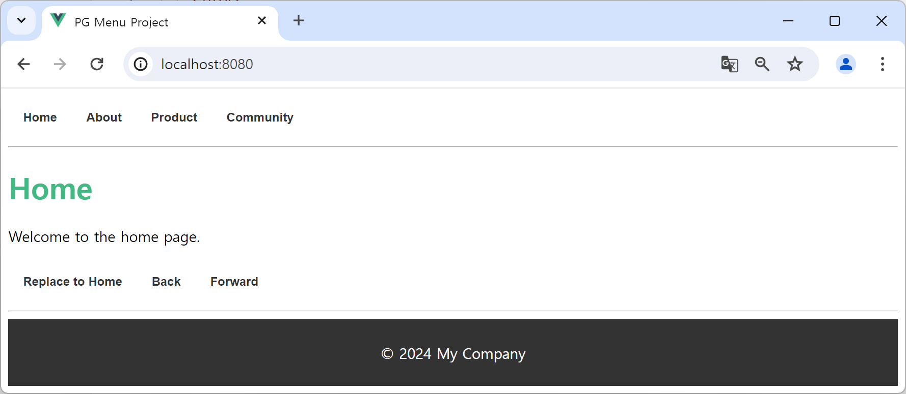

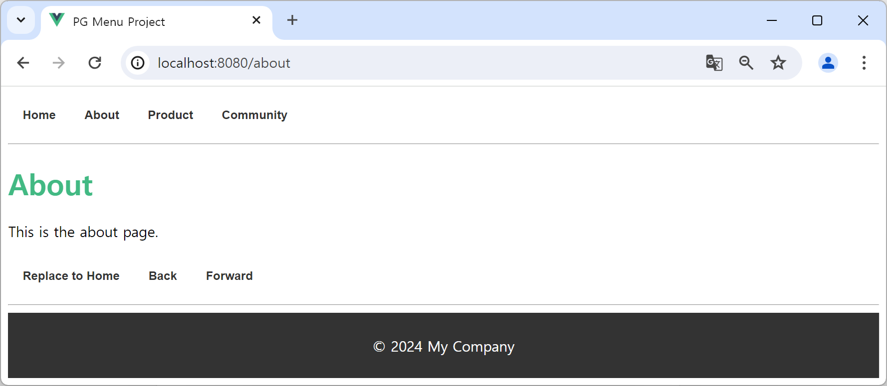


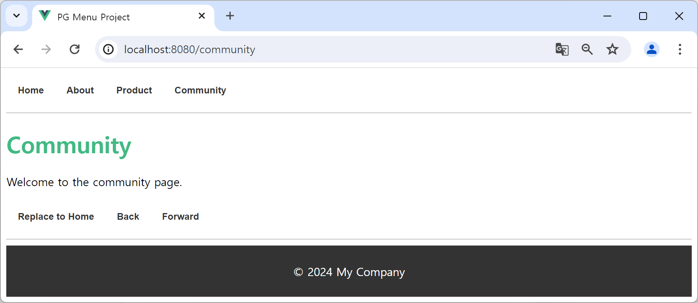

<br><br><br>

## 5-7. Redirect & Alias(리다이렉트와 별칭)

- Redirect(리다이렉트)와 Alias(별칭)는 라우팅을 보다 유연하고 편리하게 관리할 수 있도록 도와줍니다. 리다이렉트는 특정 경로를 다른 경로로 자동으로 이동시키는 기능이며, 별칭은 하나의 경로에 대해 여러 이름을 지정할 수 있는 기능입니다.

<br>

### 5-7-1. Redirect(리다이렉트)

- 리다이렉트는 사용자가 특정 경로에 접근할 때 자동으로 다른 경로로 이동시키는 기능입니다. 이를 통해 경로 변경, 경로 리팩토링, 특정 조건에 따른 경로 이동 등을 간단하게 처리할 수 있습니다.
- redirect 옵션을 사용하여 설정할 수 있습니다.

<br>

**기본 리다이렉트 설정**

```javascript
import { createRouter, createWebHistory } from 'vue-router';
import Home from './views/Home.vue';
import About from './views/About.vue';

const routes = [
  { path: '/', component: Home },
  { path: '/about', component: About },
  { path: '/home', redirect: '/' }
];

const router = createRouter({
  history: createWebHistory(),
  routes
});

export default router;
```

<br>

**함수 기반 리다이렉트**

```javascript
const routes = [
  { path: '/', component: Home },
  { path: '/about', component: About },
  { path: '/home', redirect: to => {
    // 특정 조건에 따라 리다이렉트 설정
    return { path: '/' };
  } }
];

const router = createRouter({
  history: createWebHistory(),
  routes
});

export default router;
```

<br><br>

### 5-7-2. Alias(별칭)

- 별칭은 특정 경로에 대해 여러 이름을 지정하여 동일한 컴포넌트를 다른 경로에서도 접근할 수 있도록 하는 기능입니다. 이를 통해 사용자에게 더 직관적인 URL을 제공할 수 있습니다.
- alias 옵션을 사용하여 설정할 수 있습니다.

<br>

**기본 별칭 설정**

```javascript
import { createRouter, createWebHistory } from 'vue-router';
import Home from './views/Home.vue';
import About from './views/About.vue';

const routes = [
  { path: '/', component: Home },
  { path: '/about', component: About },
  { path: '/alias-home', alias: '/home', component: Home }
];

const router = createRouter({
  history: createWebHistory(),
  routes
});

export default router;
```

<br>

**여러 별칭 설정**

```javascript
const routes = [
  { path: '/', component: Home },
  { path: '/about', component: About },
  { path: '/home', alias: ['/start', '/main'], component: Home }
];

const router = createRouter({
  history: createWebHistory(),
  routes
});

export default router;
```

<br>

### 5-7-3. 리다이렉트와 별칭의 종합 예시

```typescript
import { createRouter, createWebHistory } from 'vue-router';
import Home from './views/Home.vue';
import About from './views/About.vue';
import Contact from './views/Contact.vue';

const routes = [
  { path: '/', component: Home },
  { path: '/about', component: About },
  { path: '/contact', component: Contact },
  { path: '/home', redirect: '/' },
  { path: '/info', alias: '/about', component: About },
  { path: '/alias-home', alias: ['/start', '/main'], component: Home }
];

const router = createRouter({
  history: createWebHistory(),
  routes
});

export default router;
```

- 리다이렉트 설정: /home 경로로 접근하면 루트 경로(/)로 자동으로 이동됩니다. 이를 통해 경로가 변경되었거나 특정 조건에 따라 리다이렉트를 설정할 수 있습니다.
- 별칭 설정: /alias-home, /start, 그리고 /main 경로는 모두 Home 컴포넌트를 렌더링합니다. 사용자는 여러 경로를 통해 동일한 컴포넌트에 접근할 수 있습니다.
- 리다이렉트와 별칭을 적절히 활용하면 사용자 경험을 향상시키고, 애플리케이션의 경로 구조를 보다 유연하게 관리할 수 있습니다.

<br><br>

### 5-7-4. 리다이렉트와 별칭을 사용한 애플리케이션 제작 실습

**프로젝트 생성**

```shell
D:\gitRepository\vuejs\study05\pgmenuproject>vue create aliasproject

Vue CLI v5.0.8
? Please pick a preset: Manually select features
? Check the features needed for your project: Babel, TS, Router, Vuex
? Choose a version of Vue.js that you want to start the project with 3.x
? Use class-style component syntax? No
? Use Babel alongside TypeScript (required for modern mode, auto-detected polyfills, transpiling JSX)? Yes
? Use history mode for router? (Requires proper server setup for index fallback in production) Yes
? Where do you prefer placing config for Babel, ESLint, etc.? In dedicated config files
? Save this as a preset for future projects? No
```

**프로젝트 구조**

```lua
aliasproject/
├── node_modules/
├── public/
│   └── index.html
├── src/
│   ├── assets/
│   ├── components/
│   │   ├── Header.vue
│   │   └── Footer.vue
│   ├── model/
│   │   └── index.ts
│   ├── router/
│   │   └── index.ts
│   ├── store/
│   │   ├── actions.ts
│   │   ├── mutations.ts
│   │   ├── state.ts
│   │   └── index.ts
│   ├── views/
│   │   ├── About.vue
│   │   ├── Community.vue
│   │   ├── Home.vue
│   │   └── Product.vue
│   ├── App.vue
│   ├── main.ts
│   ├── shims-vue.d.ts
│   └── types/
│       └── index.d.ts
├── babel.config.js
├── package.json
├── tsconfig.json
└── vue.config.js
```

<br>

**01. babel.config.js**

```javascript
module.exports = {
  presets: [
    '@vue/cli-plugin-babel/preset'
  ]
};
```

<br>

**02. tsconfig.json**

```json
{
  "compilerOptions": {
    "target": "esnext",
    "module": "esnext",
    "strict": true,
    "jsx": "preserve",
    "moduleResolution": "node",
    "resolveJsonModule": true,
    "esModuleInterop": true,
    "skipLibCheck": true,
    "forceConsistentCasingInFileNames": true,
    "noEmit": true,
    "baseUrl": ".",
    "paths": {
      "@/*": ["src/*"]
    }
  },
  "include": ["src/**/*.ts", "src/**/*.d.ts", "src/**/*.tsx", "src/**/*.vue"],
  "exclude": ["node_modules"]
}
```

<br>

**03. vue.config.js**

```javascript
const { defineConfig } = require('@vue/cli-service')
module.exports = defineConfig({
  transpileDependencies: true
});
```

<br>

**04. public/index.html**

```html
<!DOCTYPE html>
<html lang="en">
<head>
  <meta charset="utf-8">
  <meta name="viewport" content="width=device-width, initial-scale=1.0">
  <style>
    button { background-color:transparent; outline:0; border:0; color:#333; 
      font-weight:bold; padding:1.2em; cursor:pointer; }
    button:hover { color:deepskyblue; }  
  </style>
  <title>Alias Project</title>
</head>
<body>
  <div id="app"></div>
  <!-- built files will be auto injected -->
</body>
</html>
```

<br>

**05. src/App.vue**

```vue
<template>
  <div id="app">
    <Header />
    <router-view></router-view>
    <Footer />
  </div>
</template>

<script setup>
import Header from '@/components/Header.vue';
import Footer from '@/components/Footer.vue';
</script>

<style>
nav {
  display: flex;
  gap: 10px;
  margin-bottom: 20px;
}
</style>
```

<br>

**06. src/main.ts**

```typescript
import { createApp } from 'vue';
import App from './App.vue';
import router from './router';
import store from './store';

const app = createApp(App);
app.use(router);
app.use(store);
app.mount('#app');
```

<br>

**07. src/shims-vue.d.ts**

```typescript
declare module '*.vue' {
  import type { DefineComponent } from 'vue';
  const component: DefineComponent<{}, {}, any>;
  export default component;
}
```

<br>

**08. src/router/index.ts**

```typescript
import { createRouter, createWebHistory } from 'vue-router';
import Home from '@/views/Home.vue';
import About from '@/views/About.vue';
import Product from '@/views/Product.vue';
import Community from '@/views/Community.vue';

const routes = [
  { path: '/', component: Home },
  { path: '/home', redirect: '/' },
  { path: '/about', alias: '/info', component: About },
  { path: '/product', alias:['/goods', '/event'], component: Product },
  { path: '/community', alias: ['/board', '/notice'], component: Community }
];

const router = createRouter({
  history: createWebHistory(),
  routes
});

export default router;
```

<br>

**09. src/components/Header.vue**

```vue
<template>
  <div>
    <button @click="goToPage('home')">홈</button>
    <button @click="goToPage('about')">소개</button>
    <button @click="goToPage('product')">상품</button>
    <button @click="goToPage('community')">커뮤니티</button>
  </div>
</template>

<script>
export default {
  methods: {
    goToPage(page) {
      this.$router.push({ path: `/${page}` });
    }
  }
};
</script>
```

<br>

**10. src/components/Footer.vue**

```vue
<template>
  <footer>
    <p>© 2024 My Company</p>
  </footer>
</template>

<script setup>
</script>

<style scoped>
footer {
  background-color: #333;
  color: #fff;
  padding: 10px;
  text-align: center;
}
</style>
```

<br>

**11. src/views/Home.vue**

```vue
<template>
  <div>
    <h1>Home</h1>
    <p>Welcome to the home page.</p>
    <button @click="replaceToPage('home')">Replace to Home</button>
    <button @click="goBack">Back</button>
    <button @click="goForward">Forward</button>
  </div>
</template>

<script>
export default {
  methods: {
    replaceToPage(page) {
      this.$router.push({ path: `/${page}` });
    },
    goBack() {
      this.$router.go(-1);
    },
    goForward() {
      this.$router.go(1);
    }
  }
};
</script>

<style scoped>
h1 {
  color: #42b983;
}
</style>
```

<br>

**12. src/views/About.vue**

```vue
<template>
  <div>
    <h1>About</h1>
    <p>This is the about page.</p>
    <button @click="replaceToPage('home')">Replace to Home</button>
    <button @click="replaceToPage('event')">Event</button>
    <button @click="replaceToPage('notice')">Notice</button>
  </div>
</template>

<script>
export default {
  methods: {
    replaceToPage(page) {
      this.$router.push({ path: `/${page}` });
    },
    goBack() {
      this.$router.go(-1);
    },
    goForward() {
      this.$router.go(1);
    }
  }
};
</script>

<style scoped>
h1 {
  color: #42b983;
}
</style>
```

<br>

**13. src/views/Product.vue**

```vue
<template>
    <div>
      <h1>Product</h1>
      <p>Here are our products.</p>
      <button @click="replaceToPage('home')">Replace to Home</button>
      <button @click="replaceToPage('info')">Info</button>
      <button @click="replaceToPage('board')">Board</button>
    </div>
  </template>
  
  <script>
  export default {
    methods: {
      replaceToPage(page) {
        this.$router.push({ path: `/${page}` });
      },
      goBack() {
        this.$router.go(-1);
      },
      goForward() {
        this.$router.go(1);
      }
    }
  };
  </script>
  
  <style scoped>
  h1 {
    color: #42b983;
  }
  </style>
```

<br>

**14. src/views/Community.vue**

```vue
<template>
    <div>
      <h1>Community</h1>
      <p>Welcome to the community page.</p>
      <button @click="replaceToPage('home')">Home</button>
      <button @click="replaceToPage('info')">Info</button>
      <button @click="replaceToPage('goods')">Goods</button>
    </div>
  </template>
  
  <script>
  export default {
    methods: {
      replaceToPage(page) {
        this.$router.push({ path: `/${page}` });
      },
      goBack() {
        this.$router.go(-1);
      },
      goForward() {
        this.$router.go(1);
      }
    }
  };
  </script>
  
  <style scoped>
  h1 {
    color: #42b983;
  }
  </style>
```

<br>

**15. src/store/index.ts**

```typescript
import { createStore } from 'vuex';
import state from './state';
import actions from './actions';
import mutations from './mutations';

export default createStore({
  state,
  actions,
  mutations
});
```

<br>

**16. src/store/state.ts**

```typescript
import { Product } from '@/model';

export interface State {
  products: Product[];
}

export default {
  products: []
} as State;
```

<br>

**17. src/store/mutations.ts**

```typescript
import { State } from './state';
import { Product } from '@/model';

export default {
  setProducts(state: State, products: Product[]) {
    state.products = products;
  }
};
```

<br>

**18. src/store/actions.ts**

```typescript
import { ActionContext } from 'vuex';
import { State } from './state';
import { Product } from '@/model';

export default {
  fetchProducts({ commit }: ActionContext<State, State>) {
    const products: Product[] = [
      { id: 1, name: 'Product A', price: 100 },
      { id: 2, name: 'Product B', price: 200 }
    ];
    commit('setProducts', products);
  }
};
```

<br>

**19. src/model/index.ts**

```typescript
export interface Product {
  id: number;
  name: string;
  price: number;
}
```

<br>

**애플리케이션 실행**

```shell
D:\gitRepository\vuejs\study05>cd aliasproject

D:\gitRepository\vuejs\study05\aliasproject>npm run serve

> dynamicproject@0.1.0 serve
> vue-cli-service serve

 INFO  Starting development server...

 DONE  Compiled successfully in 1838ms                                                                      오후 7:04:28

  App running at:
  - Local:   http://localhost:8080/
  - Network: http://192.168.0.9:8080/

  Note that the development build is not optimized.
  To create a production build, run npm run build.

Issues checking in progress...
No issues found.
```

<br>

**프로젝트 브라우저에서 열기**

1. 브라우저의 주소 입력줄에 `http://localhost:8080/` 을 입력한다.
2. 나타난 화면에서 Home / About / Product / Community 를 각 각 클릭해본다.
3. 각 페이지에서 Replace to Home / Event / Notice / Info / Board / Goods 버튼 링크를 클릭해본다. 

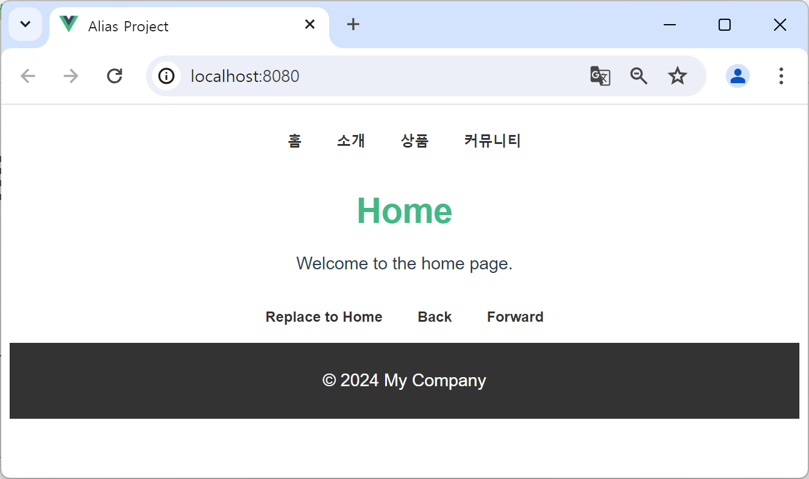

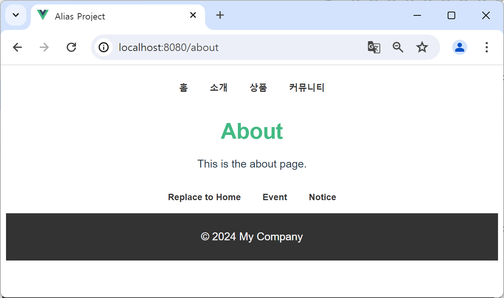


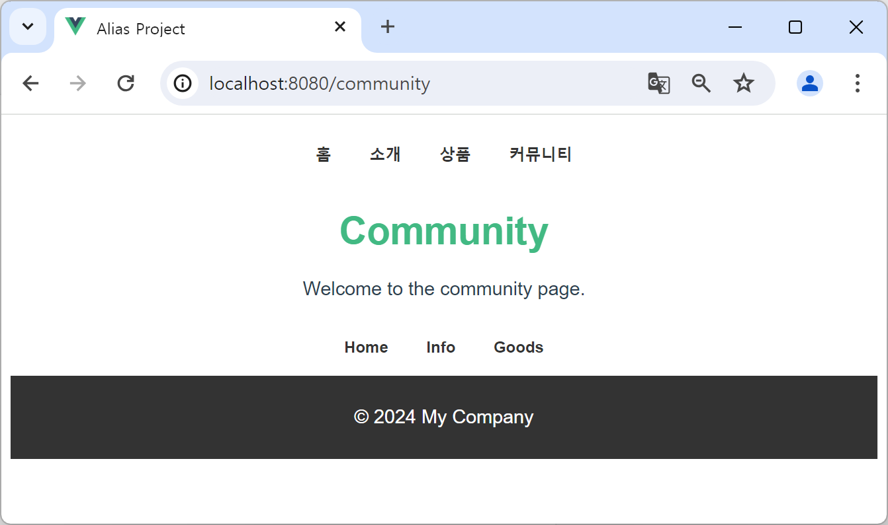

<br><br><br>

## 5-8. Forward To Route Component(라우트 컴포넌트에 데이터 전달)

- 라우트 컴포넌트에 데이터를 전달하는 방법은 다양합니다. 
- 주요 방법으로는 URL 파라미터, 쿼리 파라미터, props 옵션을 사용하는 방법 등이 있습니다. 각각의 방법은 특정 상황에 유용하게 사용할 수 있습니다.

<br>

### 5-8-1. URL 파라미터를 통한 데이터 전달

- URL 파라미터는 경로의 일부로 데이터를 전달하는 방법입니다. 이를 통해 사용자는 특정 경로에서 데이터를 추출할 수 있습니다.

**라우터 설정**

```javascript
import { createRouter, createWebHistory } from 'vue-router';
import User from './views/User.vue';

const routes = [
  { path: '/user/:id', component: User }
];

const router = createRouter({
  history: createWebHistory(),
  routes
});

export default router;
```

<br>

**User 컴포넌트**

```html
<template>
  <div>
    <h1>User ID: {{ userId }}</h1>
  </div>
</template>

<script>
export default {
  name: 'User',
  computed: {
    userId() {
      return this.$route.params.id;
    }
  }
};
</script>
```

<br>

### 5-8-2. 쿼리 파라미터를 통한 데이터 전달

- 쿼리 파라미터는 URL의 쿼리 문자열을 통해 데이터를 전달하는 방법입니다. 이를 통해 여러 파라미터를 쉽게 전달할 수 있습니다.

**라우터 설정**

```javascript
import { createRouter, createWebHistory } from 'vue-router';
import User from './views/User.vue';

const routes = [
  { path: '/user', component: User }
];

const router = createRouter({
  history: createWebHistory(),
  routes
});

export default router;
```

<br>

**User 컴포넌트**

```html
<template>
  <div>
    <h1>User ID: {{ userId }}</h1>
  </div>
</template>

<script>
export default {
  name: 'User',
  computed: {
    userId() {
      return this.$route.query.id;
    }
  }
};
</script>
```

<br>

**라우터 이동**

```javascript
this.$router.push({ path: '/user', query: { id: '123' } });
```

<br>

### 5-8-3. Props 옵션을 통한 데이터 전달

- props 옵션을 사용하여 라우트 컴포넌트에 데이터를 전달할 수 있습니다. 이를 통해 컴포넌트 내에서 전달된 데이터를 props로 쉽게 접근할 수 있습니다.

**라우터 설정**

```javascript
import { createRouter, createWebHistory } from 'vue-router';
import User from './views/User.vue';

const routes = [
  { path: '/user/:id', component: User, props: true }
];

const router = createRouter({
  history: createWebHistory(),
  routes
});

export default router;
```

<br>

**User 컴포넌트**

```html
<template>
  <div>
    <h1>User ID: {{ id }}</h1>
  </div>
</template>

<script>
export default {
  name: 'User',
  props: ['id']
};
</script>
```

<br>

**라우터 이동**

```javascript
this.$router.push({ path: '/user/123' });
```

<br>

### 5-8-4. 데이터 객체를 통한 전달

- props 옵션에 객체를 전달하여 데이터를 라우트 컴포넌트로 전달할 수 있습니다.

**라우터 설정**

```javascript
import { createRouter, createWebHistory } from 'vue-router';
import User from './views/User.vue';

const routes = [
  { path: '/user', component: User, props: { default: true, user: { id: '123', name: 'John' } } }
];

const router = createRouter({
  history: createWebHistory(),
  routes
});

export default router;
```

<br>

**User 컴포넌트**

```html
<template>
  <div>
    <h1>User ID: {{ user.id }}</h1>
    <h2>User Name: {{ user.name }}</h2>
  </div>
</template>

<script>
export default {
  name: 'User',
  props: ['user']
};
</script>
```

<br>

**라우터 이동**

```javascript
this.$router.push({ path: '/user', props: { user: { id: '456', name: 'Doe' } } });
```

<br>


### 5-8-5. route.params를 사용한 데이터 전달

- 컴포넌트 내부에서 this.$route.params를 사용하여 라우트 파라미터에 접근할 수 있습니다.

**라우터 설정**

```javascript
import { createRouter, createWebHistory } from 'vue-router';
import User from './views/User.vue';

const routes = [
  { path: '/user/:id', component: User }
];

const router = createRouter({
  history: createWebHistory(),
  routes
});

export default router;
```

<br>

**User 컴포넌트**

```html
<template>
  <div>
    <h1>User ID: {{ $route.params.id }}</h1>
  </div>
</template>

<script>
export default {
  name: 'User'
};
</script>
```

- 다양한 방법으로 Vue.js에서 라우트 컴포넌트에 데이터를 전달할 수 있습니다. 각 방법은 상황에 따라 다르게 사용될 수 있으며, 가장 적합한 방법을 선택하여 사용하면 됩니다.

<br><br>

### 5-8-6. 라우트 컴포넌트에 데이터 전달 애플리케이션 제작 실습

**프로젝트 생성**

```shell
D:\gitRepository\vuejs\study05>vue create datatransproject

Vue CLI v5.0.8
? Please pick a preset: Manually select features
? Check the features needed for your project: Babel, TS, Router, Vuex
? Choose a version of Vue.js that you want to start the project with 3.x
? Use class-style component syntax? No
? Use Babel alongside TypeScript (required for modern mode, auto-detected polyfills, transpiling JSX)? Yes
? Use history mode for router? (Requires proper server setup for index fallback in production) Yes
? Where do you prefer placing config for Babel, ESLint, etc.? In package.json
? Save this as a preset for future projects? No
```

<br>

**프로젝트 구조**

```lua
datatransproject
├── babel.config.js
├── package.json
├── public
│   └── index.html
├── src
│   ├── components
│   │   ├── Footer.vue
│   │   └── Header.vue
│   ├── main.ts
│   ├── model
│   │   └── index.ts
│   ├── router
│   │   └── index.ts
│   ├── shims-vue.d.ts
│   ├── store
│   │   ├── actions.ts
│   │   ├── index.ts
│   │   ├── mutations.ts
│   │   └── state.ts
│   └── views
│       ├── About.vue
│       ├── Community.vue
│       ├── Home.vue
│       ├── Product.vue
├── tsconfig.json
└── vue.config.js
```

<br>

**01. package.json**

```json
{
  "name": "datatransproject",
  "version": "0.1.0",
  "private": true,
  "scripts": {
    "serve": "vue-cli-service serve",
    "build": "vue-cli-service build"
  },
  "dependencies": {
    "core-js": "^3.8.3",
    "vue": "^3.2.13",
    "vue-router": "^4.0.3",
    "vuex": "^4.0.0"
  },
  "devDependencies": {
    "@vue/cli-plugin-babel": "~5.0.0",
    "@vue/cli-plugin-router": "~5.0.0",
    "@vue/cli-plugin-typescript": "~5.0.0",
    "@vue/cli-plugin-vuex": "~5.0.0",
    "@vue/cli-service": "~5.0.0",
    "typescript": "~4.5.5"
  },
  "browserslist": [
    "> 1%",
    "last 2 versions",
    "not dead",
    "not ie 11"
  ]
}
```

<br>

**02. babel.config.js**

```js
module.exports = {
  presets: [
    '@vue/cli-plugin-babel/preset'
  ]
};
```

<br>

**03. tsconfig.json**

```json
{
  "compilerOptions": {
    "target": "esnext",
    "module": "esnext",
    "strict": true,
    "jsx": "preserve",
    "importHelpers": true,
    "moduleResolution": "node",
    "experimentalDecorators": true,
    "skipLibCheck": true,
    "esModuleInterop": true,
    "allowSyntheticDefaultImports": true,
    "sourceMap": true,
    "baseUrl": ".",
    "types": [
      "webpack-env"
    ],
    "paths": {
      "@/*": [
        "src/*"
      ]
    },
    "lib": [
      "esnext",
      "dom",
      "dom.iterable",
      "scripthost"
    ]
  },
  "include": [
    "src/**/*.ts",
    "src/**/*.tsx",
    "src/**/*.vue",
    "tests/**/*.ts",
    "tests/**/*.tsx"
  ],
  "exclude": [
    "node_modules"
  ]
}
```

<br>

**04. vue.config.js**

```js
const { defineConfig } = require('@vue/cli-service')
module.exports = defineConfig({
  lintOnSave: false,
  transpileDependencies: true
});
```

<br>

**05. public/index.html**

```html
<!DOCTYPE html>
<html lang="en">
<head>
  <meta charset="UTF-8">
  <meta name="viewport" content="width=device-width, initial-scale=1.0">
  <title>datatransproject</title>
</head>
<body>
  <noscript>
    <strong>We're sorry but datatransproject doesn't work properly without JavaScript enabled. Please enable it to continue.</strong>
  </noscript>
  <div id="app"></div>
</body>
</html>
```

<br>

**06. src/main.ts**

```typescript
import { createApp } from 'vue';
import App from './App.vue';
import router from './router';
import store from './store';

const app = createApp(App);

app.use(router);
app.use(store);

app.mount('#app');
```

<br>

**07. src/shims-vue.d.ts**

```typescript
declare module '*.vue' {
  import { DefineComponent } from 'vue';
  const component: DefineComponent<{}, {}, any>;
  export default component;
}
```

<br>

**08. src/components/Header.vue**

```vue
<template>
  <div>
    <router-link to="/">홈</router-link>
    <router-link to="/about">소개</router-link>
    <router-link to="/product">상품</router-link>
    <router-link to="/community">커뮤니티</router-link>
  </div>
</template>

<script>
export default {
  name: 'Header'
};
</script>

<style scoped>
div {
  display: flex;
  gap: 10px;
}
</style>
```

<br>

**09. src/components/Footer.vue**

```vue
<template>
  <div>
    <p>© 2024 My Company</p>
  </div>
</template>

<script>
export default {
  name: 'Footer'
};
</script>

<style scoped>
div {
  text-align: center;
  margin-top: 20px;
}
</style>
```

<br>

**10. src/App.vue**

```vue
<template>
  <div id="app">
    <Header />
    <router-view />
    <Footer />
  </div>
</template>

<script>
import Header from '@/components/Header.vue';
import Footer from '@/components/Footer.vue';

export default {
  name: 'App',
  components: {
    Header,
    Footer
  }
};
</script>

<style>
#app {
  font-family: Avenir, Helvetica, Arial, sans-serif;
  -webkit-font-smoothing: antialiased;
  -moz-osx-font-smoothing: grayscale;
  text-align: center;
  color: #2c3e50;
  margin-top: 60px;
}
</style>
```

<br>

**11. src/views/Home.vue**

```vue
<template>
  <div>
    <h1>홈</h1>
    <p>환영합니다!</p>
    <button @click="replaceToPage('home')">홈으로 이동</button>
    <button @click="goBack">뒤로</button>
    <button @click="goForward">앞으로</button>
  </div>
</template>

<script>
export default {
  methods: {
    replaceToPage(page) {
      this.$router.replace({ path: `/${page}` });
    },
    goBack() {
      this.$router.go(-1);
    },
    goForward() {
      this.$router.go(1);
    }
  }
};
</script>

<style scoped>
h1 {
  color: #42b983;
}
</style>
```

<br>

**12. src/views/About.vue**

```vue
<template>
  <div>
    <h1>소개</h1>
    <p>이것은 소개 페이지입니다. 이 페이지는 /about 및 /info를 통해 접근할 수 있습니다.</p>
    <button @click="replaceToPage('home')">홈으로 이동</button>
    <button @click="goBack">뒤로</button>
    <button @click="goForward">앞으로</button>
  </div>
</template>

<script>
export default {
  methods: {
    replaceToPage(page) {
      this.$router.replace({ path: `/${page}` });
    },
    goBack() {
      this.$router.go(-1);
    },
    goForward() {
      this.$router.go(1);
    }
  }
};
</script>

<style scoped>
h1 {
  color: #42b983;
}
</style>
```

<br>

**13. src/views/Product.vue**

```vue
<template>
  <div>
    <h1>상품</h1>
    <div>
      <h2>제품 등록</h2>
      <input v-model="newProduct.name" placeholder="제품명"/>
      <input v-model="newProduct.description" placeholder="설명"/>
      <button @click="addProduct">추가</button>
    </div>
    <div>
      <h2>제품 목록</h2>
      <ul>
        <li v-for="product in products" :key="product.id">
          <router-link :to="{ name: 'product-detail', params: { id: product.id }}">{{ product.name }}</router-link>
          <button @click="editProduct(product)">수정</button>
          <button @click="deleteProduct(product.id)">삭제</button>
        </li>
      </ul>
    </div>
    <router-view></router-view>
    <button @click="replaceToPage('home')">홈으로 이동</button>
    <button @click="goBack">뒤로</button>
    <button @click="goForward">앞으로</button>
  </div>
</template>

<script>
import { mapState } from 'vuex';

export default {
  data() {
    return {
      newProduct: {
        id: null,
        name: '',
        description: ''
      }
    };
  },
  computed: {
    ...mapState(['products'])
  },
  methods: {
    addProduct() {
      if (this.newProduct.name && this.newProduct.description) {
        const id = this.products.length + 1;
        this.$store.dispatch('addProduct', { ...this.newProduct, id });
        this.newProduct.name = '';
        this.newProduct.description = '';
      }
    },
    editProduct(product) {
      this.$router.push({ name: 'product-edit', params: { id: product.id } });
    },
    deleteProduct(id) {
      this.$store.commit('DELETE_PRODUCT', id);
    },
    replaceToPage(page) {
      this.$router.replace({ path: `/${page}` });
    },
    goBack() {
      this.$router.go(-1);
    },
    goForward() {
      this.$router.go(1);
    }
  }
};
</script>

<style scoped>
h1 {
  color: #42b983;
}
</style>
```

<br>

**14. src/views/Community.vue**

```vue
<template>
  <div>
    <h1>커뮤니티</h1>
    <div>
      <h2>게시글 등록</h2>
      <input v-model="newPost.title" placeholder="제목"/>
      <input v-model="newPost.content" placeholder="내용"/>
      <button @click="addPost">추가</button>
    </div>
    <div>
      <h2>게시글 목록</h2>
      <ul>
        <li v-for="post in posts" :key="post.id">
          <router-link :to="{ name: 'post-detail', params: { id: post.id }}">{{ post.title }}</router-link>
          <button @click="editPost(post)">수정</button>
          <button @click="deletePost(post.id)">삭제</button>
        </li>
      </ul>
    </div>
    <router-view></router-view>
    <button @click="replaceToPage('home')">홈으로 이동</button>
    <button @click="goBack">뒤로</button>
    <button @click="goForward">앞으로</button>
  </div>
</template>

<script>
import { mapState } from 'vuex';

export default {
  data() {
    return {
      newPost: {
        id: null,
        title: '',
        content: ''
      }
    };
  },
  computed: {
    ...mapState(['posts'])
  },
  methods: {
    addPost() {
      if (this.newPost.title && this.newPost.content) {
        const id = this.posts.length + 1;
        this.$store.dispatch('addPost', { ...this.newPost, id });
        this.newPost.title = '';
        this.newPost.content = '';
      }
    },
    editPost(post) {
      this.$router.push({ name: 'post-edit', params: { id: post.id } });
    },
    deletePost(id) {
      this.$store.commit('DELETE_POST', id);
    },
    replaceToPage(page) {
      this.$router.replace({ path: `/${page}` });
    },
    goBack() {
      this.$router.go(-1);
    },
    goForward() {
      this.$router.go(1);
    }
  }
};
</script>

<style scoped>
h1 {
  color: #42b983;
}
</style>
```

<br>

**15. src/router/index.ts**

```typescript
import { createRouter, createWebHistory } from 'vue-router';
import Home from '@/views/Home.vue';
import About from '@/views/About.vue';
import Product from '@/views/Product.vue';
import Community from '@/views/Community.vue';

const routes = [
  { path: '/', component: Home },
  { path: '/home', redirect: '/' },
  { path: '/about', alias: '/info', component: About },
  { path: '/product', alias: ['/goods', '/event'], component: Product, 
    children: [
      { path: 'detail/:id', name: 'product-detail', component: Product },
      { path: 'edit/:id', name: 'product-edit', component: Product }
    ] 
  },
  { path: '/community', alias: ['/board', '/notice'], component: Community, 
    children: [
      { path: 'detail/:id', name: 'post-detail', component: Community },
      { path: 'edit/:id', name: 'post-edit', component: Community }
    ] 
  }
];

const router = createRouter({
  history: createWebHistory(),
  routes
});

export default router;
```

<br>

**16. src/store/index.ts**

```typescript
import { createStore } from 'vuex';
import state from './state';
import actions from './actions';
import mutations from './mutations';

export default createStore({
  state,
  actions,
  mutations,
  modules: {}
});
```

<br>

**17. src/store/state.ts**

```typescript
import { Product, Post } from '@/model';

export interface State {
  products: Product[];
  posts: Post[];
}

const state: State = {
  products: [],
  posts: []
};

export default state;
```

<br>

**18. src/store/actions.ts**

```typescript
import { ActionContext } from 'vuex';
import { Product, Post } from '@/model';
import { State } from './state';

export default {
  addProduct({ commit }: ActionContext<State, any>, product: Product) {
    commit('ADD_PRODUCT', product);
  },
  addPost({ commit }: ActionContext<State, any>, post: Post) {
    commit('ADD_POST', post);
  }
};
```

<br>

**19. src/store/mutations.ts**

```typescript
import { Product, Post } from '@/model';
import { State } from './state';

export default {
  ADD_PRODUCT(state: State, product: Product) {
    state.products.push(product);
  },
  ADD_POST(state: State, post: Post) {
    state.posts.push(post);
  },
  DELETE_PRODUCT(state: State, id: number) {
    state.products = state.products.filter(product => product.id !== id);
  },
  DELETE_POST(state: State, id: number) {
    state.posts = state.posts.filter(post => post.id !== id);
  }
};
```

<br>

**20. src/model/index.ts**

```typescript
export interface Product {
  id: number;
  name: string;
  description: string;
}

export interface Post {
  id: number;
  title: string;
  content: string;
}
```

<br>

**애플리케이션 실행**

```shell
D:\gitRepository\vuejs\study05>cd datatransproject

D:\gitRepository\vuejs\study05\datatransproject>npm run serve

> dynamicproject@0.1.0 serve
> vue-cli-service serve

 INFO  Starting development server...

 DONE  Compiled successfully in 1838ms                                                                      오후 7:04:28

  App running at:
  - Local:   http://localhost:8080/
  - Network: http://192.168.0.9:8080/

  Note that the development build is not optimized.
  To create a production build, run npm run build.

Issues checking in progress...
No issues found.
```

<br>

**프로젝트 브라우저에서 열기**

1. 브라우저의 주소 입력줄에 `http://localhost:8080/` 을 입력한다.
2. 나타난 화면에서 Home / About / Product / Community 를 각 각 클릭해본다.
3. 각 페이지에서 Replace to Home / Back / Forward 버튼 링크를 클릭해본다. 
4. Product 페이지에서 상품 추가, 상품 목록, 상품 상세보기, 상품 수정, 상품 제거를 진행해본다.
5. Community 페이지에서 글 추가, 글 목록, 글 상세보기, 글 수정, 글 제거를 진행해본다.

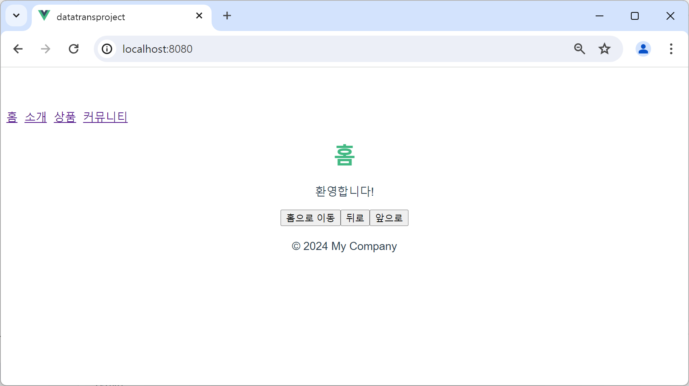

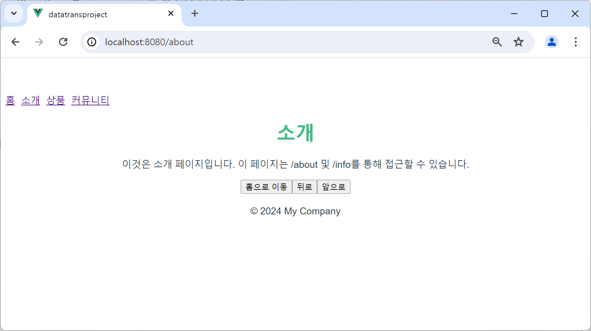

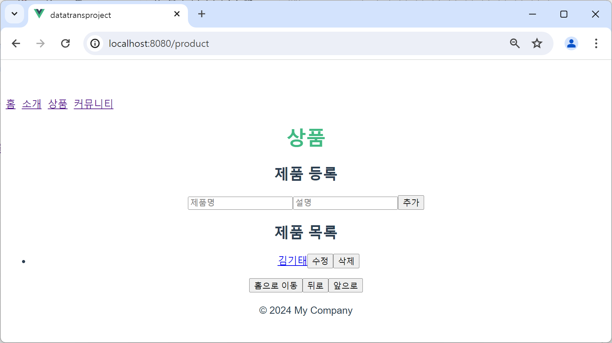

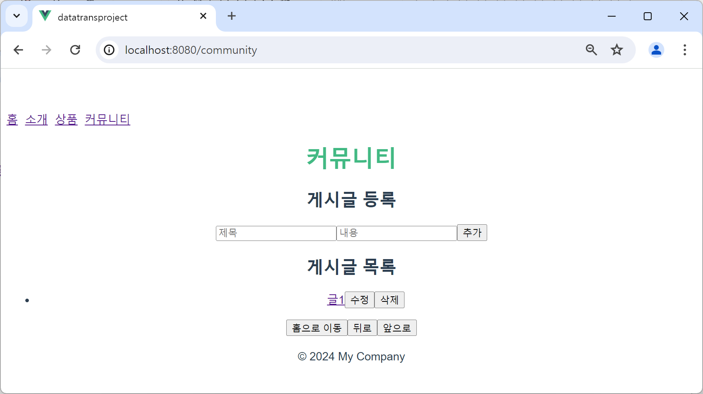


<br><br><br>


## 5-9. Route Mode(라우트 모드)

- 라우터 모드를 설정하여 브라우저의 주소(URL) 구조를 관리할 수 있습니다. 두 가지 주요 라우트 모드가 있습니다.
- Hash Mode(해시 모드)와 History Mode(히스토리 모드). 각각의 모드에는 고유의 특징과 사용 방법이 있습니다.
- 라우트 모드는 브라우저의 주소 구조를 제어하는 방식입니다. 
- Vue Router에서는 Hash Mode (해시 모드)와 History Mode (히스토리 모드)으로 두 가지 주요 모드를 지원합니다:

- Hash Mode는 서버 설정 없이 클라이언트 측 라우팅을 구현할 수 있는 쉬운 방법입니다. 주로 구형 브라우저와의 호환성을 위해 사용됩니다.
- History Mode는 깔끔한 URL 구조를 제공하며, SEO와 사용자 경험 향상을 위해 사용됩니다. 하지만 서버 측 설정이 필요합니다.

<br>

### 5-9-1. Hash Mode(해시 모드)

Hash Mode(해시 모드)

- 해시 모드는 URL의 해시(#) 기호를 사용하여 경로를 나타냅니다. 브라우저가 해시 기호 뒤에 오는 경로를 서버에 전송하지 않으므로, 서버 구성 없이도 클라이언트 측 라우팅을 쉽게 구현할 수 있습니다.

<br>

**특징**

1. 해시 기호(#)가 포함된 URL을 사용합니다.
2. 서버 설정이 필요 없습니다.
3. 구형 브라우저와 호환성이 좋습니다.

<br>

**라우터 설정**

```javascript
import { createRouter, createWebHashHistory } from 'vue-router';
import Home from './views/Home.vue';
import About from './views/About.vue';

const routes = [
  { path: '/', component: Home },
  { path: '/about', component: About }
];

const router = createRouter({
  history: createWebHashHistory(),
  routes
});

export default router;
```

<br>

**App.vue에서 라우터 사용**

```html
<template>
  <div id="app">
    <router-link to="/">Home</router-link>
    <router-link to="/about">About</router-link>
    <router-view></router-view>
  </div>
</template>

<script>
export default {
  name: 'App'
};
</script>
```

- 해시 모드로 라우터를 설정하면 URL은 다음과 같은 형태가 됩니다:

```bash
http://example.com/#/about
```

<br>

### 5-9-2. History Mode(히스토리 모드)

- 히스토리 모드는 HTML5 History API를 사용하여 브라우저의 주소를 관리합니다. 이 모드는 보다 깔끔한 URL 구조를 제공하며, 서버 측 설정이 필요합니다.

**특징**

1. 깔끔한 URL 구조 (해시 기호가 없음).
2. 서버 설정이 필요합니다 (모든 경로를 index.html로 리다이렉트해야 함).
3. 최신 브라우저와 호환됩니다.

<br>

**라우터 설정**

```javascript
import { createRouter, createWebHistory } from 'vue-router';
import Home from './views/Home.vue';
import About from './views/About.vue';

const routes = [
  { path: '/', component: Home },
  { path: '/about', component: About }
];

const router = createRouter({
  history: createWebHistory(),
  routes
});

export default router;
```

<br>

**App.vue에서 라우터 사용**

```html
<template>
  <div id="app">
    <router-link to="/">Home</router-link>
    <router-link to="/about">About</router-link>
    <router-view></router-view>
  </div>
</template>

<script>
export default {
  name: 'App'
};
</script>
```

-- 히스토리 모드로 라우터를 설정하면 URL은 다음과 같은 형태가 됩니다:

```bash
http://example.com/about
```

<br>

**서버 설정 (예: Node.js Express 서버)**

```javascript
const express = require('express');
const path = require('path');
const app = express();

app.use(express.static(path.join(__dirname, 'dist')));

app.get('*', (req, res) => {
  res.sendFile(path.resolve(__dirname, 'dist', 'index.html'));
});

app.listen(8080, () => {
  console.log('Server is running on port 8080');
});
```

<br><br>

### 5-9-3. 라우트 모드 종합 실습

**Hash Mode 설정**

```javascript
import { createRouter, createWebHashHistory } from 'vue-router';
import Home from './views/Home.vue';
import About from './views/About.vue';

const routes = [
  { path: '/', component: Home },
  { path: '/about', component: About }
];

const router = createRouter({
  history: createWebHashHistory(),
  routes
});

export default router;
```

<br>

**History Mode 설정**

```javascript
import { createRouter, createWebHistory } from 'vue-router';
import Home from './views/Home.vue';
import About from './views/About.vue';

const routes = [
  { path: '/', component: Home },
  { path: '/about', component: About }
];

const router = createRouter({
  history: createWebHistory(),
  routes
});

export default router;
```

<br><br>

### 5-9-4. 라우트 모드를 활용한 애플리케이션 제작 실습

**프로젝트 생성**

```shell
D:\gitRepository\vuejs\study05>vue create routemodeproject

Vue CLI v5.0.8
? Please pick a preset: Manually select features
? Check the features needed for your project: Babel, TS, Router, Vuex
? Choose a version of Vue.js that you want to start the project with 3.x
? Use class-style component syntax? No
? Use Babel alongside TypeScript (required for modern mode, auto-detected polyfills, transpiling JSX)? Yes
? Use history mode for router? (Requires proper server setup for index fallback in production) Yes
? Where do you prefer placing config for Babel, ESLint, etc.? In package.json
? Save this as a preset for future projects? No
```

<br>

**프로젝트 구조**

```lua
datatransproject
├── babel.config.js
├── package.json
├── public
│   ├── favicon.ico
│   └── index.html
├── src
│   ├── App.vue
│   ├── components
│   │   ├── Footer.vue
│   │   └── Header.vue
│   ├── main.ts
│   ├── model
│   │   ├── index.ts
│   │   ├── Post.ts
│   │   └── Product.ts
│   ├── router
│   │   ├── hash.ts
│   │   └── history.ts
│   ├── shims-vue.d.ts
│   ├── store
│   │   ├── actions.ts
│   │   ├── index.ts
│   │   ├── mutations.ts
│   │   └── state.ts
│   ├── views
│   │   ├── About.vue
│   │   ├── Community.vue
│   │   ├── Home.vue
│   │   └── Product.vue
├── tsconfig.json
└── vue.config.js
```

<br>

**01. package.json**

```json
{
  "name": "routemodeproject",
  "version": "0.1.0",
  "private": true,
  "scripts": {
    "serve": "vue-cli-service serve",
    "build": "vue-cli-service build"
  },
  "dependencies": {
    "core-js": "^3.8.3",
    "vue": "^3.2.13",
    "vue-router": "^4.0.3",
    "vuex": "^4.0.0"
  },
  "devDependencies": {
    "@vue/cli-plugin-babel": "~5.0.0",
    "@vue/cli-plugin-router": "~5.0.0",
    "@vue/cli-plugin-typescript": "~5.0.0",
    "@vue/cli-plugin-vuex": "~5.0.0",
    "@vue/cli-service": "~5.0.0",
    "typescript": "~4.5.5"
  },
  "browserslist": [
    "> 1%",
    "last 2 versions",
    "not dead",
    "not ie 11"
  ]
}
```

<br>

**02. babel.config.js**

```javascript
module.exports = {
  presets: [
    '@vue/cli-plugin-babel/preset'
  ]
};
```

<br>

**03. tsconfig.json**

```json
{
  "compilerOptions": {
    "target": "esnext",
    "module": "esnext",
    "strict": true,
    "jsx": "preserve",
    "importHelpers": true,
    "moduleResolution": "node",
    "esModuleInterop": true,
    "experimentalDecorators": true,
    "allowSyntheticDefaultImports": true,
    "sourceMap": true,
    "baseUrl": ".",
    "paths": {
      "@/*": ["src/*"]
    },
    "lib": [
      "esnext",
      "dom",
      "dom.iterable",
      "scripthost"
    ]
  },
  "include": [
    "src/**/*.ts",
    "src/**/*.tsx",
    "src/**/*.vue",
    "tests/**/*.ts",
    "tests/**/*.tsx"
  ],
  "exclude": [
    "node_modules"
  ]
}
```

<br>

**04. vue.config.js**

```javascript
const { defineConfig } = require('@vue/cli-service')
module.exports = defineConfig({
  lintOnSave: false,
  transpileDependencies: true
})
```

<br>

**05. public/index.html**

```html
<!DOCTYPE html>
<html lang="en">
  <head>
    <meta charset="UTF-8" />
    <meta name="viewport" content="width=device-width,initial-scale=1.0" />
    <title>datatransproject</title>
  </head>
  <body>
    <noscript>
      <strong>We're sorry but datatransproject doesn't work properly without JavaScript enabled. Please enable it to continue.</strong>
    </noscript>
    <div id="app"></div>
  </body>
</html>
```

<br>

**06. src/shims-vue.d.ts**

```typescript
declare module '*.vue' {
  import { DefineComponent } from 'vue';
  const component: DefineComponent<{}, {}, any>;
  export default component;
}
```

<br>

**07. src/main.ts**

```typescript
import { createApp } from 'vue';
import App from './App.vue';
import router from './router/history'; // Use 'hash' for hash mode
import store from './store';

createApp(App)
  .use(router)
  .use(store)
  .mount('#app');
```

<br>

**08. src/App.vue**

```vue
<template>
  <div id="app">
    <Header />
    <router-view />
    <Footer />
  </div>
</template>

<script>
import Header from '@/components/Header.vue';
import Footer from '@/components/Footer.vue';

export default {
  components: {
    Header,
    Footer
  }
};
</script>

<style>
#app {
  font-family: Avenir, Helvetica, Arial, sans-serif;
  -webkit-font-smoothing: antialiased;
  -moz-osx-font-smoothing: grayscale;
  text-align: center;
  color: #2c3e50;
  margin-top: 60px;
}
</style>
```

<br>

**09. src/components/Header.vue**

```vue
<template>
  <div>
    <router-link to="/">Home</router-link>
    <router-link to="/about">About</router-link>
    <router-link to="/product">Product</router-link>
    <router-link to="/community">Community</router-link>
  </div>
</template>

<script>
export default {};
</script>
```

<br>

**10. src/components/Footer.vue**

```vue
<template>
  <footer>
    <p>&copy; 2024 My Company</p>
  </footer>
</template>

<script>
export default {};
</script>

<style>
footer {
  position: fixed;
  bottom: 0;
  width: 100%;
  background-color: #333;
  color: white;
  text-align: center;
  padding: 10px 0;
}
</style>
```

<br>

**11. src/model/Product.ts**

```typescript
export interface Product {
  id: number;
  name: string;
  description: string;
  price: number;
}
```

<br>

**12. src/model/Post.ts**

```typescript
export interface Post {
  id: number;
  title: string;
  content: string;
}
```

<br>

**13. src/model/index.ts**

```typescript
export * from './Product';
export * from './Post';
```

<br>

**14. src/store/state.ts**

```typescript
import { Product, Post } from '@/model';

export interface State {
  products: Product[];
  posts: Post[];
}

const state: State = {
  products: [],
  posts: []
};

export default state;
```

<br>

**15. src/store/actions.ts**

```typescript
import { ActionContext } from 'vuex';
import { Product, Post } from '@/model';
import { State } from './state';

export default {
  addProduct({ commit }: ActionContext<State, any>, product: Product) {
    commit('ADD_PRODUCT', product);
  },
  addPost({ commit }: ActionContext<State, any>, post: Post) {
    commit('ADD_POST', post);
  }
};
```

<br>

**16. src/store/mutations.ts**

```typescript
import { Product, Post } from '@/model';
import { State } from './state';

export default {
  ADD_PRODUCT(state: State, product: Product) {
    state.products.push(product);
  },
  ADD_POST(state: State, post: Post) {
    state.posts.push(post);
  },
  DELETE_PRODUCT(state: State, id: number) {
    state.products = state.products.filter(product => product.id !== id);
  },
  DELETE_POST(state: State, id: number) {
    state.posts = state.posts.filter(post => post.id !== id);
  }
};
```

<br>

**17. src/store/index.ts**

```typescript
import { createStore } from 'vuex';
import state from './state';
import actions from './actions';
import mutations from './mutations';

export default createStore({
  state,
  actions,
  mutations
});
```

<br>

**18. src/router/history.ts**

```typescript
import { createRouter, createWebHistory } from 'vue-router';
import Home from '@/views/Home.vue';
import About from '@/views/About.vue';
import Product from '@/views/Product.vue';
import Community from '@/views/Community.vue';

const routes = [
  { path: '/', component: Home },
  { path: '/home', redirect: '/' },
  { path: '/about', alias: '/info', component: About },
  { path: '/product', alias: ['/goods', '/event'], component: Product },
  { path: '/community', alias: ['/board', '/notice'], component: Community }
];

const router = createRouter({
  history: createWebHistory(),
  routes
});

export default router;
```

<br>

**19. src/router/hash.ts**

```typescript
import { createRouter, createWebHashHistory } from 'vue-router';
import Home from '@/views/Home.vue';
import About from '@/views/About.vue';
import Product from '@/views/Product.vue';
import Community from '@/views/Community.vue';

const routes = [
  { path: '/', component: Home },
  { path: '/home', redirect: '/' },
  { path: '/about', alias: '/info', component: About },
  { path: '/product', alias: ['/goods', '/event'], component: Product },
  { path: '/community', alias: ['/board', '/notice'], component: Community }
];

const router = createRouter({
  history: createWebHashHistory(),
  routes
});

export default router;
```

<br>

**20. src/views/Home.vue**

```vue
<template>
  <div>
    <h1>Home Page</h1>
    <p>Welcome to the Home page!</p>
  </div>
</template>

<script>
export default {};
</script>
```

<br>

**21. src/views/About.vue**

```vue
<template>
  <div>
    <h1>About Page</h1>
    <p>Learn more about us on this page.</p>
    <button @click="replaceToPage('home')">Replace to Home</button>
    <button @click="goBack">Back</button>
    <button @click="goForward">Forward</button>
  </div>
</template>

<script>
export default {
  methods: {
    replaceToPage(page) {
      this.$router.replace({ name: page });
    },
    goBack() {
      this.$router.go(-1);
    },
    goForward() {
      this.$router.go(1);
    }
  }
};
</script>
```

<br>

**22. src/views/Product.vue**

```vue
<template>
  <div>
    <h1>Product Page</h1>
    <p>Manage your products here.</p>
    <div>
      <h2>Product List</h2>
      <ul>
        <li v-for="product in products" :key="product.id">
          {{ product.name }} - {{ product.description }} - ${{ product.price }}
          <button @click="deleteProduct(product.id)">Delete</button>
        </li>
      </ul>
    </div>
    <div>
      <h2>Add Product</h2>
      <form @submit.prevent="addProduct">
        <input v-model="newProduct.name" placeholder="Name" />
        <input v-model="newProduct.description" placeholder="Description" />
        <input v-model.number="newProduct.price" placeholder="Price" />
        <button type="submit">Add</button>
      </form>
    </div>
    <button @click="replaceToPage('home')">Replace to Home</button>
    <button @click="goBack">Back</button>
    <button @click="goForward">Forward</button>
  </div>
</template>

<script>
import { mapState, mapActions } from 'vuex';

export default {
  data() {
    return {
      newProduct: {
        id: 0,
        name: '',
        description: '',
        price: 0
      }
    };
  },
  computed: {
    ...mapState(['products'])
  },
  methods: {
    ...mapActions(['addProduct', 'deleteProduct']),
    addProduct() {
      this.addProduct({ ...this.newProduct, id: Date.now() });
      this.newProduct = { id: 0, name: '', description: '', price: 0 };
    },
    replaceToPage(page) {
      this.$router.replace({ name: page });
    },
    goBack() {
      this.$router.go(-1);
    },
    goForward() {
      this.$router.go(1);
    }
  }
};
</script>
```

<br>

**23. src/views/Community.vue**

```vue
<template>
  <div>
    <h1>Community Page</h1>
    <p>Manage your community posts here.</p>
    <div>
      <h2>Post List</h2>
      <ul>
        <li v-for="post in posts" :key="post.id">
          {{ post.title }} - {{ post.content }}
          <button @click="deletePost(post.id)">Delete</button>
        </li>
      </ul>
    </div>
    <div>
      <h2>Add Post</h2>
      <form @submit.prevent="addPost">
        <input v-model="newPost.title" placeholder="Title" />
        <input v-model="newPost.content" placeholder="Content" />
        <button type="submit">Add</button>
      </form>
    </div>
    <button @click="replaceToPage('home')">Replace to Home</button>
    <button @click="goBack">Back</button>
    <button @click="goForward">Forward</button>
  </div>
</template>

<script>
import { mapState, mapActions } from 'vuex';

export default {
  data() {
    return {
      newPost: {
        id: 0,
        title: '',
        content: ''
      }
    };
  },
  computed: {
    ...mapState(['posts'])
  },
  methods: {
    ...mapActions(['addPost', 'deletePost']),
    addPost() {
      this.addPost({ ...this.newPost, id: Date.now() });
      this.newPost = { id: 0, title: '', content: '' };
    },
    replaceToPage(page) {
      this.$router.replace({ name: page });
    },
    goBack() {
      this.$router.go(-1);
    },
    goForward() {
      this.$router.go(1);
    }
  }
};
</script>
```

<br>

**애플리케이션 실행**

```shell
D:\gitRepository\vuejs\study05>cd routemodeproject

D:\gitRepository\vuejs\study05\routemodeproject>npm run serve

> dynamicproject@0.1.0 serve
> vue-cli-service serve

 INFO  Starting development server...

 DONE  Compiled successfully in 1838ms                                                                      오후 7:04:28

  App running at:
  - Local:   http://localhost:8080/
  - Network: http://192.168.0.9:8080/

  Note that the development build is not optimized.
  To create a production build, run npm run build.

Issues checking in progress...
No issues found.
```

<br>

**프로젝트 브라우저에서 열기**

1. 브라우저의 주소 입력줄에 `http://localhost:8080/` 을 입력한다.
2. 나타난 화면에서 Home / About / Product / Community 를 각 각 클릭해본다.
3. 각 페이지에서 Replace to Home / Back / Forward 버튼 링크를 클릭해본다. 
4. Product 페이지에서 상품 추가, 상품 목록, 상품 상세보기, 상품 수정, 상품 제거를 진행해본다.
5. Community 페이지에서 글 추가, 글 목록, 글 상세보기, 글 수정, 글 제거를 진행해본다.

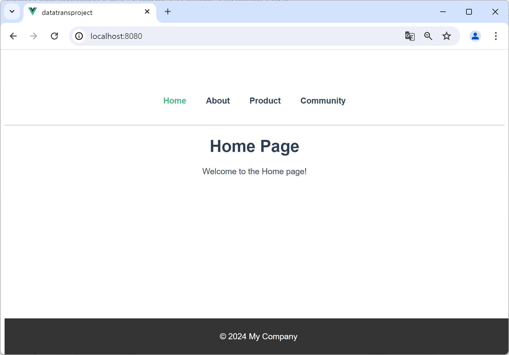

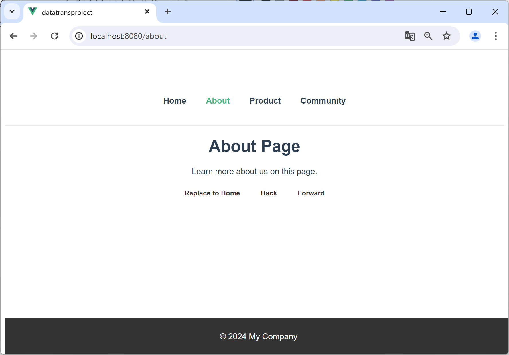

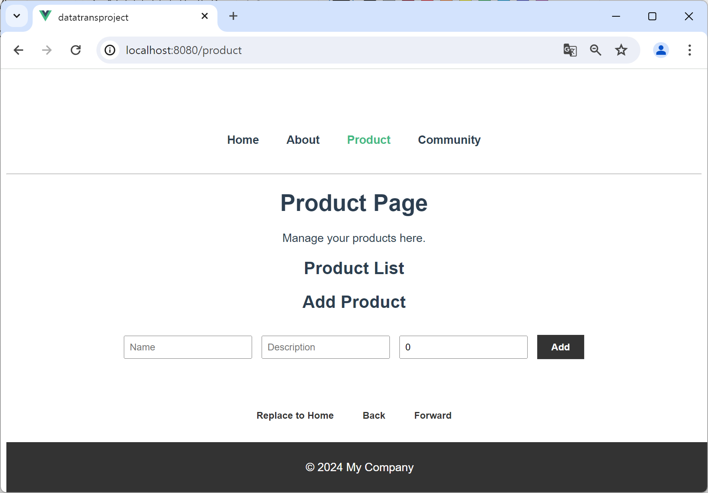

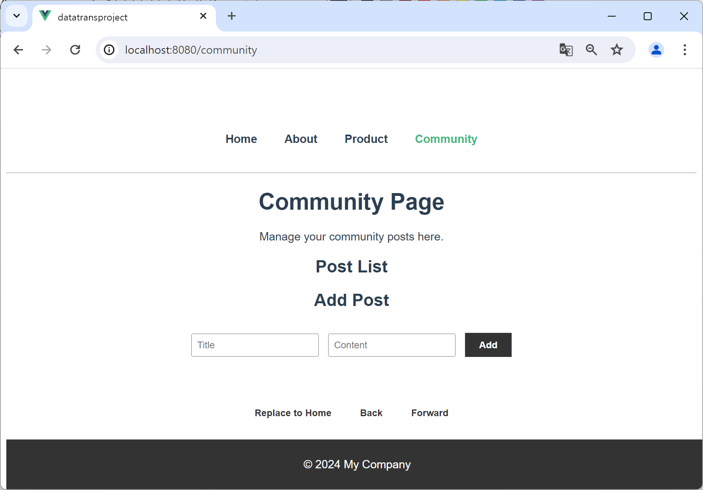

<br><br><br>

## 5-10. Navigation Gard(네비게이션 가드)

- 네비게이션 가드(Navigation Guard)를 사용하여 라우트 전환을 제어하고 특정 조건에 따라 라우팅을 허용하거나 거부할 수 있습니다. 네비게이션 가드는 글로벌 가드, 라우트별 가드, 컴포넌트별 가드의 세 가지 주요 유형으로 나뉩니다.

<br>

### 5-10-1. 글로벌 가드 (Global Guard)

- 글로벌 가드는 라우터 인스턴스에 직접 등록되며, 모든 라우트 전환에 대해 호출됩니다. 세 가지 주요 글로벌 가드가 있습니다:

beforeEach: 라우트 전환이 일어나기 전에 호출됩니다.
beforeResolve: 모든 라우트 가드와 비동기 컴포넌트가 완료된 후 호출됩니다.
afterEach: 라우트 전환이 완료된 후 호출됩니다.

<br>

**예시 코드**

```javascript
import { createRouter, createWebHistory } from 'vue-router';
import Home from './views/Home.vue';
import About from './views/About.vue';

const routes = [
  { path: '/', component: Home },
  { path: '/about', component: About }
];

const router = createRouter({
  history: createWebHistory(),
  routes
});

// beforeEach 가드
router.beforeEach((to, from, next) => {
  console.log('Global beforeEach');
  next(); // 반드시 next() 호출
});

// beforeResolve 가드
router.beforeResolve((to, from, next) => {
  console.log('Global beforeResolve');
  next();
});

// afterEach 가드
router.afterEach((to, from) => {
  console.log('Global afterEach');
});

export default router;
```

<br><br>

### 5-10-2. 라우트별 가드 (Route Guard)

- 라우트별 가드는 특정 라우트에 대해 정의되며, 라우트의 beforeEnter 속성을 사용하여 설정합니다.

**예시 코드**

```javascript
import { createRouter, createWebHistory } from 'vue-router';
import Home from './views/Home.vue';
import About from './views/About.vue';

const routes = [
  { path: '/', component: Home },
  { 
    path: '/about', 
    component: About,
    beforeEnter: (to, from, next) => {
      console.log('Route-specific beforeEnter');
      next();
    }
  }
];

const router = createRouter({
  history: createWebHistory(),
  routes
});

export default router;
```

<br>

### 5-10-3. 컴포넌트 가드 (Component Guard)

- 컴포넌트 가드는 컴포넌트 내부에 정의되며, 세 가지 주요 가드가 있습니다:

1. beforeRouteEnter: 라우트가 전환되기 전에 호출됩니다.
2. beforeRouteUpdate: 동일한 컴포넌트가 재사용될 때 호출됩니다.
3. beforeRouteLeave: 라우트가 떠나기 전에 호출됩니다.

<br>

#### 5-10-3-1. 예시 코드

**Home.vue**

```html
<template>
  <div>
    <h1>Home</h1>
  </div>
</template>

<script>
export default {
  name: 'Home',
  beforeRouteEnter(to, from, next) {
    console.log('Component beforeRouteEnter');
    next();
  },
  beforeRouteUpdate(to, from, next) {
    console.log('Component beforeRouteUpdate');
    next();
  },
  beforeRouteLeave(to, from, next) {
    console.log('Component beforeRouteLeave');
    next();
  }
};
</script>
```

<br>

**About.vue**

```html
<template>
  <div>
    <h1>About</h1>
  </div>
</template>

<script>
export default {
  name: 'About',
  beforeRouteEnter(to, from, next) {
    console.log('Component beforeRouteEnter');
    next();
  },
  beforeRouteUpdate(to, from, next) {
    console.log('Component beforeRouteUpdate');
    next();
  },
  beforeRouteLeave(to, from, next) {
    console.log('Component beforeRouteLeave');
    next();
  }
};
</script>
```

<br>

### 5-10-4. 네비게이션 가드 종합 예제

```javascript
import { createRouter, createWebHistory } from 'vue-router';
import Home from './views/Home.vue';
import About from './views/About.vue';

const routes = [
  { path: '/', component: Home },
  { 
    path: '/about', 
    component: About,
    beforeEnter: (to, from, next) => {
      console.log('Route-specific beforeEnter');
      next();
    }
  }
];

const router = createRouter({
  history: createWebHistory(),
  routes
});

// 글로벌 가드
router.beforeEach((to, from, next) => {
  console.log('Global beforeEach');
  next();
});

router.beforeResolve((to, from, next) => {
  console.log('Global beforeResolve');
  next();
});

router.afterEach((to, from) => {
  console.log('Global afterEach');
});

export default router;
```

- Home.vue와 About.vue는 이전 예시 코드와 동일하게 컴포넌트 가드를 포함합니다.

<br><br>

### 5-10-5. 네비게이션 가드를 활용한 애플리케이션 제작 실습

**프로젝트 생성**

```shell
D:\gitRepository\vuejs\study05>vue create navigardproject

Vue CLI v5.0.8
? Please pick a preset: Manually select features
? Check the features needed for your project: Babel, TS, Router, Vuex
? Choose a version of Vue.js that you want to start the project with 3.x
? Use class-style component syntax? No
? Use Babel alongside TypeScript (required for modern mode, auto-detected polyfills, transpiling JSX)? Yes
? Use history mode for router? (Requires proper server setup for index fallback in production) Yes
? Where do you prefer placing config for Babel, ESLint, etc.? In package.json
? Save this as a preset for future projects? No
```

<br>

**프로젝트 구조**

```lua
navigardproject/
├── babel.config.js
├── package.json
├── tsconfig.json
├── vue.config.js
├── public/
│   └── index.html
├── src/
│   ├── App.vue
│   ├── main.ts
│   ├── shims-vue.d.ts
│   ├── components/
│   │   ├── Header.vue
│   │   └── Footer.vue
│   ├── model/
│   │   └── index.ts
│   ├── router/
│   │   └── index.ts
│   ├── store/
│   │   ├── index.ts
│   │   ├── state.ts
│   │   ├── actions.ts
│   │   └── mutations.ts
│   └── views/
│       ├── Home.vue
│       ├── About.vue
│       ├── Product.vue
│       └── Community.vue
```

<br>

**01. package.json**

```json
{
  "name": "navigardproject",
  "version": "0.1.0",
  "private": true,
  "scripts": {
    "serve": "vue-cli-service serve",
    "build": "vue-cli-service build"
  },
  "dependencies": {
    "core-js": "^3.8.3",
    "vue": "^3.2.13",
    "vue-router": "^4.0.3",
    "vuex": "^4.0.0"
  },
  "devDependencies": {
    "@vue/cli-plugin-babel": "~5.0.0",
    "@vue/cli-plugin-router": "~5.0.0",
    "@vue/cli-plugin-typescript": "~5.0.0",
    "@vue/cli-plugin-vuex": "~5.0.0",
    "@vue/cli-service": "~5.0.0",
    "typescript": "~4.5.5"
  },
  "browserslist": [
    "> 1%",
    "last 2 versions",
    "not dead",
    "not ie 11"
  ]
}
```

<br>

**02. babel.config.js**

```js
module.exports = {
  presets: [
    '@vue/cli-plugin-babel/preset'
  ]
}
```

<br>

**03. tsconfig.json**

```json
{
  "compilerOptions": {
    "target": "esnext",
    "module": "esnext",
    "strict": true,
    "jsx": "preserve",
    "importHelpers": true,
    "moduleResolution": "node",
    "skipLibCheck": true,
    "esModuleInterop": true,
    "allowSyntheticDefaultImports": true,
    "sourceMap": true,
    "baseUrl": ".",
    "paths": {
      "@/*": ["src/*"]
    },
    "lib": ["esnext", "dom"]
  },
  "include": ["src/**/*.ts", "src/**/*.tsx", "src/**/*.vue", "tests/**/*.ts", "tests/**/*.tsx"],
  "exclude": ["node_modules"]
}
```

<br>

**04. vue.config.js**

```js
const { defineConfig } = require('@vue/cli-service')
module.exports = defineConfig({
  lintOnSave: false,
  transpileDependencies: true
})
```

<br>

**05. src/main.ts**

```typescript
import { createApp } from 'vue';
import App from './App.vue';
import router from './router';
import store from './store';

createApp(App).use(router).use(store).mount('#app');
```

<br>

**06. src/shims-vue.d.ts**

```typescript
declare module '*.vue' {
  import { DefineComponent } from 'vue';
  const component: DefineComponent<{}, {}, any>;
  export default component;
}
```

<br>

**07. src/store/index.ts**

```typescript
import { createStore } from 'vuex';
import state from './state';
import actions from './actions';
import mutations from './mutations';

export default createStore({
  state,
  actions,
  mutations
});
```

<br>

**08. src/store/state.ts**

```typescript
import { Product, Post } from '@/model';

interface State {
  products: Product[];
  posts: Post[];
}

const state: State = {
  products: [],
  posts: []
};

export default state;
```

<br>

**09. src/store/actions.ts**

```typescript
import { ActionContext } from 'vuex';
import { Product, Post } from '@/model';
import state from './state';

export default {
  addProduct({ commit }: ActionContext<typeof state, any>, product: Product) {
    commit('ADD_PRODUCT', product);
  },
  deleteProduct({ commit }: ActionContext<typeof state, any>, id: number) {
    commit('DELETE_PRODUCT', id);
  },
  addPost({ commit }: ActionContext<typeof state, any>, post: Post) {
    commit('ADD_POST', post);
  },
  deletePost({ commit }: ActionContext<typeof state, any>, id: number) {
    commit('DELETE_POST', id);
  }
};
```

<br>

**10. src/store/mutations.ts**

```typescript
import { MutationTree } from 'vuex';
import { State } from './state';
import { Product, Post } from '@/model';

const mutations: MutationTree<State> = {
  ADD_PRODUCT(state, product: Product) {
    state.products.push(product);
  },
  DELETE_PRODUCT(state, id: number) {
    state.products = state.products.filter(product => product.id !== id);
  },
  ADD_POST(state, post: Post) {
    state.posts.push(post);
  },
  DELETE_POST(state, id: number) {
    state.posts = state.posts.filter(post => post.id !== id);
  }
};

export default mutations;
```

<br>

**11. src/model/index.ts**

```typescript
export interface Product {
  id: number;
  name: string;
  price: number;
}

export interface Post {
  id: number;
  title: string;
  content: string;
}
```

<br>

**12. src/components/Header.vue**

```vue
<template>
  <div>
    <router-link to="/">Home</router-link>
    <router-link to="/about">About</router-link>
    <router-link to="/product">Product</router-link>
    <router-link to="/community">Community</router-link>
  </div>
</template>

<script lang="ts">
import { defineComponent } from 'vue';

export default defineComponent({
  name: 'Header'
});
</script>

<style scoped>
/* Add your styles here */
</style>
```

<br>

**13. src/components/Footer.vue**

```vue
<template>
  <footer>
    <p>&copy; 2024 My Company</p>
  </footer>
</template>

<script lang="ts">
import { defineComponent } from 'vue';

export default defineComponent({
  name: 'Footer'
});
</script>

<style scoped>
/* Add your styles here */
</style>
```

<br>

**14. public/index.html**

```html
<!DOCTYPE html>
<html lang="en">
<head>
  <meta charset="UTF-8">
  <meta name="viewport" content="width=device-width, initial-scale=1.0">
  <title>navigardproject</title>
</head>
<body>
  <div id="app"></div>
</body>
</html>
```

<br>

**15. src/App.vue**

```vue
<template>
  <div id="app">
    <Header />
    <router-view />
    <Footer />
  </div>
</template>

<script lang="ts">
import { defineComponent } from 'vue';
import Header from '@/components/Header.vue';
import Footer from '@/components/Footer.vue';

export default defineComponent({
  name: 'App',
  components: {
    Header,
    Footer
  }
});
</script>

<style>
#app {
  font-family: Avenir, Helvetica, Arial, sans-serif;
  -webkit-font-smoothing: antialiased;
  -moz-osx-font-smoothing: grayscale;
  text-align: center;
  color: #2c3e50;
  margin-top: 60px;
}

nav {
  padding: 30px;
}

nav a {
  font-weight: bold;
  color: #2c3e50;
  padding: 1.2em;
  text-decoration: none;
}

nav a.router-link-exact-active {
  color: #42b983;
}

form {
  margin-top: 2em;
  margin-bottom: 3em;
}

button { 
  background-color: transparent;
  outline: none;
  border: none;
  color: #333;
  padding: 0.7em 1.5em;
  font-weight: bold;
  margin-bottom: 1em;
}

form button {
  color: #fff;
  background-color: #333;
}

form input {
  padding: 0.5em;
  margin-right: 1em;
}
</style>
```

<br>

**16. src/router/index.ts**

```typescript
import { createRouter, createWebHistory, createWebHashHistory } from 'vue-router';
import Home from '@/views/Home.vue';
import About from '@/views/About.vue';
import Product from '@/views/Product.vue';
import Community from '@/views/Community.vue';

// Global guard example
const globalGuard = (to: any, from: any, next: any) => {
  console.log('Global Guard:', to, from);
  next();
};

const routes = [
  { path: '/', component: Home },
  { path: '/home', redirect: '/' },
  { path: '/about', alias: '/info', component: About },
  { path: '/product', alias: ['/goods', '/event'], component: Product },
  { path: '/community', alias: ['/board', '/notice'], component: Community }
];

const router = createRouter({
  // Use either createWebHistory() or createWebHashHistory()
  history: createWebHistory(),
  // history: createWebHashHistory(),
  routes
});

router.beforeEach(globalGuard);

export default router;
```

<br>

**17. src/views/Home.vue**

```vue
<template>
  <div>
    <h1>Home</h1>
  </div>
</template>

<script lang="ts">
import { defineComponent } from 'vue';

export default defineComponent({
  name: 'Home'
});
</script>

<style scoped>
/* Add your styles here */
</style>
```

<br>

**18. src/views/About.vue**

```vue
<template>
  <div>
    <h1>About</h1>
  </div>
</template>

<script lang="ts">
import { defineComponent } from 'vue';

export default defineComponent({
  name: 'About',
  beforeRouteEnter(to, from, next) {
    console.log('Component Guard: About - beforeRouteEnter');
    next();
  },
  beforeRouteUpdate(to, from, next) {
    console.log('Component Guard: About - beforeRouteUpdate');
    next();
  },
  beforeRouteLeave(to, from, next) {
    console.log('Component Guard: About - beforeRouteLeave');
    next();
  }
});
</script>

<style scoped>
/* Add your styles here */
</style>
```

<br>

**19. src/views/Product.vue**

```vue
<template>
  <div>
    <h1>Product</h1>
    <div>
      <input v-model="newProduct.name" placeholder="Product Name" />
      <input v-model.number="newProduct.price" placeholder="Product Price" />
      <button @click="addProduct">Add Product</button>
    </div>
    <ul>
      <li v-for="product in products" :key="product.id">
        <router-link :to="{ name: 'ProductDetail', params: { id: product.id } }">{{ product.name }}</router-link>
        <button @click="deleteProduct(product.id)">Delete</button>
      </li>
    </ul>
  </div>
</template>

<script lang="ts">
import { defineComponent, reactive, computed } from 'vue';
import { useStore } from 'vuex';
import { Product } from '@/model';

export default defineComponent({
  name: 'Product',
  setup() {
    const store = useStore();

    const newProduct = reactive({
      name: '',
      price: 0
    });

    const products = computed(() => store.state.products);

    const addProduct = () => {
      const product: Product = {
        id: Math.floor(Math.random() * 1000), // 임의의 ID 생성 (실제로는 서버에서 생성)
        name: newProduct.name,
        price: newProduct.price
      };
      store.dispatch('addProduct', product);
      newProduct.name = '';
      newProduct.price = 0;
    };

    const deleteProduct = (id: number) => {
      store.dispatch('deleteProduct', id);
    };

    return {
      newProduct,
      products,
      addProduct,
      deleteProduct
    };
  },
  beforeRouteEnter(to, from, next) {
    console.log('Route Guard: Product - beforeRouteEnter');
    next();
  },
  beforeRouteUpdate(to, from, next) {
    console.log('Route Guard: Product - beforeRouteUpdate');
    next();
  },
  beforeRouteLeave(to, from, next) {
    console.log('Route Guard: Product - beforeRouteLeave');
    next();
  }
});
</script>

<style scoped>
/* Add your styles here */
</style>
```

<br>

**20. src/views/Community.vue**

```vue
<template>
  <div>
    <h1>Community</h1>
    <div>
      <input v-model="newPost.title" placeholder="Post Title" />
      <textarea v-model="newPost.content" placeholder="Post Content"></textarea>
      <button @click="addPost">Add Post</button>
    </div>
    <ul>
      <li v-for="post in posts" :key="post.id">
        <router-link :to="{ name: 'PostDetail', params: { id: post.id } }">{{ post.title }}</router-link>
        <button @click="deletePost(post.id)">Delete</button>
      </li>
    </ul>
  </div>
</template>

<script lang="ts">
import { defineComponent, reactive, computed } from 'vue';
import { useStore } from 'vuex';
import { Post } from '@/model';

export default defineComponent({
  name: 'Community',
  setup() {
    const store = useStore();

    const newPost = reactive({
      title: '',
      content: ''
    });

    const posts = computed(() => store.state.posts);

    const addPost = () => {
      const post: Post = {
        id: Math.floor(Math.random() * 1000), // 임의의 ID 생성 (실제로는 서버에서 생성)
        title: newPost.title,
        content: newPost.content
      };
      store.dispatch('addPost', post);
      newPost.title = '';
      newPost.content = '';
    };

    const deletePost = (id: number) => {
      store.dispatch('deletePost', id);
    };

    return {
      newPost,
      posts,
      addPost,
      deletePost
    };
  },
  beforeRouteEnter(to, from, next) {
    console.log('Route Guard: Community - beforeRouteEnter');
    next();
  },
  beforeRouteUpdate(to, from, next) {
    console.log('Route Guard: Community - beforeRouteUpdate');
    next();
  },
  beforeRouteLeave(to, from, next) {
    console.log('Route Guard: Community - beforeRouteLeave');
    next();
  }
});
</script>

<style scoped>
/* Add your styles here */
</style>
```

<br>

**애플리케이션 실행**

```shell
D:\gitRepository\vuejs\study05>cd navigardproject

D:\gitRepository\vuejs\study05\navigardproject>npm run serve

> dynamicproject@0.1.0 serve
> vue-cli-service serve

 INFO  Starting development server...

 DONE  Compiled successfully in 1838ms                                                                      오후 7:04:28

  App running at:
  - Local:   http://localhost:8080/
  - Network: http://192.168.0.9:8080/

  Note that the development build is not optimized.
  To create a production build, run npm run build.

Issues checking in progress...
No issues found.
```

<br>

**프로젝트 브라우저에서 열기**

1. 브라우저의 주소 입력줄에 `http://localhost:8080/` 을 입력한다.
2. 나타난 화면에서 Home / About / Product / Community 를 각 각 클릭해본다.
3. 각 페이지에서 Replace to Home / Back / Forward 버튼 링크를 클릭해본다. 
4. Product 페이지에서 상품 추가, 상품 목록, 상품 상세보기, 상품 수정, 상품 제거를 진행해본다.
5. Community 페이지에서 글 추가, 글 목록, 글 상세보기, 글 수정, 글 제거를 진행해본다.

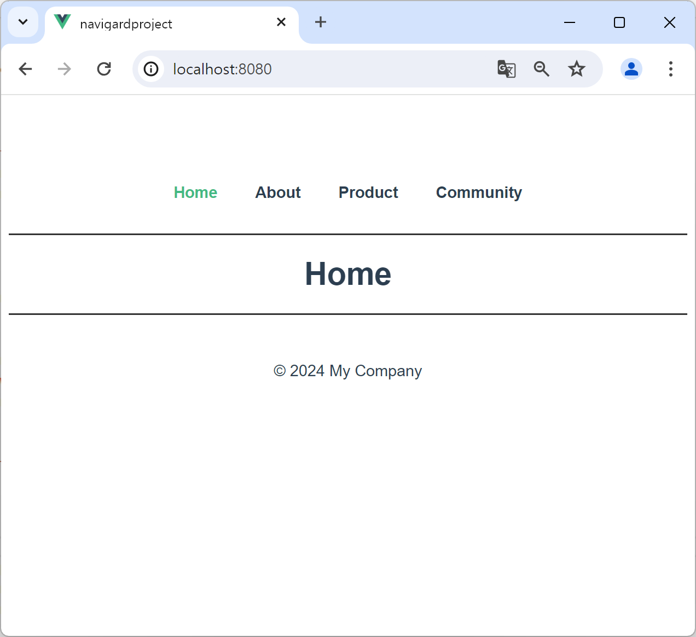

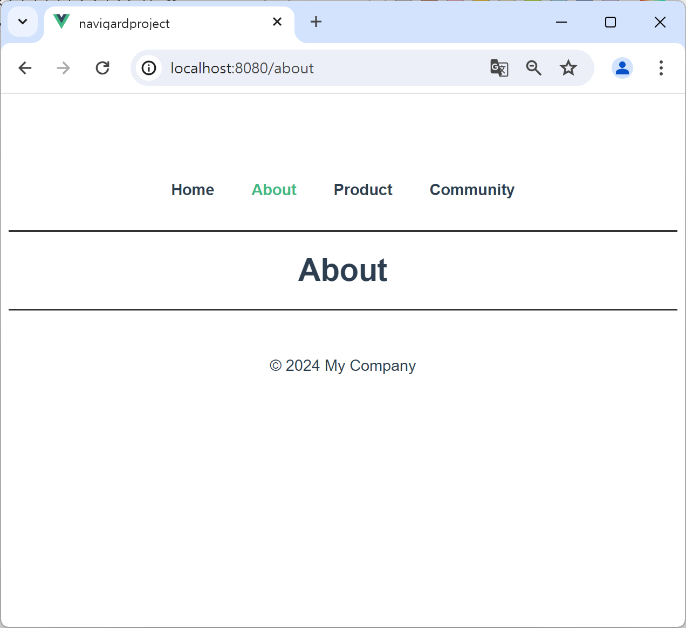


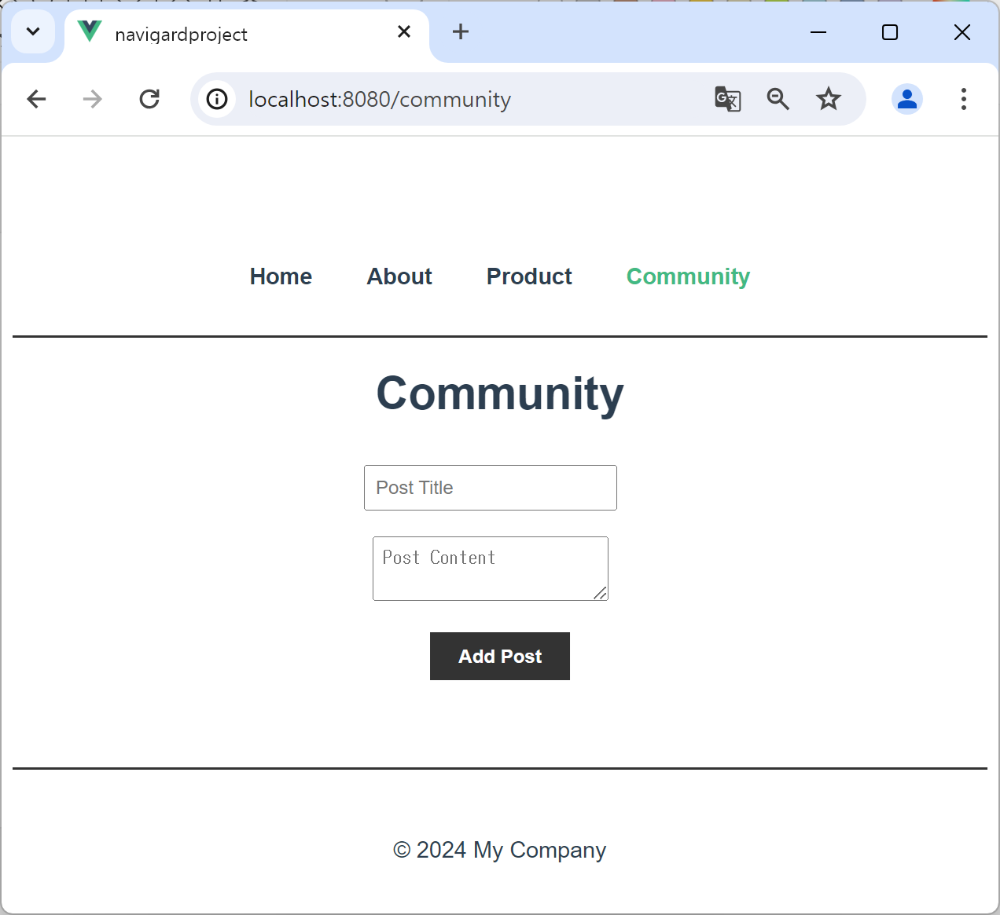


<br><br><br>

## 5-11. Route 를 활용한 메뉴 구성

```html
    <nav id="gnb">
        <ul class="menu">
            <li>
                <a href="/company" class="dp1">Company</a>
                <ul class="sub">
                    <li><a href="/company/intro">회사소개</a></li>
                    <li><a href="/company/hitory">회사연혁</a></li>
                    <li><a href="/company/greetings">인사말</a></li>
                    <li><a href="/company/organization">조직</a></li>
                </ul>
            </li>
            <li>
                <a href="/product" class="dp1">Product</a>
                <ul class="sub">
                    <li><a href="/product/a01">도서</a></li>
                    <li><a href="/product/b01">문구</a></li>
                    <li><a href="/product/c01">학습</a></li>
                    <li><a href="/product/d01">액세사리</a></li>
                </ul>
            </li>
            <li>
                <a href="/service" class="dp1">Service</a>
                <ul class="sub">
                    <li><a href="/service/online">온라인 서비스</a></li>
                    <li><a href="/service/visit">방문 서비스</a></li>
                    <li><a href="/service/delivery">택배 서비스</a></li>
                    <li><a href="/service/reservation">시설 이용 예약 서비스</a></li>
                </ul>
            </li>
            <li>
                <a href="/community" class="dp1">Cummunity</a>
                <ul class="sub">
                    <li><a href="/community/notice">공지사항</a></li>
                    <li><a href="/community/qna">질문 및 답변</a></li>
                    <li><a href="/community/faq">자주하는 질문</a></li>
                    <li><a href="/community/online">온라인 상담</a></li>
                    <li><a href="/community/chatbot">챗봇 상담</a></li>
                </ul>
            </li>
        </ul>
    </nav>
```

<div style="font-size:32px;color:red;"> 위와 같은 html에서 작성된 메뉴를 Vue 에서의 코드로 변환하도록 하겠습니다.</div>

### 5-11-1. 프로젝트 생성

```bash
D:\gitRepository\vuejs\study05>vue create routemenuproject

Vue CLI v5.0.8
? Please pick a preset: Manually select features
? Check the features needed for your project: Babel, TS, Router, Vuex
? Choose a version of Vue.js that you want to start the project with 3.x
? Use class-style component syntax? No
? Use Babel alongside TypeScript (required for modern mode, auto-detected polyfills, transpiling JSX)? Yes
? Use history mode for router? (Requires proper server setup for index fallback in production) Yes
? Where do you prefer placing config for Babel, ESLint, etc.? In package.json
? Save this as a preset for future projects? No
```

<br><br>

#### 15-11-1-1. 프로젝트의 구조

```lua
src/
|-- assets/
|-- components/
|-- views/
|   |-- company/
|   |   |-- Intro.vue
|   |   |-- History.vue
|   |   |-- Greetings.vue
|   |   |-- Organization.vue
|   |-- product/
|   |   |-- A01.vue
|   |   |-- B01.vue
|   |   |-- C01.vue
|   |   |-- D01.vue
|   |-- service/
|   |   |-- Online.vue
|   |   |-- Visit.vue
|   |   |-- Delivery.vue
|   |   |-- Reservation.vue
|   |-- community/
|   |   |-- Notice.vue
|   |   |-- QnA.vue
|   |   |-- FAQ.vue
|   |   |-- Online.vue
|   |   |-- Chatbot.vue
|   |-- Home.vue
|   |-- Company.vue
|   |-- Product.vue
|   |-- Service.vue
|   |-- Community.vue
|-- App.vue
|-- main.ts
|-- router/
|   |-- index.ts
```

<br><br>

### 5-11-2. 라우트 설정

- 라우트 설정을 위해 src/router/index.ts 파일을 생성하고, 다음과 같이 라우트를 설정합니다.

```typescript
import { createRouter, createWebHistory } from 'vue-router';
import Home from '../views/Home.vue';
import Company from '../views/Company.vue';
import CompanyIntro from '../views/company/Intro.vue';
import CompanyHistory from '../views/company/History.vue';
import CompanyGreetings from '../views/company/Greetings.vue';
import CompanyOrganization from '../views/company/Organization.vue';
import Product from '../views/Product.vue';
import ProductA01 from '../views/product/A01.vue';
import ProductB01 from '../views/product/B01.vue';
import ProductC01 from '../views/product/C01.vue';
import ProductD01 from '../views/product/D01.vue';
import Service from '../views/Service.vue';
import ServiceOnline from '../views/service/Online.vue';
import ServiceVisit from '../views/service/Visit.vue';
import ServiceDelivery from '../views/service/Delivery.vue';
import ServiceReservation from '../views/service/Reservation.vue';
import Community from '../views/Community.vue';
import CommunityNotice from '../views/community/Notice.vue';
import CommunityQnA from '../views/community/QnA.vue';
import CommunityFAQ from '../views/community/FAQ.vue';
import CommunityOnline from '../views/community/Online.vue';
import CommunityChatbot from '../views/community/Chatbot.vue';

const routes = [
  { path: '/', component: Home },
  { path: '/company', component: Company,
    children: [
      { path: 'intro', component: CompanyIntro },
      { path: 'history', component: CompanyHistory },
      { path: 'greetings', component: CompanyGreetings },
      { path: 'organization', component: CompanyOrganization }
    ]
  },
  { path: '/product', component: Product,
    children: [
      { path: 'a01', component: ProductA01 },
      { path: 'b01', component: ProductB01 },
      { path: 'c01', component: ProductC01 },
      { path: 'd01', component: ProductD01 }
    ]
  },
  { path: '/service', component: Service,
    children: [
      { path: 'online', component: ServiceOnline },
      { path: 'visit', component: ServiceVisit },
      { path: 'delivery', component: ServiceDelivery },
      { path: 'reservation', component: ServiceReservation }
    ]
  },
  { path: '/community', component: Community,
    children: [
      { path: 'notice', component: CommunityNotice },
      { path: 'qna', component: CommunityQnA },
      { path: 'faq', component: CommunityFAQ },
      { path: 'online', component: CommunityOnline },
      { path: 'chatbot', component: CommunityChatbot }
    ]
  }
];

const router = createRouter({
  history: createWebHistory(),
  routes
});

export default router;
```

<br><br>

### 5-11-3. App.vue 업데이트

- App.vue 파일을 업데이트하여 네비게이션 메뉴와 `<router-view>`를 추가합니다.

```html
<template>
  <div id="app">
    <nav id="gnb">
      <ul class="menu">
        <li>
          <router-link to="/company" class="dp1">Company</router-link>
          <ul class="sub">
            <li><router-link to="/company/intro">회사소개</router-link></li>
            <li><router-link to="/company/history">회사연혁</router-link></li>
            <li><router-link to="/company/greetings">인사말</router-link></li>
            <li><router-link to="/company/organization">조직</router-link></li>
          </ul>
        </li>
        <li>
          <router-link to="/product" class="dp1">Product</router-link>
          <ul class="sub">
            <li><router-link to="/product/a01">도서</router-link></li>
            <li><router-link to="/product/b01">문구</router-link></li>
            <li><router-link to="/product/c01">학습</router-link></li>
            <li><router-link to="/product/d01">액세사리</router-link></li>
          </ul>
        </li>
        <li>
          <router-link to="/service" class="dp1">Service</router-link>
          <ul class="sub">
            <li><router-link to="/service/online">온라인 서비스</router-link></li>
            <li><router-link to="/service/visit">방문 서비스</router-link></li>
            <li><router-link to="/service/delivery">택배 서비스</router-link></li>
            <li><router-link to="/service/reservation">시설 이용 예약 서비스</router-link></li>
          </ul>
        </li>
        <li>
          <router-link to="/community" class="dp1">Community</router-link>
          <ul class="sub">
            <li><router-link to="/community/notice">공지사항</router-link></li>
            <li><router-link to="/community/qna">질문 및 답변</router-link></li>
            <li><router-link to="/community/faq">자주하는 질문</router-link></li>
            <li><router-link to="/community/online">온라인 상담</router-link></li>
            <li><router-link to="/community/chatbot">챗봇 상담</router-link></li>
          </ul>
        </li>
      </ul>
    </nav>
    <router-view></router-view>
  </div>
</template>

<script>
export default {
  name: 'App'
};
</script>

<style>
/* 스타일을 추가하세요 */
</style>
```

<br><br>

### 5-11-4. 네비게이션에 기입된 컴포넌트 작성

- 각 라우트에 대한 컴포넌트를 작성합니다.

**01. views/Home.vue**

```html
<template>
  <div>
    <h1>Home</h1>
  </div>
</template>

<script>
export default {
  name: 'Home'
};
</script>
```

<br>

**02. views/Company.vue**

```html
<template>
  <div>
    <h1>Company</h1>
    <router-view></router-view>
  </div>
</template>

<script>
export default {
  name: 'Company'
};
</script>
```

<br>

**03. views/company/Intro.vue**

```html
<template>
  <div>
    <h1>회사소개</h1>
  </div>
</template>

<script>
export default {
  name: 'CompanyIntro'
};
</script>
```

<br>

**04. views/company/History.vue**

```html
<template>
  <div>
    <h1>회사연혁</h1>
  </div>
</template>

<script>
export default {
  name: 'CompanyHistory'
};
</script>
```

<br>

**05. views/company/Greetings.vue**

```html
<template>
  <div>
    <h1>인사말</h1>
  </div>
</template>

<script>
export default {
  name: 'CompanyGreetings'
};
</script>
```

<br>

**06. views/company/Organization.vue**

```html
<template>
  <div>
    <h1>조직</h1>
  </div>
</template>

<script>
export default {
  name: 'CompanyOrganization'
};
</script>
```

<br>

**07. views/Product.vue**

```html
<template>
  <div>
    <h1>Product</h1>
    <router-view></router-view>
  </div>
</template>

<script>
export default {
  name: 'Product'
};
</script>
```

<br>

**08. views/product/A01.vue**

```html
<template>
  <div>
    <h1>도서</h1>
  </div>
</template>

<script>
export default {
  name: 'ProductA01'
};
</script>
```

<br>

**09. views/product/B01.vue**

```html
<template>
  <div>
    <h1>문구</h1>
  </div>
</template>

<script>
export default {
  name: 'ProductB01'
};
</script>
```

<br>

**10. views/product/C01.vue**

```html
<template>
  <div>
    <h1>학습</h1>
  </div>
</template>

<script>
export default {
  name: 'ProductC01'
};
</script>
```

<br>

**11. views/product/D01.vue**

```html
<template>
  <div>
    <h1>액세사리</h1>
  </div>
</template>

<script>
export default {
  name: 'ProductD01'
};
</script>
```

<br>

**12. views/Service.vue**

```html
<template>
  <div>
    <h1>Service</h1>
    <router-view></router-view>
  </div>
</template>

<script>
export default {
  name: 'Service'
};
</script>
```

<br>

**13. views/service/Online.vue**

```html
<template>
  <div>
    <h1>온라인 서비스</h1>
  </div>
</template>

<script>
export default {
  name: 'ServiceOnline'
};
</script>
```

<br>

**14. views/service/Visit.vue**

```html
<template>
  <div>
    <h1>방문 서비스</h1>
  </div>
</template>

<script>
export default {
  name: 'ServiceVisit'
};
</script>
```

<br>

**15. views/service/Delivery.vue**

```html
<template>
  <div>
    <h1>택배 서비스</h1>
  </div>
</template>

<script>
export default {
  name: 'ServiceDelivery'
};
</script>
```

<br>

**16. views/service/Reservation.vue**

```html
<template>
  <div>
    <h1>시설 이용 예약 서비스</h1>
  </div>
</template>

<script>
export default {
  name: 'ServiceReservation'
};
</script>
```

<br>

**17. views/Community.vue**

```html
<template>
  <div>
    <h1>Community</h1>
    <router-view></router-view>
  </div>
</template>

<script>
export default {
  name: 'Community'
};
</script>
```

<br>

**18. views/community/Notice.vue**

```html
<template>
  <div>
    <h1>공지사항</h1>
  </div>
</template>

<script>
export default {
  name: 'CommunityNotice'
};
</script>
```

<br>

**19. views/community/QnA.vue**

```html
<template>
  <div>
    <h1>질문 및 답변</h1>
  </div>
</template>

<script>
export default {
  name: 'CommunityQnA'
};
</script>
```

<br>

**20. views/community/FAQ.vue**

```html
<template>
  <div>
    <h1>자주하는 질문</h1>
  </div>
</template>

<script>
export default {
  name: 'CommunityFAQ'
};
</script>
```

<br>

**21. views/community/Online.vue**

```html
<template>
  <div>
    <h1>온라인 상담</h1>
  </div>
</template>

<script>
export default {
  name: 'CommunityOnline'
};
</script>
```

<br>

**22. views/community/Chatbot.vue**

```html
<template>
  <div>
    <h1>챗봇 상담</h1>
  </div>
</template>

<script>
export default {
  name: 'CommunityChatbot'
};
</script>
```

<br>

**애플리케이션 실행**

```shell
D:\gitRepository\vuejs\study05>cd routemenuproject

D:\gitRepository\vuejs\study05\routemenuproject>npm run serve

> dynamicproject@0.1.0 serve
> vue-cli-service serve

 INFO  Starting development server...

 DONE  Compiled successfully in 1838ms                                                                      오후 7:04:28

  App running at:
  - Local:   http://localhost:8080/
  - Network: http://192.168.0.9:8080/

  Note that the development build is not optimized.
  To create a production build, run npm run build.

Issues checking in progress...
No issues found.
```

<br>

**프로젝트 브라우저에서 열기**

1. 브라우저의 주소 입력줄에 `http://localhost:8080/` 을 입력한다.
2. 나타난 화면에서 Company / Product / Service / Community 를 각 각 클릭해본다.
3. 각 페이지에서 서브 메뉴를 클릭한다.

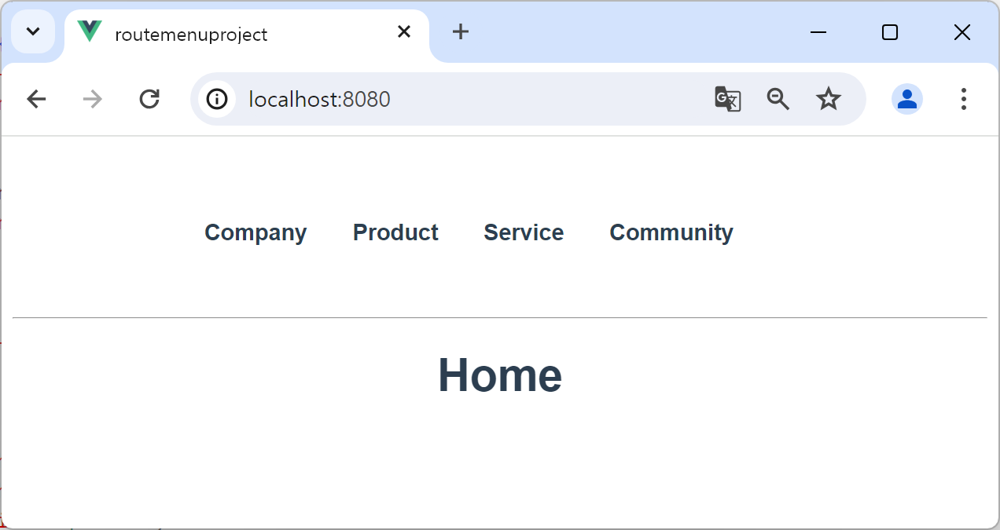

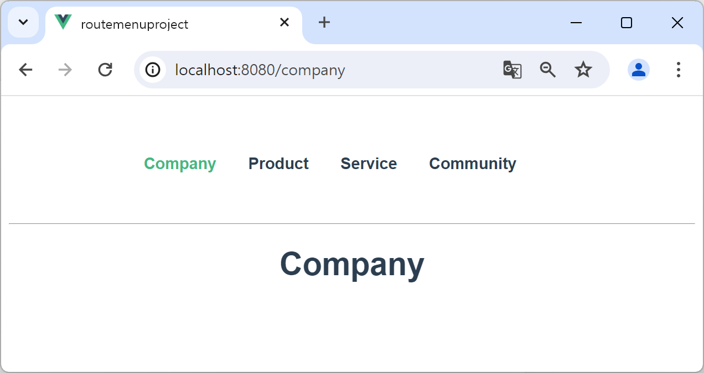

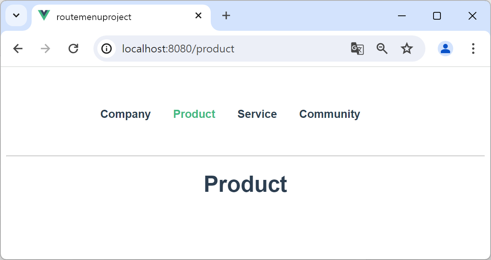

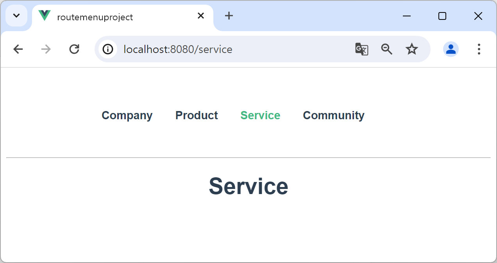


<br><br><br>

## 5-12. Axios

- Axios를 사용하면 Vue.js 애플리케이션에서 HTTP 요청을 효율적으로 관리할 수 있습니다.

**Axios 구성 요소**

| 구성 요소       | 설명                                                                 | 기본 문법 및 예시 코드                                                                                                     |
|----------------|--------------------------------------------------------------------|--------------------------------------------------------------------------------------------------------------------------|
| **Axios 인스턴스** | Axios는 기본 인스턴스 외에도 설정을 커스터마이징한 인스턴스를 생성할 수 있습니다. | ```javascript<br>import axios from 'axios';<br>const instance = axios.create({<br>  baseURL: 'https://api.example.com',<br>  timeout: 1000,<br>  headers: {'X-Custom-Header': 'foobar'}<br>});<br>``` |
| **요청 메서드**   | Axios는 GET, POST, PUT, DELETE 등 다양한 HTTP 요청 메서드를 지원합니다. | ```javascript<br>axios.get('/user?ID=12345')<br>  .then(response => {<br>    console.log(response);<br>  })<br>  .catch(error => {<br>    console.log(error);<br>  });<br>``` |
| **응답 인터셉터** | 요청이나 응답을 가로채고 처리할 수 있는 메서드입니다.                               | ```javascript<br>axios.interceptors.response.use(function (response) {<br>  // 응답 데이터 가공<br>  return response;<br>}, function (error) {<br>  // 오류 응답 처리<br>  return Promise.reject(error);<br>});<br>``` |
| **요청 취소**    | Axios는 요청을 취소할 수 있는 기능을 제공합니다.                                     | ```javascript<br>const CancelToken = axios.CancelToken;<br>const source = CancelToken.source();<br>axios.get('/user/12345', {<br>  cancelToken: source.token<br>})<br>  .catch(function (thrown) {<br>    if (axios.isCancel(thrown)) {<br>      console.log('Request canceled', thrown.message);<br>    } else {<br>      // handle error<br>    }<br>  });<br>source.cancel('Operation canceled by the user.');<br>``` |
| **병렬 요청**    | 여러 요청을 병렬로 처리할 수 있습니다.                                               | ```javascript<br>function getUserAccount() {<br>  return axios.get('/user/12345');<br>}<br>function getUserPermissions() {<br>  return axios.get('/user/12345/permissions');<br>}<br>axios.all([getUserAccount(), getUserPermissions()])<br>  .then(axios.spread(function (acct, perms) {<br>    // 두 요청이 모두 완료될 때 실행<br>  }));<br>``` |

<br><br>

### 5-12-1. Axios를 Vue.js와 함께 사용하기

#### 5-12-1-1. Axios 설치

```bash
npm install axios
```

<br>

#### 5-12-1-2. Axios 기본 설정

```javascript
// main.js
import { createApp } from 'vue';
import App from './App.vue';
import axios from 'axios';

const app = createApp(App);

// Axios를 Vue 애플리케이션에 플러그인으로 추가
app.config.globalProperties.$axios = axios;

app.mount('#app');
```

<br>

#### 5-12-1-3. 컴포넌트에서의 사용 예시

```javascript
<template>
  <div>
    <h1>{{ user.name }}</h1>
  </div>
</template>

<script>
export default {
  data() {
    return {
      user: {}
    };
  },
  created() {
    this.fetchData();
  },
  methods: {
    async fetchData() {
      try {
        const response = await this.$axios.get('https://api.example.com/user/12345');
        this.user = response.data;
      } catch (error) {
        console.error(error);
      }
    }
  }
};
</script>
```

<br><br>

### 5-12-2. Axios 의 메소드

| 메소드명      | 기본 문법                                                      | 설명                                                                 | 사용 예시                                                                                   |
|--------------|----------------------------------------------------------------|--------------------------------------------------------------------|------------------------------------------------------------------------------------------|
| **axios.get** | `axios.get(url[, config])`                                      | 지정된 URL로 GET 요청을 보냅니다.                                      | ```javascript<br>axios.get('/user?ID=12345')<br>  .then(response => {<br>    console.log(response);<br>  })<br>  .catch(error => {<br>    console.log(error);<br>  });<br>``` |
| **axios.post** | `axios.post(url[, data[, config]])`                            | 지정된 URL로 POST 요청을 보냅니다.                                    | ```javascript<br>axios.post('/user', {<br>  firstName: 'Fred',<br>  lastName: 'Flintstone'<br>})<br>  .then(response => {<br>    console.log(response);<br>  })<br>  .catch(error => {<br>    console.log(error);<br>  });<br>``` |
| **axios.put** | `axios.put(url[, data[, config]])`                              | 지정된 URL로 PUT 요청을 보냅니다.                                     | ```javascript<br>axios.put('/user/12345', {<br>  firstName: 'Fred',<br>  lastName: 'Flintstone'<br>})<br>  .then(response => {<br>    console.log(response);<br>  })<br>  .catch(error => {<br>    console.log(error);<br>  });<br>``` |
| **axios.delete** | `axios.delete(url[, config])`                                    | 지정된 URL로 DELETE 요청을 보냅니다.                                  | ```javascript<br>axios.delete('/user/12345')<br>  .then(response => {<br>    console.log(response);<br>  })<br>  .catch(error => {<br>    console.log(error);<br>  });<br>``` |
| **axios.head** | `axios.head(url[, config])`                                      | 지정된 URL로 HEAD 요청을 보냅니다.                                    | ```javascript<br>axios.head('/user?ID=12345')<br>  .then(response => {<br>    console.log(response);<br>  })<br>  .catch(error => {<br>    console.log(error);<br>  });<br>``` |
| **axios.patch** | `axios.patch(url[, data[, config]])`                            | 지정된 URL로 PATCH 요청을 보냅니다.                                   | ```javascript<br>axios.patch('/user/12345', {<br>  firstName: 'Fred'<br>})<br>  .then(response => {<br>    console.log(response);<br>  })<br>  .catch(error => {<br>    console.log(error);<br>  });<br>``` |
| **axios.options** | `axios.options(url[, config])`                                    | 지정된 URL로 OPTIONS 요청을 보냅니다.                                 | ```javascript<br>axios.options('/user?ID=12345')<br>  .then(response => {<br>    console.log(response);<br>  })<br>  .catch(error => {<br>    console.log(error);<br>  });<br>``` |
| **axios.request** | `axios.request(config)`                                           | 설정을 바탕으로 요청을 보냅니다.                                      | ```javascript<br>axios.request({<br>  method: 'get',<br>  url: '/user/12345'<br>})<br>  .then(response => {<br>    console.log(response);<br>  })<br>  .catch(error => {<br>    console.log(error);<br>  });<br>``` |
| **axios.create** | `axios.create([config])`                                          | 새로운 Axios 인스턴스를 생성합니다.                                    | ```javascript<br>const instance = axios.create({<br>  baseURL: 'https://api.example.com'<br>});<br>instance.get('/user/12345');<br>``` |
| **axios.all** | `axios.all(iterable)`                                             | 여러 요청을 병렬로 수행합니다.                                         | ```javascript<br>axios.all([<br>  axios.get('/user/12345'),<br>  axios.get('/user/67890')<br>])<br>  .then(axios.spread((acct, perms) => {<br>    console.log(acct, perms);<br>  }));<br>``` |
| **axios.spread** | `axios.spread(callback)`                                           | 여러 요청의 응답을 분리된 인수로 전달하는 헬퍼 함수입니다.                     | ```javascript<br>function getUserAccount() {<br>  return axios.get('/user/12345');<br>}<br>function getUserPermissions() {<br>  return axios.get('/user/12345/permissions');<br>}<br>axios.all([getUserAccount(), getUserPermissions()])<br>  .then(axios.spread((acct, perms) => {<br>    console.log(acct, perms);<br>  }));<br>``` |
| **axios.interceptors** | `axios.interceptors`                                             | 요청 및 응답을 가로채고 처리하는 인터셉터를 정의할 수 있습니다.                    | ```javascript<br>axios.interceptors.request.use(config => {<br>  console.log('Request made with ', config);<br>  return config;<br>}, error => {<br>  return Promise.reject(error);<br>});<br>``` |

<br>

#### 5-12-2-1. axios.get()

- 지정된 URL로 GET 요청을 보냅니다.

**문법**

```javascript
axios.get(url[, config])
```

<br>

**예시 코드**

```javascript
axios.get('/user?ID=12345')
  .then(response => {
    console.log(response);
  })
  .catch(error => {
    console.log(error);
  });
```

<br>

#### 5-12-2-2. axios.post()

- 지정된 URL로 POST 요청을 보냅니다.

**문법**

```javascript
axios.post(url[, data[, config]])
```

<br>

**예시 코드**

```javascript
axios.post('/user', {
  firstName: 'Fred',
  lastName: 'Flintstone'
})
  .then(response => {
    console.log(response);
  })
  .catch(error => {
    console.log(error);
  });
```

<br>

#### 5-12-2-3. axios.put()

- 지정된 URL로 PUT 요청을 보냅니다.

**문법** 

```
axios.put(url[, data[, config]])
```

<br>

**예시 코드**

```javascript
axios.put('/user/12345', {
  firstName: 'Fred',
  lastName: 'Flintstone'
})
  .then(response => {
    console.log(response);
  })
  .catch(error => {
    console.log(error);
  });
```

<br>

#### 5-12-2-4. axios.delete()

- 지정된 URL로 DELETE 요청을 보냅니다.

**문법**

```javascript
axios.delete(url[, config])
```

<br>

**예시 코드**

```javascript
axios.delete('/user/12345')
  .then(response => {
    console.log(response);
  })
  .catch(error => {
    console.log(error);
  });
```

<br>

#### 5-12-2-5. axios.head()

- 지정된 URL로 HEAD 요청을 보냅니다.

**문법**

```javascript
axios.head(url[, config])
```


<br>

**예시 코드**

```javascript
axios.head('/user?ID=12345')
  .then(response => {
    console.log(response);
  })
  .catch(error => {
    console.log(error);
  });
```

<br>

#### 5-12-2-6. axios.patch()

- 지정된 URL로 PATCH 요청을 보냅니다.

**문법**

```javascript
axios.patch(url[, data[, config]])
```

<br>

**예시 코드**

```javascript
axios.patch('/user/12345', {
  firstName: 'Fred'
})
  .then(response => {
    console.log(response);
  })
  .catch(error => {
    console.log(error);
  });
```

<br>

#### 5-12-2-7. axios.options()

- 지정된 URL로 OPTIONS 요청을 보냅니다.

**문법**

```javascript
axios.options(url[, config])
```

<br>

**예시 코드**

```javascript
axios.options('/user?ID=12345')
  .then(response => {
    console.log(response);
  })
  .catch(error => {
    console.log(error);
  });
```

<br>

#### 5-12-2-8. axios.request()

- 설정을 바탕으로 요청을 보냅니다.

**문법**

```javascript
axios.request(config)
```

<br>

**예시 코드**

```javascript
axios.request({
  method: 'get',
  url: '/user/12345'
})
  .then(response => {
    console.log(response);
  })
  .catch(error => {
    console.log(error);
  });
```

<br>

#### 5-12-2-9. axios.create()

- 새로운 Axios 인스턴스를 생성합니다.

**문법**

```javascript
axios.create([config])
```

<br>

**예시 코드**

```javascript
const instance = axios.create({
  baseURL: 'https://api.example.com'
});

instance.get('/user/12345')
  .then(response => {
    console.log(response);
  })
  .catch(error => {
    console.log(error);
  });
```

<br>

#### 5-12-2-10. axios.all()

- 여러 요청을 병렬로 수행합니다.

**문법**

```javascript
axios.all(iterable)
```

<br>

**예시 코드**

```javascript
axios.all([
  axios.get('/user/12345'),
  axios.get('/user/67890')
])
  .then(axios.spread((acct, perms) => {
    console.log(acct);
    console.log(perms);
  }));
```

<br>

#### 5-12-2-11. axios.spread()

- 여러 요청의 응답을 분리된 인수로 전달하는 헬퍼 함수입니다.

**문법**

```javascript
axios.spread(callback)
```

<br>


**예시 코드**

```javascript
function getUserAccount() {
  return axios.get('/user/12345');
}

function getUserPermissions() {
  return axios.get('/user/12345/permissions');
}

axios.all([getUserAccount(), getUserPermissions()])
  .then(axios.spread((acct, perms) => {
    console.log(acct);
    console.log(perms);
  }));
```

<br>

#### 5-12-2-12. axios.interceptors

- 요청 및 응답을 가로채고 처리하는 인터셉터를 정의할 수 있습니다.

**문법**

```javascript
axios.interceptors.request.use(onFulfilled, onRejected) 및 axios.interceptors.response.use(onFulfilled, onRejected)
```

<br>

**예시 코드**

```javascript
// 요청 인터셉터
axios.interceptors.request.use(config => {
  console.log('Request made with ', config);
  return config;
}, error => {
  return Promise.reject(error);
});

// 응답 인터셉터
axios.interceptors.response.use(response => {
  console.log('Response received', response);
  return response;
}, error => {
  return Promise.reject(error);
});
```

<br><br>

### 5-12-3. Axios 를 활용한 애플리케이션 제작 실습

**프로젝트 생성**

```shell
D:\gitRepository\vuejs\study05>vue create axiosproject

Vue CLI v5.0.8
? Please pick a preset: Manually select features
? Check the features needed for your project: Babel, TS, Router, Vuex
? Choose a version of Vue.js that you want to start the project with 3.x
? Use class-style component syntax? No
? Use Babel alongside TypeScript (required for modern mode, auto-detected polyfills, transpiling JSX)? Yes
? Use history mode for router? (Requires proper server setup for index fallback in production) Yes
? Where do you prefer placing config for Babel, ESLint, etc.? In package.json
? Save this as a preset for future projects? No
```

<br>

**필요한 라이브러리 및 패키지 설치**

```shell
npm install axios
```

<br>

**프로젝트 구조**

```lua
axiosproject
├── babel.config.js
├── package.json
├── public
│   └── index.html
├── src
│   ├── components
│   │   ├── Footer.vue
│   │   └── Header.vue
│   ├── main.ts
│   ├── model
│   │   └── index.ts
│   ├── router
│   │   └── index.ts
│   ├── shims-vue.d.ts
│   ├── store
│   │   ├── actions.ts
│   │   ├── index.ts
│   │   ├── mutations.ts
│   │   └── state.ts
│   ├── views
│   │   ├── About.vue
│   │   ├── Community.vue
│   │   ├── Home.vue
│   │   └── Product.vue
│   └── App.vue
├── tsconfig.json
└── vue.config.js
```

<br>

**package.json**

```json
{
  "name": "axiosproject",
  "version": "0.1.0",
  "private": true,
  "scripts": {
    "serve": "vue-cli-service serve",
    "build": "vue-cli-service build"
  },
  "dependencies": {
    "core-js": "^3.8.3",
    "vue": "^3.2.13",
    "vue-router": "^4.0.3",
    "vuex": "^4.0.0"
  },
  "devDependencies": {
    "@vue/cli-plugin-babel": "~5.0.0",
    "@vue/cli-plugin-router": "~5.0.0",
    "@vue/cli-plugin-typescript": "~5.0.0",
    "@vue/cli-plugin-vuex": "~5.0.0",
    "@vue/cli-service": "~5.0.0",
    "axios": "^1.7.2",
    "typescript": "~4.5.5"
  },
  "browserslist": [
    "> 1%",
    "last 2 versions",
    "not dead",
    "not ie 11"
  ]
}
```

<br>

**babel.config.js**

```javascript
module.exports = {
  presets: [
    '@vue/cli-plugin-babel/preset'
  ]
};
```

<br>

**tsconfig.json**

```json
{
  "compilerOptions": {
    "target": "esnext",
    "module": "esnext",
    "strict": true,
    "jsx": "preserve",
    "importHelpers": true,
    "moduleResolution": "node",
    "esModuleInterop": true,
    "experimentalDecorators": true,
    "skipLibCheck": true,
    "forceConsistentCasingInFileNames": true,
    "useDefineForClassFields": true,
    "baseUrl": ".",
    "paths": {
      "@/*": ["src/*"]
    },
    "lib": ["esnext", "dom"]
  },
  "include": ["src/**/*.ts", "src/**/*.d.ts", "src/**/*.tsx", "src/**/*.vue"]
}
```

<br>

**vue.config.js**

```javascript
const { defineConfig } = require('@vue/cli-service')
module.exports = defineConfig({
  lintOnSave: false,
  transpileDependencies: true
})
```

<br>

**public/index.html**

```html
<!DOCTYPE html>
<html lang="en">
<head>
  <meta charset="UTF-8">
  <meta name="viewport" content="width=device-width, initial-scale=1.0">
  <title>axiosproject</title>
</head>
<body>
  <div id="app"></div>
</body>
</html>
```

<br>

**src/main.ts**

```typescript
import { createApp } from 'vue';
import App from './App.vue';
import router from './router';
import store from './store';
import axios from 'axios';

const app = createApp(App);

app.config.globalProperties.$axios = axios;

app.use(router);
app.use(store);
app.mount('#app');
```

<br>

**src/shims-vue.d.ts**

```typescript
declare module '*.vue' {
  import { DefineComponent } from 'vue';
  const component: DefineComponent<{}, {}, any>;
  export default component;
}
```

<br>

**src/components/Header.vue**

```vue
<template>
  <header>
    <nav>
      <router-link to="/">Home</router-link>
      <router-link to="/about">About</router-link>
      <router-link to="/product">Product</router-link>
      <router-link to="/community">Community</router-link>
    </nav>
  </header>
</template>

<script lang="ts">
import { defineComponent } from 'vue';

export default defineComponent({
  name: 'Header'
});
</script>

<style scoped>
nav {
  display: flex;
  gap: 10px;
}
</style>
```

<br>

**src/components/Footer.vue**

```vue
<template>
  <footer>
    <p>&copy; 2024 axiosproject</p>
  </footer>
</template>

<script lang="ts">
import { defineComponent } from 'vue';

export default defineComponent({
  name: 'Footer'
});
</script>

<style scoped>
footer {
  text-align: center;
  margin-top: 20px;
}
</style>
```

<br>

**src/App.vue**

```vue
<template>
  <div id="app">
    <Header />
    <router-view />
    <Footer />
  </div>
</template>

<script lang="ts">
import { defineComponent } from 'vue';
import Header from './components/Header.vue';
import Footer from './components/Footer.vue';

export default defineComponent({
  name: 'App',
  components: {
    Header,
    Footer
  }
});
</script>

<style>
#app {
  font-family: Avenir, Helvetica, Arial, sans-serif;
  -webkit-font-smoothing: antialiased;
  -moz-osx-font-smoothing: grayscale;
  text-align: center;
  color: #2c3e50;
  margin-top: 60px;
}
</style>
```

<br>

**src/model/index.ts**

```typescript
export interface Product {
  id: number;
  name: string;
  price: number;
}

export interface Post {
  id: number;
  title: string;
  content: string;
}
```

<br>

**src/router/index.ts**

```typescript
import { createRouter, createWebHistory } from 'vue-router';
import Home from '@/views/Home.vue';
import About from '@/views/About.vue';
import Product from '@/views/Product.vue';
import Community from '@/views/Community.vue';

const routes = [
  { path: '/', component: Home },
  { path: '/about', component: About },
  { path: '/product', component: Product },
  { path: '/community', component: Community }
];

const router = createRouter({
  history: createWebHistory(),
  routes
});

export default router;
```

<br>

**src/store/index.ts**

```typescript
import { createStore } from 'vuex';
import state from './state';
import actions from './actions';
import mutations from './mutations';

export default createStore({
  state,
  actions,
  mutations
});
```

<br>

**src/store/state.ts**

```typescript
import { Product, Post } from '@/model';

export interface State {
  products: Product[];
  posts: Post[];
}

const state: State = {
  products: [],
  posts: []
};

export default state;
```

<br>

**src/store/actions.ts**

```typescript
import { ActionTree } from 'vuex';
import { State } from './state';
import axios from 'axios';
import { Product, Post } from '@/model';

const actions: ActionTree<State, State> = {
  async addProduct({ commit }, product: Product) {
    // 임의의 API 호출
    const response = await axios.post('/api/products', product);
    commit('ADD_PRODUCT', response.data);
  },
  async deleteProduct({ commit }, id: number) {
    // 임의의 API 호출
    await axios.delete(`/api/products/${id}`);
    commit('DELETE_PRODUCT', id);
  },
  async addPost({ commit }, post: Post) {
    // 임의의 API 호출
    const response = await axios.post('/api/posts', post);
    commit('ADD_POST', response.data);
  },
  async deletePost({ commit }, id: number) {
    // 임의의 API 호출
    await axios.delete(`/api/posts/${id}`);
    commit('DELETE_POST', id);
  }
};

export default actions;
```

<br>

**src/store/mutations.ts**

```typescript
import { MutationTree } from 'vuex';
import { State } from './state';
import { Product, Post } from '@/model';

const mutations: MutationTree<State> = {
  ADD_PRODUCT(state, product: Product) {
    state.products.push(product);
  },
  DELETE_PRODUCT(state, id: number) {
    state.products = state.products.filter((product) => product.id !== id);
  },
  ADD_POST(state, post: Post) {
    state.posts.push(post);
  },
  DELETE_POST(state, id: number) {
    state.posts = state.posts.filter((post) => post.id !== id);
  }
};

export default mutations;
```

<br>

**src/views/Home.vue**

```vue
<template>
  <div>
    <h1>Home</h1>
    <p>Welcome to axiosproject!</p>
  </div>
</template>

<script lang="ts">
import { defineComponent } from 'vue';

export default defineComponent({
  name: 'Home'
});
</script>

<style scoped>
/* Add your styles here */
</style>
```

<br>

**src/views/About.vue**

```vue
<template>
  <div>
    <h1>About</h1>
    <p>This is an about page.</p>
  </div>
</template>

<script lang="ts">
import { defineComponent } from 'vue';

export default defineComponent({
  name: 'About'
});
</script>

<style scoped>
/* Add your styles here */
</style>
```

<br>

**src/views/Product.vue**

```vue
<template>
  <div>
    <h1>Product</h1>
    <div>
      <input v-model="newProduct.name" placeholder="Product Name" />
      <input v-model.number="newProduct.price" placeholder="Product Price" />
      <button @click="addProduct">Add Product</button>
    </div>
    <ul>
      <li v-for="product in products" :key="product.id">
        <router-link :to="{ name: 'ProductDetail', params: { id: product.id } }">{{ product.name }}</router-link>
        <button @click="deleteProduct(product.id)">Delete</button>
      </li>
    </ul>
  </div>
</template>

<script lang="ts">
import { defineComponent } from 'vue';
import { useStore } from 'vuex';
import { Product } from '@/model';

export default defineComponent({
  name: 'Product',
  data() {
    return {
      newProduct: {
        name: '',
        price: 0
      }
    };
  },
  computed: {
    products(): Product[] {
      return this.$store.state.products;
    }
  },
  methods: {
    async addProduct() {
      const product: Product = {
        id: Math.floor(Math.random() * 1000), // 임의의 ID 생성 (실제로는 서버에서 생성)
        name: this.newProduct.name,
        price: this.newProduct.price
      };
      await this.$store.dispatch('addProduct', product);
      this.newProduct.name = '';
      this.newProduct.price = 0;
    },
    async deleteProduct(id: number) {
      await this.$store.dispatch('deleteProduct', id);
    }
  }
});
</script>

<style scoped>
/* Add your styles here */
</style>
```

<br>

**src/views/Community.vue**

```vue
<template>
  <div>
    <h1>Community</h1>
    <div>
      <input v-model="newPost.title" placeholder="Post Title" />
      <textarea v-model="newPost.content" placeholder="Post Content"></textarea>
      <button @click="addPost">Add Post</button>
    </div>
    <ul>
      <li v-for="post in posts" :key="post.id">
        <router-link :to="{ name: 'PostDetail', params: { id: post.id } }">{{ post.title }}</router-link>
        <button @click="deletePost(post.id)">Delete</button>
      </li>
    </ul>
  </div>
</template>

<script lang="ts">
import { defineComponent } from 'vue';
import { useStore } from 'vuex';
import { Post } from '@/model';

export default defineComponent({
  name: 'Community',
  data() {
    return {
      newPost: {
        title: '',
        content: ''
      }
    };
  },
  computed: {
    posts(): Post[] {
      return this.$store.state.posts;
    }
  },
  methods: {
    async addPost() {
      const post: Post = {
        id: Math.floor(Math.random() * 1000), // 임의의 ID 생성 (실제로는 서버에서 생성)
        title: this.newPost.title,
        content: this.newPost.content
      };
      await this.$store.dispatch('addPost', post);
      this.newPost.title = '';
      this.newPost.content = '';
    },
    async deletePost(id: number) {
      await this.$store.dispatch('deletePost', id);
    }
  }
});
</script>

<style scoped>
/* Add your styles here */
</style>
```

<br>

**애플리케이션 실행**

```shell
D:\gitRepository\vuejs\study05>cd axiosproject

D:\gitRepository\vuejs\study05\axiosproject>npm run serve

> dynamicproject@0.1.0 serve
> vue-cli-service serve

 INFO  Starting development server...

 DONE  Compiled successfully in 1838ms                                                                      오후 7:04:28

  App running at:
  - Local:   http://localhost:8080/
  - Network: http://192.168.0.9:8080/

  Note that the development build is not optimized.
  To create a production build, run npm run build.

Issues checking in progress...
No issues found.
```

<br>

**프로젝트 브라우저에서 열기**

1. 브라우저의 주소 입력줄에 `http://localhost:8080/` 을 입력한다.
2. 나타난 화면에서 Home / About / Product / Community 를 각 각 클릭해본다.
3. 각 페이지에서 Replace to Home / Back / Forward 버튼 링크를 클릭해본다. 
4. Product 페이지에서 상품 추가, 상품 목록, 상품 상세보기, 상품 수정, 상품 제거를 진행해본다.
5. Community 페이지에서 글 추가, 글 목록, 글 상세보기, 글 수정, 글 제거를 진행해본다.

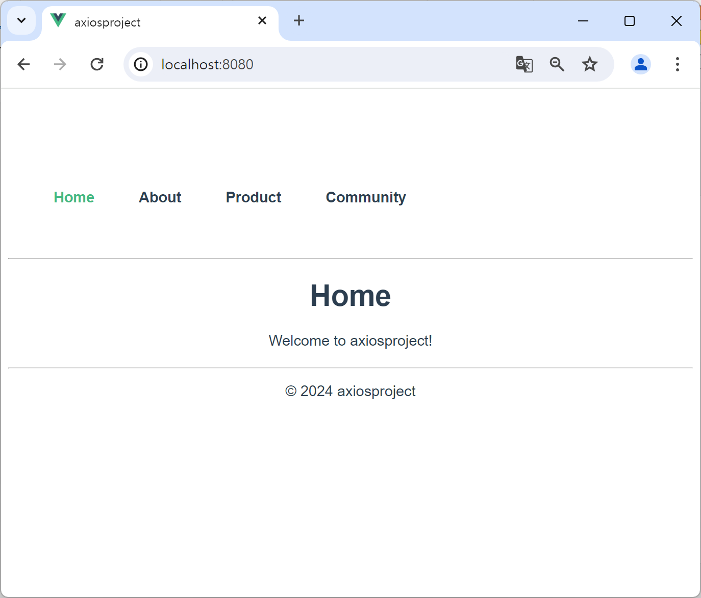

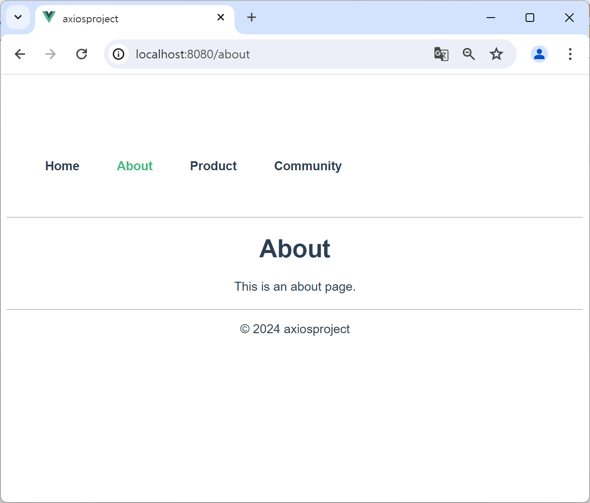

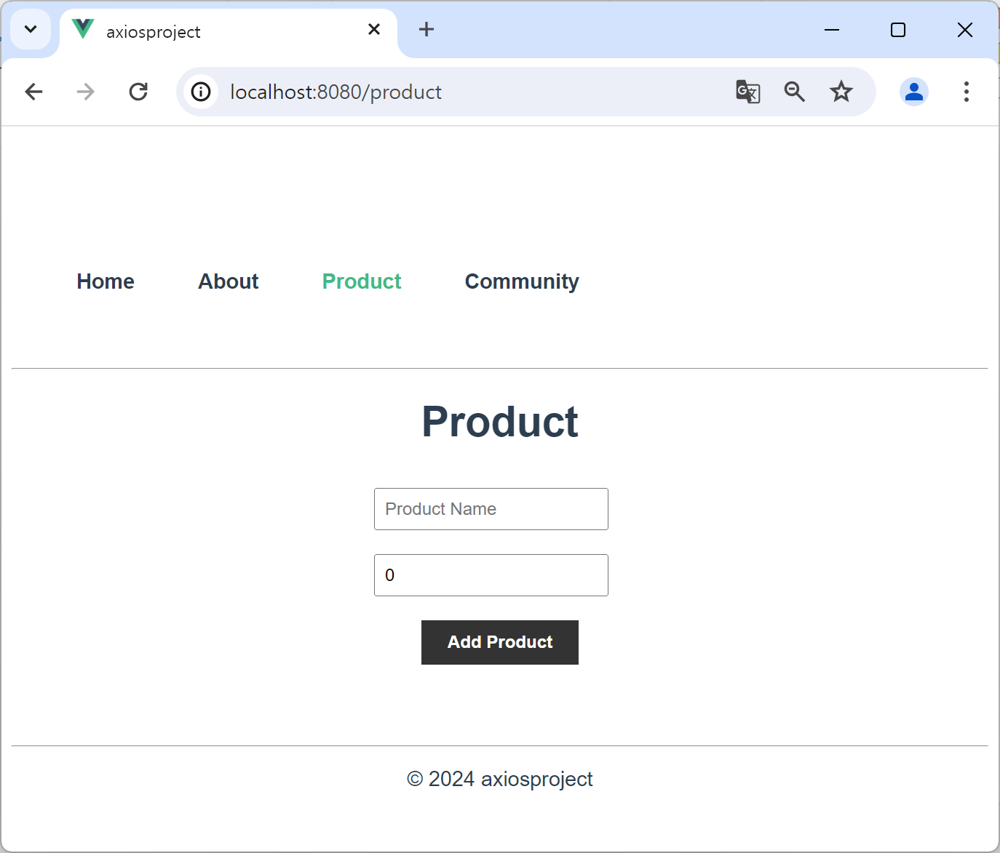

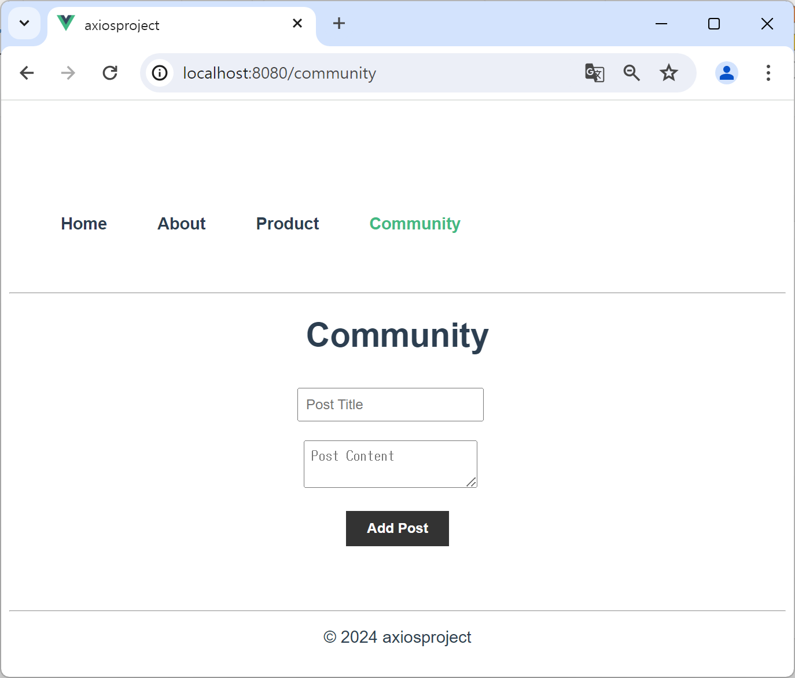

<br><br><br>